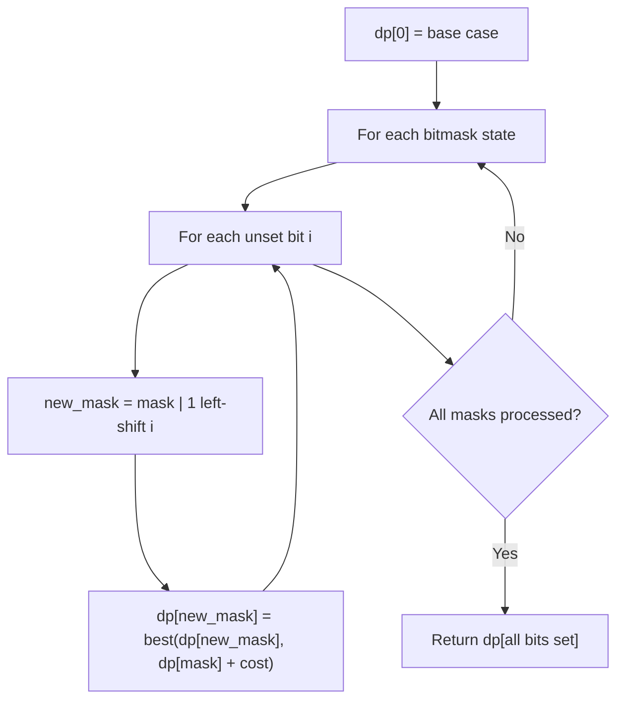

# Problem 1815: Maximum Number of Groups Getting Fresh Donuts

**Difficulty:** Hard  
**Tags:** Array, Dynamic Programming, Bit Manipulation, Memoization, Bitmask  
**Pattern:** Dynamic Programming (Bitmask)  
**Link:** [leetcode.com/problems/maximum-number-of-groups-getting-fresh-donuts](https://leetcode.com/problems/maximum-number-of-groups-getting-fresh-donuts/)

## Description

There is a donuts shop that bakes donuts in batches of `batchSize`. They have a rule where they must serve **all** of the donuts of a batch before serving any donuts of the next batch. You are given an integer `batchSize` and an integer array `groups`, where `groups[i]` denotes that there is a group of `groups[i]` customers that will visit the shop. Each customer will get exactly one donut.

When a group visits the shop, all customers of the group must be served before serving any of the following groups. A group will be happy if they all get fresh donuts. That is, the first customer of the group does not receive a donut that was left over from the previous group.

You can freely rearrange the ordering of the groups. Return *the **maximum** possible number of happy groups after rearranging the groups.*

 

Example 1:

```

**Input:** batchSize = 3, groups = [1,2,3,4,5,6]
**Output:** 4
**Explanation:** You can arrange the groups as [6,2,4,5,1,3]. Then the 1st, 2nd, 4th, and 6th groups will be happy.

```

Example 2:

```

**Input:** batchSize = 4, groups = [1,3,2,5,2,2,1,6]
**Output:** 4

```

 

**Constraints:**

	- `1 <= batchSize <= 9`
	- `1 <= groups.length <= 30`
	- `1 <= groups[i] <= 10^9`

## Approach: Dynamic Programming (Bitmask)

Use bitmask to represent subsets of n elements. dp[mask] = optimal value when the selected subset is represented by mask. Iterate over all masks and transitions.

## Pseudocode

```
1. dp[0] = base case
2. For mask from 0 to 2^n - 1:
   a. For each bit i not set in mask:
      - new_mask = mask | (1 << i)
      - dp[new_mask] = best of dp[new_mask], dp[mask] + cost(i)
3. Return dp[(1 << n) - 1]
```

## Algorithm Flow



## Complexity Analysis

- **Time:** O(2^n * n)
- **Space:** O(2^n)

## Solution (Python3)

```python
class Solution:
    def maxHappyGroups(self, batchSize: int, groups: List[int]) -> int:
        # Bitmask DP - O(2^n * n) time
        n = len(batchSize)
        dp = [float('inf')] * (1 << n)
        dp[0] = 0
        for mask in range(1 << n):
            bits = bin(mask).count('1')
            for i in range(n):
                if mask & (1 << i):
                    continue
                new_mask = mask | (1 << i)
                dp[new_mask] = min(dp[new_mask], dp[mask] + 1)
        return dp[(1 << n) - 1]
```

## Solution (C++)

```cpp
#include <algorithm>
#include <climits>
#include <string>
#include <vector>
using namespace std;

class Solution {
public:
    int maxHappyGroups(int batchSize, vector<int>& groups) {
        // Bitmask DP - O(2^n * n) time
        int n = batchSize.size();
        vector<int> dp(1 << n, INT_MAX);
        dp[0] = 0;
        for (int mask = 0; mask < (1 << n); mask++) {
            for (int i = 0; i < n; i++) {
                if (mask & (1 << i)) continue;
                int new_mask = mask | (1 << i);
                dp[new_mask] = min(dp[new_mask], dp[mask] + 1);
            }
        }
        return dp[(1 << n) - 1];
    }
};
```
