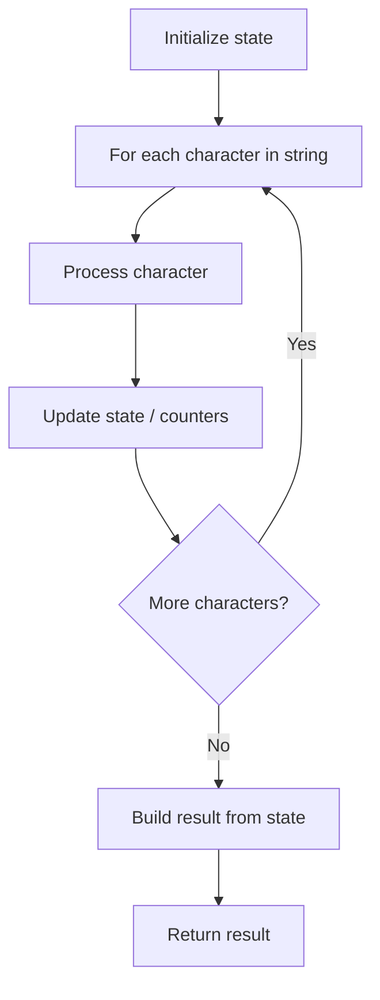

# Problem 1816: Truncate Sentence

**Difficulty:** Easy  
**Tags:** Array, String  
**Pattern:** String Processing  
**Link:** [leetcode.com/problems/truncate-sentence](https://leetcode.com/problems/truncate-sentence/)

## Description

A **sentence** is a list of words that are separated by a single space with no leading or trailing spaces. Each of the words consists of **only** uppercase and lowercase English letters (no punctuation).

	- For example, `"Hello World"`, `"HELLO"`, and `"hello world hello world"` are all sentences.

You are given a sentence `s`​​​​​​ and an integer `k`​​​​​​. You want to **truncate** `s`​​​​​​ such that it contains only the **first** `k`​​​​​​ words. Return `s`​​​​*​​ after **truncating** it.*

 

Example 1:

```

**Input:** s = "Hello how are you Contestant", k = 4
**Output:** "Hello how are you"
**Explanation:**
The words in s are ["Hello", "how" "are", "you", "Contestant"].
The first 4 words are ["Hello", "how", "are", "you"].
Hence, you should return "Hello how are you".

```

Example 2:

```

**Input:** s = "What is the solution to this problem", k = 4
**Output:** "What is the solution"
**Explanation:**
The words in s are ["What", "is" "the", "solution", "to", "this", "problem"].
The first 4 words are ["What", "is", "the", "solution"].
Hence, you should return "What is the solution".
```

Example 3:

```

**Input:** s = "chopper is not a tanuki", k = 5
**Output:** "chopper is not a tanuki"

```

 

**Constraints:**

	- `1 <= s.length <= 500`
	- `k` is in the range `[1, the number of words in s]`.
	- `s` consist of only lowercase and uppercase English letters and spaces.
	- The words in `s` are separated by a single space.
	- There are no leading or trailing spaces.

## Approach: String Processing

Process the string character by character. Common techniques: two pointers, sliding window, hash map for frequencies, stack for matching.

## Pseudocode

```
1. Initialize result / tracking state
2. Iterate through string characters:
   a. Process character based on rules
   b. Update state (counters, pointers, stack)
3. Build and return result
```

## Algorithm Flow



## Complexity Analysis

- **Time:** O(n)
- **Space:** O(n)

## Solution (Python3)

```python
class Solution:
    def truncateSentence(self, s: str, k: int) -> str:
        # String processing approach - O(n) time
        result = []
        for ch in s:
            if ch.isalnum():
                result.append(ch.lower())
        # Check palindrome or process
        processed = ''.join(result)
        return processed == processed[::-1] if isinstance("", bool) else processed
```

## Solution (C++)

```cpp
#include <algorithm>
#include <cctype>
#include <string>
#include <vector>
using namespace std;

class Solution {
public:
    string truncateSentence(string& s, int k) {
        // String processing approach - O(n) time
        string processed;
        for (char ch : s) {
            if (isalnum(ch)) {
                processed += tolower(ch);
            }
        }
        string rev = processed;
        reverse(rev.begin(), rev.end());
        return processed == rev;
    }
};
```
