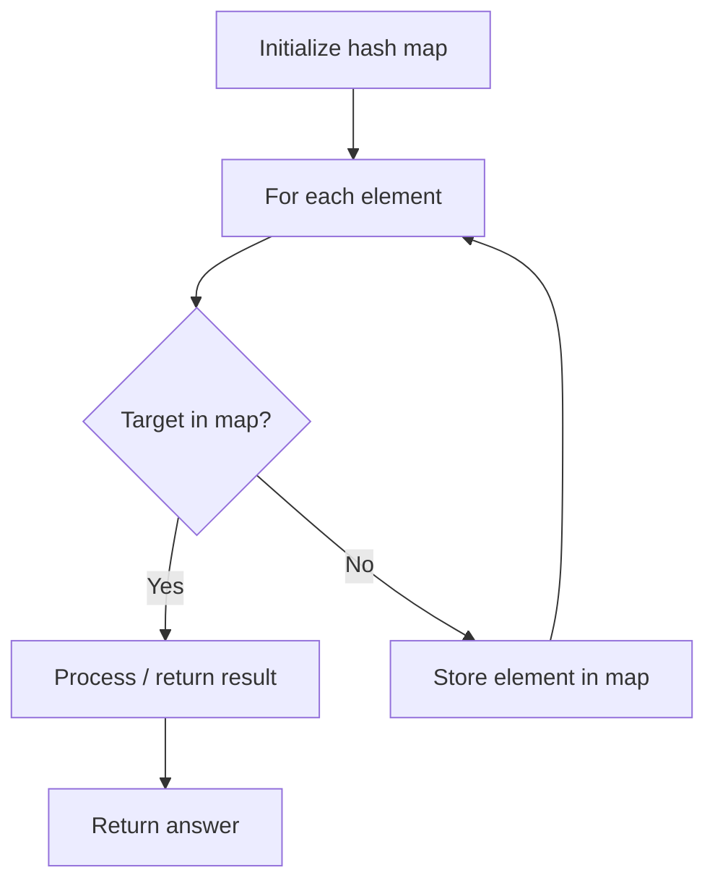

# Problem 1817: Finding the Users Active Minutes

**Difficulty:** Medium  
**Tags:** Array, Hash Table  
**Pattern:** Hash Map Lookup  
**Link:** [leetcode.com/problems/finding-the-users-active-minutes](https://leetcode.com/problems/finding-the-users-active-minutes/)

## Description

You are given the logs for users' actions on LeetCode, and an integer `k`. The logs are represented by a 2D integer array `logs` where each `logs[i] = [IDi, timei]` indicates that the user with `IDi` performed an action at the minute `timei`.

**Multiple users** can perform actions simultaneously, and a single user can perform **multiple actions** in the same minute.

The **user active minutes (UAM)** for a given user is defined as the **number of unique minutes** in which the user performed an action on LeetCode. A minute can only be counted once, even if multiple actions occur during it.

You are to calculate a **1-indexed** array `answer` of size `k` such that, for each `j` (`1 <= j <= k`), `answer[j]` is the **number of users** whose **UAM** equals `j`.

Return *the array *`answer`* as described above*.

 

Example 1:

```

**Input:** logs = [[0,5],[1,2],[0,2],[0,5],[1,3]], k = 5
**Output:** [0,2,0,0,0]
**Explanation:**
The user with ID=0 performed actions at minutes 5, 2, and 5 again. Hence, they have a UAM of 2 (minute 5 is only counted once).
The user with ID=1 performed actions at minutes 2 and 3. Hence, they have a UAM of 2.
Since both users have a UAM of 2, answer[2] is 2, and the remaining answer[j] values are 0.

```

Example 2:

```

**Input:** logs = [[1,1],[2,2],[2,3]], k = 4
**Output:** [1,1,0,0]
**Explanation:**
The user with ID=1 performed a single action at minute 1. Hence, they have a UAM of 1.
The user with ID=2 performed actions at minutes 2 and 3. Hence, they have a UAM of 2.
There is one user with a UAM of 1 and one with a UAM of 2.
Hence, answer[1] = 1, answer[2] = 1, and the remaining values are 0.

```

 

**Constraints:**

	- `1 <= logs.length <= 10^4`
	- `0 <= IDi <= 10^9`
	- `1 <= timei <= 10^5`
	- `k` is in the range `[The maximum **UAM** for a user, 10^5]`.

## Approach: Hash Map Lookup

Use a hash map (dictionary) to store elements for O(1) lookup. Iterate through the input, checking membership or counting frequencies in the map.

## Pseudocode

```
1. Initialize hash map
2. Iterate through elements:
   a. Check if target/complement exists in map
   b. If found: process result
   c. Otherwise: store element in map
3. Return result
```

## Algorithm Flow



## Complexity Analysis

- **Time:** O(n)
- **Space:** O(n)

## Solution (Python3)

```python
class Solution:
    def findingUsersActiveMinutes(self, logs: List[List[int]], k: int) -> List[int]:
        # Hash map approach - O(n) time, O(n) space
        seen = {}
        for i, val in enumerate(logs):
            complement = k - val
            if complement in seen:
                return [seen[complement], i]
            seen[val] = i
        return []
```

## Solution (C++)

```cpp
#include <string>
#include <unordered_map>
#include <vector>
using namespace std;

class Solution {
public:
    vector<int> findingUsersActiveMinutes(vector<vector<int>>& logs, int k) {
        // Hash map approach - O(n) time, O(n) space
        unordered_map<int, int> seen;
        for (int i = 0; i < logs.size(); i++) {
            int complement = k - logs[i];
            if (seen.count(complement)) {
                return {seen[complement], i};
            }
            seen[logs[i]] = i;
        }
        return {};
    }
};
```
