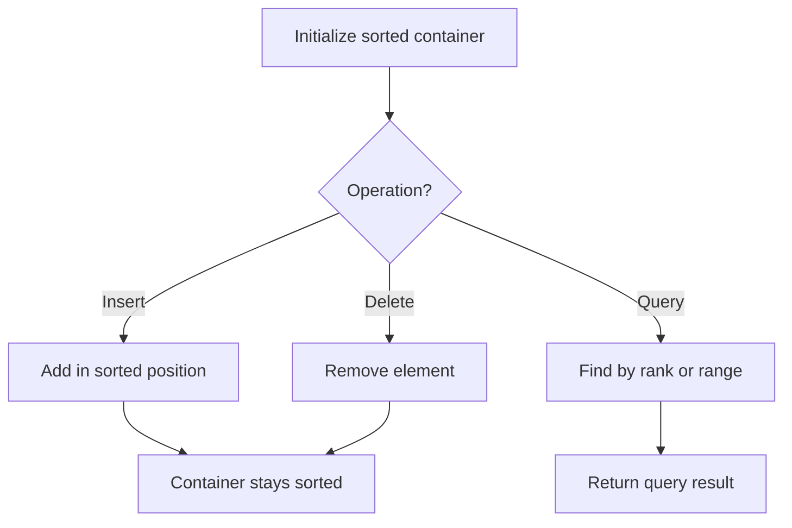

# Problem 1818: Minimum Absolute Sum Difference

**Difficulty:** Medium  
**Tags:** Array, Binary Search, Sorting, Ordered Set  
**Pattern:** Ordered Set / SortedList  
**Link:** [leetcode.com/problems/minimum-absolute-sum-difference](https://leetcode.com/problems/minimum-absolute-sum-difference/)

## Description

You are given two positive integer arrays `nums1` and `nums2`, both of length `n`.

The **absolute sum difference** of arrays `nums1` and `nums2` is defined as the **sum** of `|nums1[i] - nums2[i]|` for each `0 <= i < n` (**0-indexed**).

You can replace **at most one** element of `nums1` with **any** other element in `nums1` to **minimize** the absolute sum difference.

Return the *minimum absolute sum difference **after** replacing at most one** **element in the array `nums1`.* Since the answer may be large, return it **modulo** `10^9 + 7`.

`|x|` is defined as:

	- `x` if `x >= 0`, or
	- `-x` if `x < 0`.

 

Example 1:

```

**Input:** nums1 = [1,7,5], nums2 = [2,3,5]
**Output:** 3
**Explanation: **There are two possible optimal solutions:
- Replace the second element with the first: [1,**7**,5] => [1,**1**,5], or
- Replace the second element with the third: [1,**7**,5] => [1,**5**,5].
Both will yield an absolute sum difference of `|1-2| + (|1-3| or |5-3|) + |5-5| = `3.

```

Example 2:

```

**Input:** nums1 = [2,4,6,8,10], nums2 = [2,4,6,8,10]
**Output:** 0
**Explanation: **nums1 is equal to nums2 so no replacement is needed. This will result in an 
absolute sum difference of 0.

```

Example 3:

```

**Input:** nums1 = [1,10,4,4,2,7], nums2 = [9,3,5,1,7,4]
**Output:** 20
**Explanation: **Replace the first element with the second: [**1**,10,4,4,2,7] => [**10**,10,4,4,2,7].
This yields an absolute sum difference of `|10-9| + |10-3| + |4-5| + |4-1| + |2-7| + |7-4| = 20`

```

 

**Constraints:**

	- `n == nums1.length`
	- `n == nums2.length`
	- `1 <= n <= 10^5`
	- `1 <= nums1[i], nums2[i] <= 10^5`

## Approach: Ordered Set / SortedList

Maintain elements in sorted order for efficient insertion, deletion, and rank queries. Use balanced BST, skip list, or sorted container.

## Pseudocode

```
1. Initialize sorted container
2. For each operation:
   - Insert: add element in sorted position O(log n)
   - Delete: remove element O(log n)
   - Query: find kth element, count, or range O(log n)
3. Return results
```

## Algorithm Flow



## Complexity Analysis

- **Time:** O(n log n)
- **Space:** O(n)

## Solution (Python3)

```python
class Solution:
    def minAbsoluteSumDiff(self, nums1: List[int], nums2: List[int]) -> int:
        # Ordered set / SortedList - O(n log n) time
        from sortedcontainers import SortedList
        sl = SortedList()
        result = 0
        for val in nums1:
            pos = sl.bisect_left(val)
            if pos < len(sl):
                result = max(result, sl[pos] - val)
            sl.add(val)
        return result
```

## Solution (C++)

```cpp
#include <algorithm>
#include <set>
#include <string>
#include <vector>
using namespace std;

class Solution {
public:
    int minAbsoluteSumDiff(vector<int>& nums1, vector<int>& nums2) {
        // Ordered set - O(n log n) time
        set<int> ordered;
        int result = 0;
        for (int val : nums1) {
            auto it = ordered.lower_bound(val);
            if (it != ordered.end()) {
                result = max(result, *it - val);
            }
            ordered.insert(val);
        }
        return result;
    }
};
```
