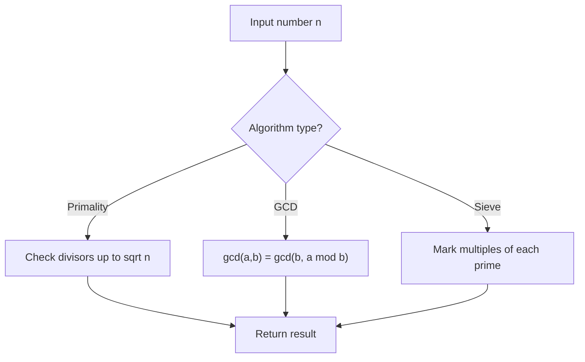

# Problem 1819: Number of Different Subsequences GCDs

**Difficulty:** Hard  
**Tags:** Array, Math, Counting, Number Theory  
**Pattern:** Number Theory  
**Link:** [leetcode.com/problems/number-of-different-subsequences-gcds](https://leetcode.com/problems/number-of-different-subsequences-gcds/)

## Description

You are given an array `nums` that consists of positive integers.

The **GCD** of a sequence of numbers is defined as the greatest integer that divides **all** the numbers in the sequence evenly.

	- For example, the GCD of the sequence `[4,6,16]` is `2`.

A **subsequence** of an array is a sequence that can be formed by removing some elements (possibly none) of the array.

	- For example, `[2,5,10]` is a subsequence of `[1,2,1,**2**,4,1,**5**,**10**]`.

Return *the **number** of **different** GCDs among all **non-empty** subsequences of* `nums`.

 

Example 1:

```

**Input:** nums = [6,10,3]
**Output:** 5
**Explanation:** The figure shows all the non-empty subsequences and their GCDs.
The different GCDs are 6, 10, 3, 2, and 1.

```

Example 2:

```

**Input:** nums = [5,15,40,5,6]
**Output:** 7

```

 

**Constraints:**

	- `1 <= nums.length <= 10^5`
	- `1 <= nums[i] <= 2 * 10^5`

## Approach: Number Theory

Apply number theory: prime checking, factorization, GCD, modular exponentiation, sieve of Eratosthenes, or Euler's totient.

## Pseudocode

```
1. Apply number-theoretic algorithm:
   - Sieve for primes up to n
   - GCD via Euclidean algorithm
   - Modular exponentiation
2. Process results
3. Return answer
```

## Algorithm Flow



## Complexity Analysis

- **Time:** O(sqrt(n)) or O(n log log n)
- **Space:** O(n)

## Solution (Python3)

```python
class Solution:
    def countDifferentSubsequenceGCDs(self, nums: List[int]) -> int:
        # Number theory approach
        def gcd(a, b):
            while b:
                a, b = b, a % b
            return a
        
        result = nums[0] if isinstance(nums, list) else nums
        if isinstance(nums, list):
            for val in nums[1:]:
                result = gcd(result, val)
        return result
```

## Solution (C++)

```cpp
#include <string>
#include <vector>
using namespace std;

class Solution {
public:
    int countDifferentSubsequenceGCDs(vector<int>& nums) {
        // Number theory approach
        auto gcd_func = [](int a, int b) -> int {
            while (b) { int t = b; b = a % b; a = t; }
            return a;
        };
        int result = nums[0];
        for (int i = 1; i < (int)nums.size(); i++) {
            result = gcd_func(result, nums[i]);
        }
        return result;
    }
};
```
