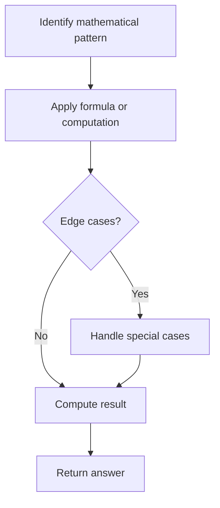

# Problem 1822: Sign of the Product of an Array

**Difficulty:** Easy  
**Tags:** Array, Math  
**Pattern:** Math  
**Link:** [leetcode.com/problems/sign-of-the-product-of-an-array](https://leetcode.com/problems/sign-of-the-product-of-an-array/)

## Description

Implement a function `signFunc(x)` that returns:

	- `1` if `x` is positive.
	- `-1` if `x` is negative.
	- `0` if `x` is equal to `0`.

You are given an integer array `nums`. Let `product` be the product of all values in the array `nums`.

Return `signFunc(product)`.

 

Example 1:

```

**Input:** nums = [-1,-2,-3,-4,3,2,1]
**Output:** 1
**Explanation:** The product of all values in the array is 144, and signFunc(144) = 1

```

Example 2:

```

**Input:** nums = [1,5,0,2,-3]
**Output:** 0
**Explanation:** The product of all values in the array is 0, and signFunc(0) = 0

```

Example 3:

```

**Input:** nums = [-1,1,-1,1,-1]
**Output:** -1
**Explanation:** The product of all values in the array is -1, and signFunc(-1) = -1

```

 

**Constraints:**

	- `1 <= nums.length <= 1000`
	- `-100 <= nums[i] <= 100`

## Approach: Math

Apply mathematical properties, formulas, or number-theoretic concepts. Look for patterns, modular arithmetic, or closed-form solutions.

## Pseudocode

```
1. Identify the mathematical pattern or formula
2. Apply computation:
   - Modular arithmetic for large numbers
   - GCD/LCM for divisibility
   - Sieve for primes
3. Handle edge cases
4. Return result
```

## Algorithm Flow



## Complexity Analysis

- **Time:** O(n) or O(sqrt(n))
- **Space:** O(1)

## Solution (Python3)

```python
class Solution:
    def arraySign(self, nums: List[int]) -> int:
        # Mathematical approach
        result = 0
        x = nums
        while x != 0:
            result = result * 10 + x % 10
            x //= 10 if isinstance(x, int) else 1
        return result
```

## Solution (C++)

```cpp
#include <string>
#include <vector>
using namespace std;

class Solution {
public:
    int arraySign(vector<int>& nums) {
        // Mathematical approach
        long long result = 0;
        int x = nums;
        while (x != 0) {
            result = result * 10 + x % 10;
            x /= 10;
        }
        return (int)result;
    }
};
```
