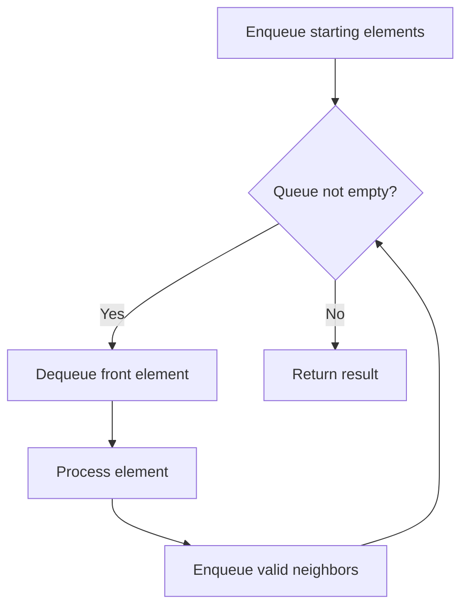

# Problem 1823: Find the Winner of the Circular Game

**Difficulty:** Medium  
**Tags:** Array, Math, Recursion, Queue, Simulation  
**Pattern:** Queue / BFS  
**Link:** [leetcode.com/problems/find-the-winner-of-the-circular-game](https://leetcode.com/problems/find-the-winner-of-the-circular-game/)

## Description

There are `n` friends that are playing a game. The friends are sitting in a circle and are numbered from `1` to `n` in **clockwise order**. More formally, moving clockwise from the `i^th` friend brings you to the `(i+1)^th` friend for `1 <= i < n`, and moving clockwise from the `n^th` friend brings you to the `1^st` friend.

The rules of the game are as follows:

	- **Start** at the `1^st` friend.
	- Count the next `k` friends in the clockwise direction **including** the friend you started at. The counting wraps around the circle and may count some friends more than once.
	- The last friend you counted leaves the circle and loses the game.
	- If there is still more than one friend in the circle, go back to step `2` **starting** from the friend **immediately clockwise** of the friend who just lost and repeat.
	- Else, the last friend in the circle wins the game.

Given the number of friends, `n`, and an integer `k`, return *the winner of the game*.

 

Example 1:

```

**Input:** n = 5, k = 2
**Output:** 3
**Explanation:** Here are the steps of the game:
1) Start at friend 1.
2) Count 2 friends clockwise, which are friends 1 and 2.
3) Friend 2 leaves the circle. Next start is friend 3.
4) Count 2 friends clockwise, which are friends 3 and 4.
5) Friend 4 leaves the circle. Next start is friend 5.
6) Count 2 friends clockwise, which are friends 5 and 1.
7) Friend 1 leaves the circle. Next start is friend 3.
8) Count 2 friends clockwise, which are friends 3 and 5.
9) Friend 5 leaves the circle. Only friend 3 is left, so they are the winner.
```

Example 2:

```

**Input:** n = 6, k = 5
**Output:** 1
**Explanation:** The friends leave in this order: 5, 4, 6, 2, 3. The winner is friend 1.

```

 

**Constraints:**

	- `1 <= k <= n <= 500`

 

**Follow up:**

Could you solve this problem in linear time with constant space?

## Approach: Queue / BFS

Use a queue (FIFO) for level-order or breadth-first processing. Enqueue starting elements, then process level by level.

## Pseudocode

```
1. Initialize queue with starting element(s)
2. While queue is not empty:
   a. Dequeue front element
   b. Process element
   c. Enqueue valid neighbors/children
3. Return result
```

## Algorithm Flow



## Complexity Analysis

- **Time:** O(n)
- **Space:** O(n)

## Solution (Python3)

```python
class Solution:
    def findTheWinner(self, n: int, k: int) -> int:
        # Queue-based approach - O(n) time
        from collections import deque
        queue = deque()
        for val in n:
            queue.append(val)
        result = []
        while queue:
            result.append(queue.popleft())
        return result
```

## Solution (C++)

```cpp
#include <queue>
#include <string>
#include <vector>
using namespace std;

class Solution {
public:
    int findTheWinner(int n, int k) {
        // Queue-based approach - O(n) time
        queue<int> q;
        for (int val : n) {
            q.push(val);
        }
        vector<int> result;
        while (!q.empty()) {
            result.push_back(q.front());
            q.pop();
        }
        return result;
    }
};
```
