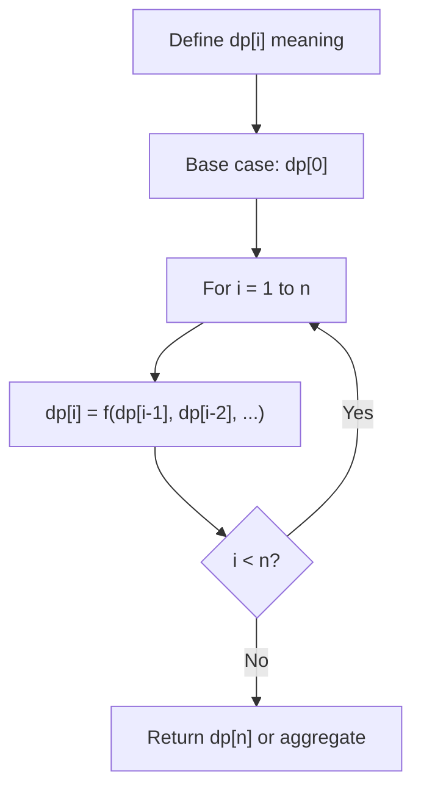
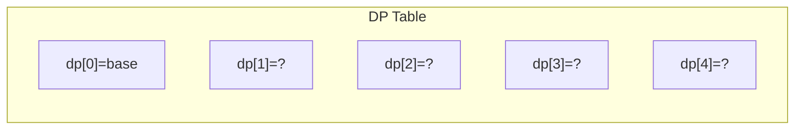
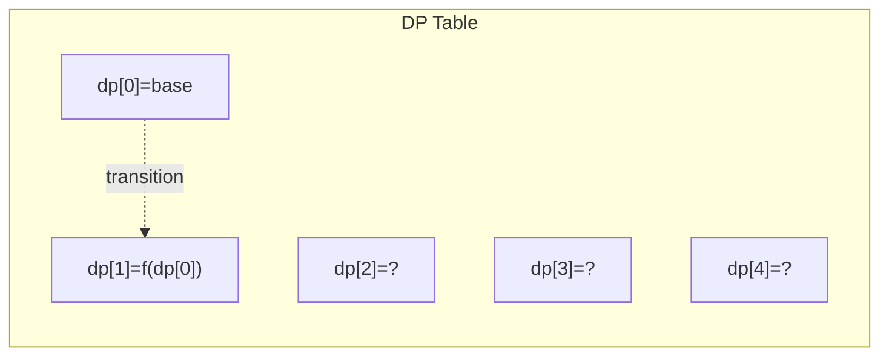
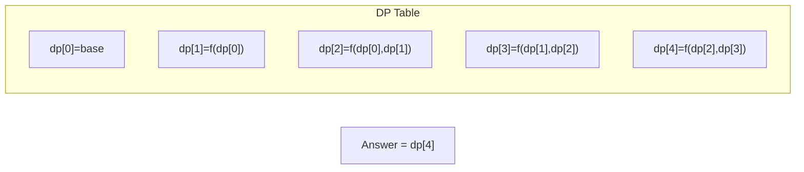

# Problem 1824: Minimum Sideway Jumps

**Difficulty:** Medium  
**Tags:** Array, Dynamic Programming, Greedy  
**Pattern:** Dynamic Programming (1D)  
**Link:** [leetcode.com/problems/minimum-sideway-jumps](https://leetcode.com/problems/minimum-sideway-jumps/)

## Description

There is a **3 lane road** of length `n` that consists of `n + 1` **points** labeled from `0` to `n`. A frog **starts** at point `0` in the **second **lane** **and wants to jump to point `n`. However, there could be obstacles along the way.

You are given an array `obstacles` of length `n + 1` where each `obstacles[i]` (**ranging from 0 to 3**) describes an obstacle on the lane `obstacles[i]` at point `i`. If `obstacles[i] == 0`, there are no obstacles at point `i`. There will be **at most one** obstacle in the 3 lanes at each point.

	- For example, if `obstacles[2] == 1`, then there is an obstacle on lane 1 at point 2.

The frog can only travel from point `i` to point `i + 1` on the same lane if there is not an obstacle on the lane at point `i + 1`. To avoid obstacles, the frog can also perform a **side jump** to jump to **another** lane (even if they are not adjacent) at the **same** point if there is no obstacle on the new lane.

	- For example, the frog can jump from lane 3 at point 3 to lane 1 at point 3.

Return* the **minimum number of side jumps** the frog needs to reach **any lane** at point n starting from lane `2` at point 0.*

**Note:** There will be no obstacles on points `0` and `n`.

 

Example 1:

```

**Input:** obstacles = [0,1,2,3,0]
**Output:** 2 
**Explanation:** The optimal solution is shown by the arrows above. There are 2 side jumps (red arrows).
Note that the frog can jump over obstacles only when making side jumps (as shown at point 2).

```

Example 2:

```

**Input:** obstacles = [0,1,1,3,3,0]
**Output:** 0
**Explanation:** There are no obstacles on lane 2. No side jumps are required.

```

Example 3:

```

**Input:** obstacles = [0,2,1,0,3,0]
**Output:** 2
**Explanation:** The optimal solution is shown by the arrows above. There are 2 side jumps.

```

 

**Constraints:**

	- `obstacles.length == n + 1`
	- `1 <= n <= 5 * 10^5`
	- `0 <= obstacles[i] <= 3`
	- `obstacles[0] == obstacles[n] == 0`

## Approach: Dynamic Programming (1D)

Break the problem into overlapping subproblems. Define dp[i] as the optimal value for the subproblem ending at or considering index i. Build the solution bottom-up, using previously computed dp values.

## Pseudocode

```
1. Define dp[i] = optimal value for subproblem i
2. Base case: dp[0] = initial value
3. For i from 1 to n:
   a. dp[i] = recurrence(dp[i-1], dp[i-2], ...)
4. Return dp[n] or max/min of dp
```

## Algorithm Flow



## Visual State Transitions

**1D Dynamic Programming Table Build:**

**Frame 1: Initialize base cases**


**Frame 2: Fill dp[1] from dp[0]**


**Frame 3: Fill remaining cells**



## Complexity Analysis

- **Time:** O(n)
- **Space:** O(n)

## Solution (Python3)

```python
class Solution:
    def minSideJumps(self, obstacles: List[int]) -> int:
        # Dynamic programming (1D) - O(n) time, O(n) space
        if not obstacles:
            return 0
        n = len(obstacles) if isinstance(obstacles, list) else obstacles
        dp = [0] * (n + 1)
        dp[0] = 1  # base case
        for i in range(1, n + 1):
            dp[i] = dp[i-1]  # transition (customize per problem)
            if i >= 2:
                dp[i] += dp[i-2]
        return dp[n]
```

## Solution (C++)

```cpp
#include <string>
#include <vector>
using namespace std;

class Solution {
public:
    int minSideJumps(vector<int>& obstacles) {
        // Dynamic programming (1D) - O(n) time, O(n) space
        int n = obstacles;
        if (n <= 0) return 0;
        vector<int> dp(n + 1, 0);
        dp[0] = 1;
        for (int i = 1; i <= n; i++) {
            dp[i] = dp[i-1];
            if (i >= 2) dp[i] += dp[i-2];
        }
        return dp[n];
    }
};
```
