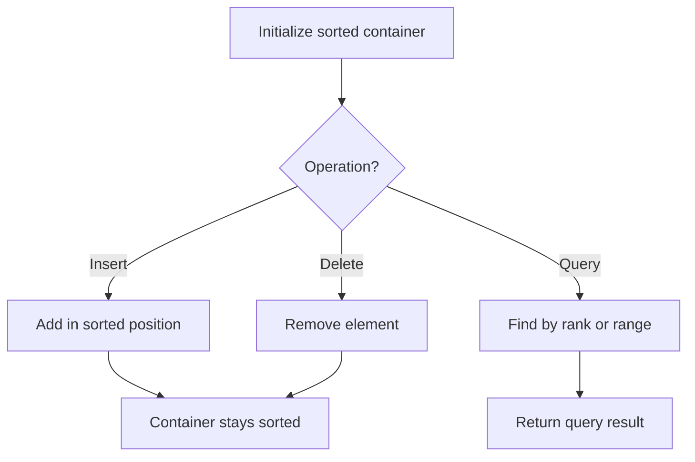

# Problem 1825: Finding MK Average

**Difficulty:** Hard  
**Tags:** Design, Queue, Heap (Priority Queue), Data Stream, Ordered Set  
**Pattern:** Ordered Set / SortedList  
**Link:** [leetcode.com/problems/finding-mk-average](https://leetcode.com/problems/finding-mk-average/)

## Description

You are given two integers, `m` and `k`, and a stream of integers. You are tasked to implement a data structure that calculates the **MKAverage** for the stream.

The **MKAverage** can be calculated using these steps:

	- If the number of the elements in the stream is less than `m` you should consider the **MKAverage** to be `-1`. Otherwise, copy the last `m` elements of the stream to a separate container.
	- Remove the smallest `k` elements and the largest `k` elements from the container.
	- Calculate the average value for the rest of the elements **rounded down to the nearest integer**.

Implement the `MKAverage` class:

	- `MKAverage(int m, int k)` Initializes the **MKAverage** object with an empty stream and the two integers `m` and `k`.
	- `void addElement(int num)` Inserts a new element `num` into the stream.
	- `int calculateMKAverage()` Calculates and returns the **MKAverage** for the current stream **rounded down to the nearest integer**.

 

Example 1:

```

**Input**
["MKAverage", "addElement", "addElement", "calculateMKAverage", "addElement", "calculateMKAverage", "addElement", "addElement", "addElement", "calculateMKAverage"]
[[3, 1], [3], [1], [], [10], [], [5], [5], [5], []]
**Output**
[null, null, null, -1, null, 3, null, null, null, 5]

**Explanation**
MKAverage obj = new MKAverage(3, 1); 
obj.addElement(3);        // current elements are [3]
obj.addElement(1);        // current elements are [3,1]
obj.calculateMKAverage(); // return -1, because m = 3 and only 2 elements exist.
obj.addElement(10);       // current elements are [3,1,10]
obj.calculateMKAverage(); // The last 3 elements are [3,1,10].
                          // After removing smallest and largest 1 element the container will be [3].
                          // The average of [3] equals 3/1 = 3, return 3
obj.addElement(5);        // current elements are [3,1,10,5]
obj.addElement(5);        // current elements are [3,1,10,5,5]
obj.addElement(5);        // current elements are [3,1,10,5,5,5]
obj.calculateMKAverage(); // The last 3 elements are [5,5,5].
                          // After removing smallest and largest 1 element the container will be [5].
                          // The average of [5] equals 5/1 = 5, return 5

```

 

**Constraints:**

	- `3 <= m <= 10^5`
	- `1 < k*2 < m`
	- `1 <= num <= 10^5`
	- At most `10^5` calls will be made to `addElement` and `calculateMKAverage`.

## Approach: Ordered Set / SortedList

Maintain elements in sorted order for efficient insertion, deletion, and rank queries. Use balanced BST, skip list, or sorted container.

## Pseudocode

```
1. Initialize sorted container
2. For each operation:
   - Insert: add element in sorted position O(log n)
   - Delete: remove element O(log n)
   - Query: find kth element, count, or range O(log n)
3. Return results
```

## Algorithm Flow



## Complexity Analysis

- **Time:** O(n log n)
- **Space:** O(n)

## Solution (Python3)

```python
class MKAverage:
    def __init__(self, m: int, k: int):
        # Initialize data structure
        self.m = m
        self.k = k

    def addElement(self, num: int) -> None:
        return None

    def calculateMKAverage(self) -> int:
        return 0

```

## Solution (C++)

```cpp
#include <algorithm>
#include <set>
#include <string>
#include <vector>
using namespace std;

class MKAverage {
public:
    MKAverage(int m, int k) {
        // Initialize
    }

    void addElement(int num) {
        return ;
    }

    int calculateMKAverage() {
        return 0;
    }

};
```
