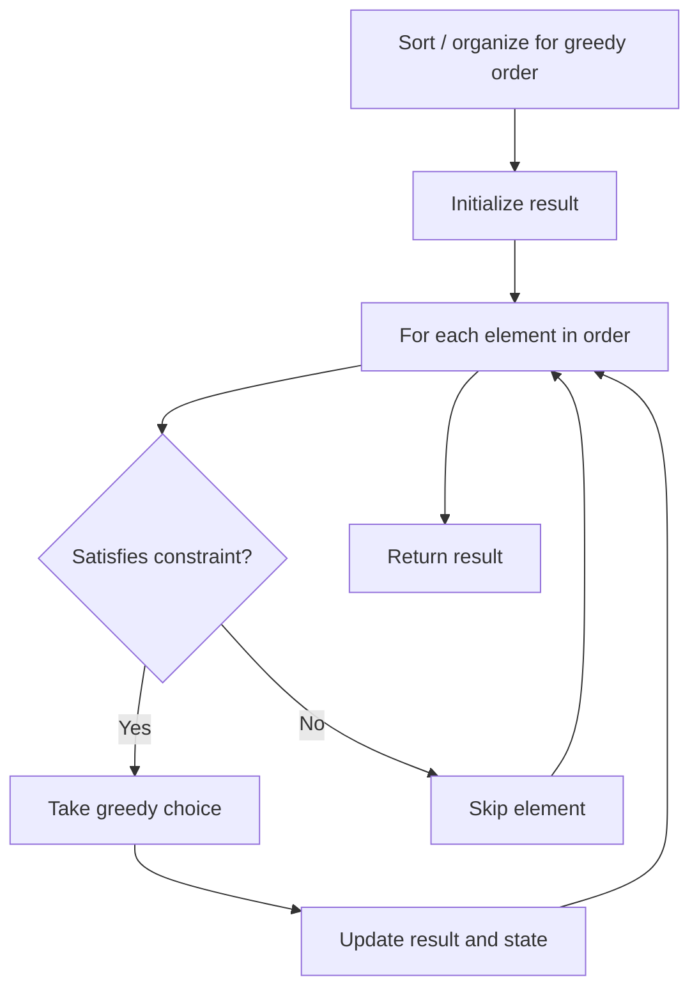

# Problem 1827: Minimum Operations to Make the Array Increasing

**Difficulty:** Easy  
**Tags:** Array, Greedy  
**Pattern:** Greedy  
**Link:** [leetcode.com/problems/minimum-operations-to-make-the-array-increasing](https://leetcode.com/problems/minimum-operations-to-make-the-array-increasing/)

## Description

You are given an integer array `nums` (**0-indexed**). In one operation, you can choose an element of the array and increment it by `1`.


	- For example, if `nums = [1,2,3]`, you can choose to increment `nums[1]` to make `nums = [1,**3**,3]`.


Return *the **minimum** number of operations needed to make* `nums` ***strictly** **increasing**.*


An array `nums` is **strictly increasing** if `nums[i] < nums[i+1]` for all `0 <= i < nums.length - 1`. An array of length `1` is trivially strictly increasing.


 

Example 1:


```

**Input:** nums = [1,1,1]
**Output:** 3
**Explanation:** You can do the following operations:
1) Increment nums[2], so nums becomes [1,1,**2**].
2) Increment nums[1], so nums becomes [1,**2**,2].
3) Increment nums[2], so nums becomes [1,2,**3**].

```


Example 2:


```

**Input:** nums = [1,5,2,4,1]
**Output:** 14

```


Example 3:


```

**Input:** nums = [8]
**Output:** 0

```


 

**Constraints:**


	- `1 <= nums.length <= 5000`
	- `1 <= nums[i] <= 10^4`

## Approach: Greedy

Make the locally optimal choice at each step, trusting it leads to a global optimum. Greedy works when the problem has the greedy-choice property and optimal substructure.

## Pseudocode

```
1. Sort or organize data for greedy ordering
2. Initialize result
3. For each element in greedy order:
   a. If element satisfies constraint:
      - Take the greedy choice
      - Update result and state
4. Return result
```

## Algorithm Flow



## Complexity Analysis

- **Time:** O(n log n)
- **Space:** O(1)

## Solution (Python3)

```python
class Solution:
    def minOperations(self, nums: List[int]) -> int:
        # Greedy approach - O(n) time
        result = 0
        curr_max = 0
        for i in range(len(nums)):
            if isinstance(nums[i], int):
                curr_max = max(curr_max, nums[i])
                result = max(result, curr_max)
            else:
                result += 1
        return result
```

## Solution (C++)

```cpp
#include <algorithm>
#include <string>
#include <vector>
using namespace std;

class Solution {
public:
    int minOperations(vector<int>& nums) {
        // Greedy approach - O(n) time
        int result = 0, curr_max = 0;
        for (int i = 0; i < (int)nums.size(); i++) {
            curr_max = max(curr_max, nums[i]);
            result = max(result, curr_max);
        }
        return result;
    }
};
```
