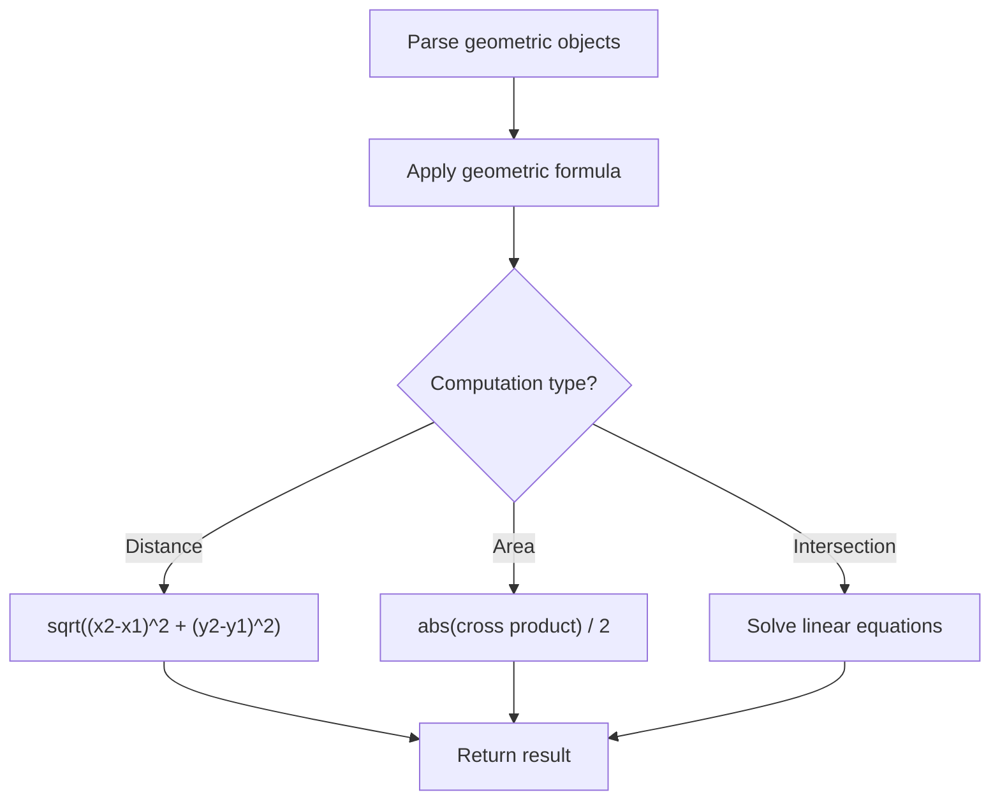

# Problem 1828: Queries on Number of Points Inside a Circle

**Difficulty:** Medium  
**Tags:** Array, Math, Geometry  
**Pattern:** Geometry  
**Link:** [leetcode.com/problems/queries-on-number-of-points-inside-a-circle](https://leetcode.com/problems/queries-on-number-of-points-inside-a-circle/)

## Description

You are given an array `points` where `points[i] = [xi, yi]` is the coordinates of the `i^th` point on a 2D plane. Multiple points can have the **same** coordinates.

You are also given an array `queries` where `queries[j] = [xj, yj, rj]` describes a circle centered at `(xj, yj)` with a radius of `rj`.

For each query `queries[j]`, compute the number of points **inside** the `j^th` circle. Points **on the border** of the circle are considered **inside**.

Return *an array *`answer`*, where *`answer[j]`* is the answer to the *`j^th`* query*.

 

Example 1:

```

**Input:** points = [[1,3],[3,3],[5,3],[2,2]], queries = [[2,3,1],[4,3,1],[1,1,2]]
**Output:** [3,2,2]
**Explanation: **The points and circles are shown above.
queries[0] is the green circle, queries[1] is the red circle, and queries[2] is the blue circle.

```

Example 2:

```

**Input:** points = [[1,1],[2,2],[3,3],[4,4],[5,5]], queries = [[1,2,2],[2,2,2],[4,3,2],[4,3,3]]
**Output:** [2,3,2,4]
**Explanation: **The points and circles are shown above.
queries[0] is green, queries[1] is red, queries[2] is blue, and queries[3] is purple.

```

 

**Constraints:**

	- `1 <= points.length <= 500`
	- `points[i].length == 2`
	- `0 <= x​​​​​​i, y​​​​​​i <= 500`
	- `1 <= queries.length <= 500`
	- `queries[j].length == 3`
	- `0 <= xj, yj <= 500`
	- `1 <= rj <= 500`
	- All coordinates are integers.

 

**Follow up:** Could you find the answer for each query in better complexity than `O(n)`?

## Approach: Geometry

Apply geometric formulas: distance, area, cross product, convex hull, line intersection. Handle floating-point precision carefully.

## Pseudocode

```
1. Parse geometric objects (points, lines, shapes)
2. Apply geometric operations:
   - Distance formula
   - Cross/dot product
   - Area computation
3. Handle precision and edge cases
4. Return result
```

## Algorithm Flow



## Complexity Analysis

- **Time:** O(n^2) or O(n log n)
- **Space:** O(n)

## Solution (Python3)

```python
class Solution:
    def countPoints(self, points: List[List[int]], queries: List[List[int]]) -> List[int]:
        # Geometry approach
        import math
        result = 0
        for i in range(len(points)):
            for j in range(i + 1, len(points)):
                dx = points[i][0] - points[j][0]
                dy = points[i][1] - points[j][1]
                dist = math.sqrt(dx*dx + dy*dy)
                result = max(result, dist)
        return result
```

## Solution (C++)

```cpp
#include <algorithm>
#include <cmath>
#include <string>
#include <vector>
using namespace std;

class Solution {
public:
    vector<int> countPoints(vector<vector<int>>& points, vector<vector<int>>& queries) {
        // Geometry approach
        double result = 0;
        for (int i = 0; i < (int)points.size(); i++) {
            for (int j = i + 1; j < (int)points.size(); j++) {
                double dx = points[i][0] - points[j][0];
                double dy = points[i][1] - points[j][1];
                result = max(result, sqrt(dx*dx + dy*dy));
            }
        }
        return result;
    }
};
```
