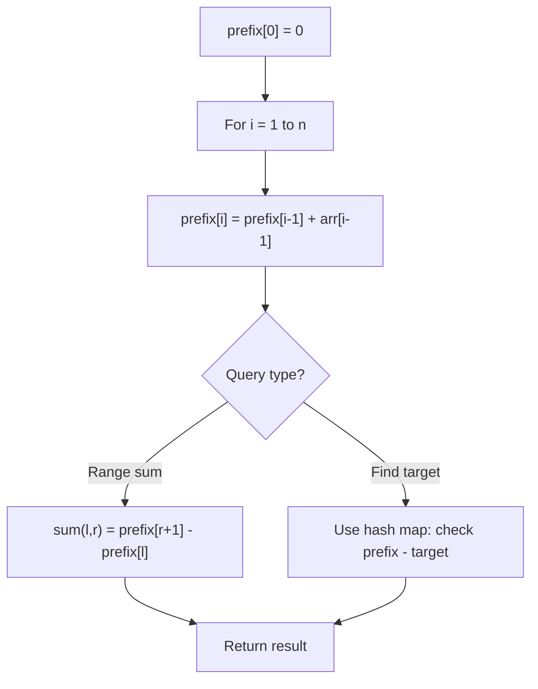

# Problem 1829: Maximum XOR for Each Query

**Difficulty:** Medium  
**Tags:** Array, Bit Manipulation, Prefix Sum  
**Pattern:** Prefix Sum  
**Link:** [leetcode.com/problems/maximum-xor-for-each-query](https://leetcode.com/problems/maximum-xor-for-each-query/)

## Description

You are given a **sorted** array `nums` of `n` non-negative integers and an integer `maximumBit`. You want to perform the following query `n` **times**:

	- Find a non-negative integer `k < 2^maximumBit` such that `nums[0] XOR nums[1] XOR ... XOR nums[nums.length-1] XOR k` is **maximized**. `k` is the answer to the `i^th` query.
	- Remove the **last **element from the current array `nums`.

Return *an array* `answer`*, where *`answer[i]`* is the answer to the *`i^th`* query*.

 

Example 1:

```

**Input:** nums = [0,1,1,3], maximumBit = 2
**Output:** [0,3,2,3]
**Explanation**: The queries are answered as follows:
1st query: nums = [0,1,1,3], k = 0 since 0 XOR 1 XOR 1 XOR 3 XOR 0 = 3.
2nd query: nums = [0,1,1], k = 3 since 0 XOR 1 XOR 1 XOR 3 = 3.
3rd query: nums = [0,1], k = 2 since 0 XOR 1 XOR 2 = 3.
4th query: nums = [0], k = 3 since 0 XOR 3 = 3.

```

Example 2:

```

**Input:** nums = [2,3,4,7], maximumBit = 3
**Output:** [5,2,6,5]
**Explanation**: The queries are answered as follows:
1st query: nums = [2,3,4,7], k = 5 since 2 XOR 3 XOR 4 XOR 7 XOR 5 = 7.
2nd query: nums = [2,3,4], k = 2 since 2 XOR 3 XOR 4 XOR 2 = 7.
3rd query: nums = [2,3], k = 6 since 2 XOR 3 XOR 6 = 7.
4th query: nums = [2], k = 5 since 2 XOR 5 = 7.

```

Example 3:

```

**Input:** nums = [0,1,2,2,5,7], maximumBit = 3
**Output:** [4,3,6,4,6,7]

```

 

**Constraints:**

	- `nums.length == n`
	- `1 <= n <= 10^5`
	- `1 <= maximumBit <= 20`
	- `0 <= nums[i] < 2^maximumBit`
	- `nums`​​​ is sorted in **ascending** order.

## Approach: Prefix Sum

Build a prefix sum array where prefix[i] = sum of elements 0..i-1. Any subarray sum [l..r] = prefix[r+1] - prefix[l]. Combine with hash map for O(n) subarray sum queries.

## Pseudocode

```
1. Build prefix sum array: prefix[0]=0, prefix[i]=prefix[i-1]+arr[i-1]
2. Use prefix sums to answer queries:
   - Subarray sum [l..r] = prefix[r+1] - prefix[l]
   - Or use hash map to find prefix[j]-prefix[i] == target
3. Return result
```

## Algorithm Flow



## Complexity Analysis

- **Time:** O(n)
- **Space:** O(n)

## Solution (Python3)

```python
class Solution:
    def getMaximumXor(self, nums: List[int], maximumBit: int) -> List[int]:
        # Prefix sum approach - O(n) time, O(n) space
        prefix = {0: -1}
        curr_sum = 0
        result = 0
        target = maximumBit if isinstance(maximumBit, int) else 0
        for i, val in enumerate(nums):
            curr_sum += val
            if curr_sum - target in prefix:
                result = max(result, i - prefix[curr_sum - target])
            if curr_sum not in prefix:
                prefix[curr_sum] = i
        return result
```

## Solution (C++)

```cpp
#include <algorithm>
#include <string>
#include <unordered_map>
#include <vector>
using namespace std;

class Solution {
public:
    vector<int> getMaximumXor(vector<int>& nums, int maximumBit) {
        // Prefix sum approach - O(n) time, O(n) space
        unordered_map<int, int> prefix;
        prefix[0] = -1;
        int curr_sum = 0, result = 0;
        int target = maximumBit;
        for (int i = 0; i < (int)nums.size(); i++) {
            curr_sum += nums[i];
            if (prefix.count(curr_sum - target)) {
                result = max(result, i - prefix[curr_sum - target]);
            }
            if (!prefix.count(curr_sum)) {
                prefix[curr_sum] = i;
            }
        }
        return result;
    }
};
```
