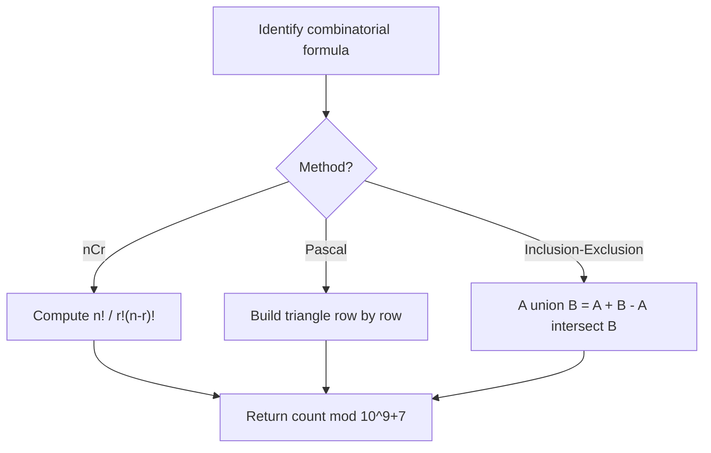

# Problem 1830: Minimum Number of Operations to Make String Sorted

**Difficulty:** Hard  
**Tags:** Math, String, Combinatorics  
**Pattern:** Combinatorics  
**Link:** [leetcode.com/problems/minimum-number-of-operations-to-make-string-sorted](https://leetcode.com/problems/minimum-number-of-operations-to-make-string-sorted/)

## Description

You are given a string `s` (**0-indexed**)​​​​​​. You are asked to perform the following operation on `s`​​​​​​ until you get a sorted string:

	- Find **the largest index** `i` such that `1 <= i < s.length` and `s[i] < s[i - 1]`.
	- Find **the largest index** `j` such that `i <= j < s.length` and `s[k] < s[i - 1]` for all the possible values of `k` in the range `[i, j]` inclusive.
	- Swap the two characters at indices `i - 1`​​​​ and `j`​​​​​.
	- Reverse the suffix starting at index `i`​​​​​​.

Return *the number of operations needed to make the string sorted.* Since the answer can be too large, return it **modulo** `10^9 + 7`.

 

Example 1:

```

**Input:** s = "cba"
**Output:** 5
**Explanation:** The simulation goes as follows:
Operation 1: i=2, j=2. Swap s[1] and s[2] to get s="cab", then reverse the suffix starting at 2. Now, s="cab".
Operation 2: i=1, j=2. Swap s[0] and s[2] to get s="bac", then reverse the suffix starting at 1. Now, s="bca".
Operation 3: i=2, j=2. Swap s[1] and s[2] to get s="bac", then reverse the suffix starting at 2. Now, s="bac".
Operation 4: i=1, j=1. Swap s[0] and s[1] to get s="abc", then reverse the suffix starting at 1. Now, s="acb".
Operation 5: i=2, j=2. Swap s[1] and s[2] to get s="abc", then reverse the suffix starting at 2. Now, s="abc".

```

Example 2:

```

**Input:** s = "aabaa"
**Output:** 2
**Explanation:** The simulation goes as follows:
Operation 1: i=3, j=4. Swap s[2] and s[4] to get s="aaaab", then reverse the substring starting at 3. Now, s="aaaba".
Operation 2: i=4, j=4. Swap s[3] and s[4] to get s="aaaab", then reverse the substring starting at 4. Now, s="aaaab".

```

 

**Constraints:**

	- `1 <= s.length <= 3000`
	- `s`​​​​​​ consists only of lowercase English letters.

## Approach: Combinatorics

Count or enumerate combinations, permutations, or arrangements. Use factorials, Pascal's triangle, or inclusion-exclusion principle.

## Pseudocode

```
1. Identify combinatorial structure
2. Compute using:
   - nCr = n! / (r! * (n-r)!)
   - Pascal's triangle for binomial coefficients
   - Inclusion-exclusion for overlapping sets
3. Apply modular arithmetic if needed
4. Return count
```

## Algorithm Flow



## Complexity Analysis

- **Time:** O(n) or O(n^2)
- **Space:** O(n)

## Solution (Python3)

```python
class Solution:
    def makeStringSorted(self, s: str) -> int:
        # Combinatorics approach
        MOD = 10**9 + 7
        # Compute using factorials or DP
        n = s if isinstance(s, int) else len(s)
        dp = [1] * (n + 1)
        for i in range(2, n + 1):
            dp[i] = dp[i-1] * i % MOD
        return dp[n] % MOD
```

## Solution (C++)

```cpp
#include <string>
#include <vector>
using namespace std;

class Solution {
public:
    int makeStringSorted(string& s) {
        // Combinatorics approach
        const int MOD = 1e9 + 7;
        int n = s;
        vector<long long> dp(n + 1, 1);
        for (int i = 2; i <= n; i++) {
            dp[i] = dp[i-1] * i % MOD;
        }
        return dp[n] % MOD;
    }
};
```
