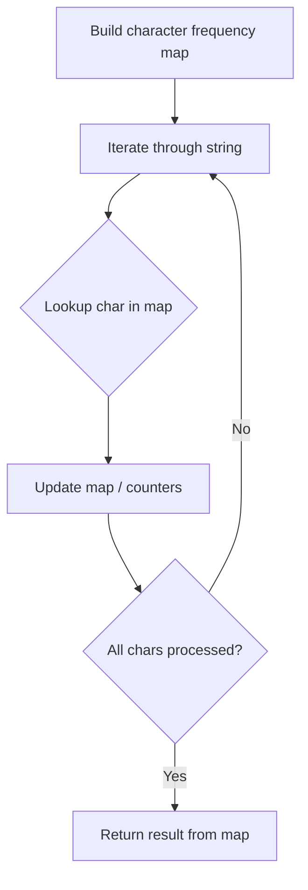

# Problem 1832: Check if the Sentence Is Pangram

**Difficulty:** Easy  
**Tags:** Hash Table, String  
**Pattern:** Hash Map String Processing  
**Link:** [leetcode.com/problems/check-if-the-sentence-is-pangram](https://leetcode.com/problems/check-if-the-sentence-is-pangram/)

## Description

A **pangram** is a sentence where every letter of the English alphabet appears at least once.

Given a string `sentence` containing only lowercase English letters, return* *`true`* if *`sentence`* is a **pangram**, or *`false`* otherwise.*

 

Example 1:

```

**Input:** sentence = "thequickbrownfoxjumpsoverthelazydog"
**Output:** true
**Explanation:** sentence contains at least one of every letter of the English alphabet.

```

Example 2:

```

**Input:** sentence = "leetcode"
**Output:** false

```

 

**Constraints:**

	- `1 <= sentence.length <= 1000`
	- `sentence` consists of lowercase English letters.

## Approach: Hash Map String Processing

Use a hash map to count character frequencies or map characters/strings for O(1) lookups. Process the string in one or two passes.

## Pseudocode

```
1. Build frequency map / char-to-index map
2. Iterate through string:
   a. Look up character in map
   b. Update counts or mappings
3. Return result based on map state
```

## Algorithm Flow



## Complexity Analysis

- **Time:** O(n)
- **Space:** O(n)

## Solution (Python3)

```python
class Solution:
    def checkIfPangram(self, sentence: str) -> bool:
        # Hash map for string/character frequency - O(n) time
        freq = {}
        for ch in sentence:
            freq[ch] = freq.get(ch, 0) + 1
        # Process frequency map
        for ch, cnt in freq.items():
            if cnt == 1:
                return sentence.index(ch)
        return False
```

## Solution (C++)

```cpp
#include <string>
#include <unordered_map>
#include <vector>
using namespace std;

class Solution {
public:
    bool checkIfPangram(string& sentence) {
        // Hash map for string/character frequency - O(n) time
        unordered_map<char, int> freq;
        for (char ch : sentence) {
            freq[ch]++;
        }
        // Process frequency map
        for (int i = 0; i < sentence.size(); i++) {
            if (freq[sentence[i]] == 1) return i;
        }
        return false;
    }
};
```
