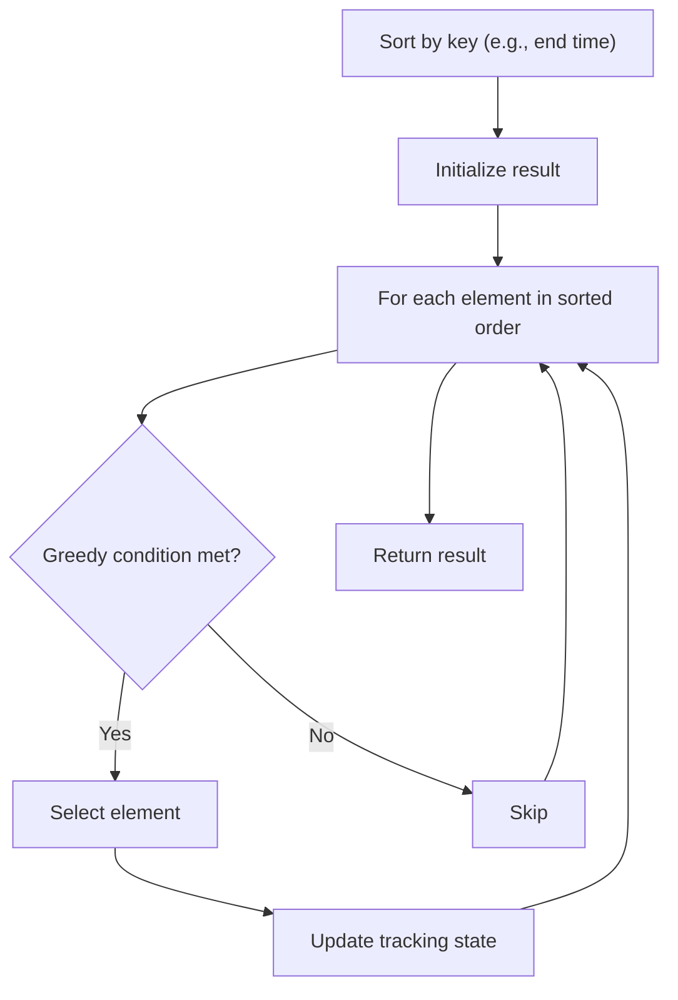

# Problem 1833: Maximum Ice Cream Bars

**Difficulty:** Medium  
**Tags:** Array, Greedy, Sorting, Counting Sort  
**Pattern:** Greedy with Sorting  
**Link:** [leetcode.com/problems/maximum-ice-cream-bars](https://leetcode.com/problems/maximum-ice-cream-bars/)

## Description

It is a sweltering summer day, and a boy wants to buy some ice cream bars.

At the store, there are `n` ice cream bars. You are given an array `costs` of length `n`, where `costs[i]` is the price of the `i^th` ice cream bar in coins. The boy initially has `coins` coins to spend, and he wants to buy as many ice cream bars as possible. 

**Note:** The boy can buy the ice cream bars in any order.

Return *the **maximum** number of ice cream bars the boy can buy with *`coins`* coins.*

You must solve the problem by counting sort.

 

Example 1:

```

**Input:** costs = [1,3,2,4,1], coins = 7
**Output:** 4
**Explanation: **The boy can buy ice cream bars at indices 0,1,2,4 for a total price of 1 + 3 + 2 + 1 = 7.

```

Example 2:

```

**Input:** costs = [10,6,8,7,7,8], coins = 5
**Output:** 0
**Explanation: **The boy cannot afford any of the ice cream bars.

```

Example 3:

```

**Input:** costs = [1,6,3,1,2,5], coins = 20
**Output:** 6
**Explanation: **The boy can buy all the ice cream bars for a total price of 1 + 6 + 3 + 1 + 2 + 5 = 18.

```

 

**Constraints:**

	- `costs.length == n`
	- `1 <= n <= 10^5`
	- `1 <= costs[i] <= 10^5`
	- `1 <= coins <= 10^8`

## Approach: Greedy with Sorting

Sort the input by a key criterion, then greedily process elements in sorted order. The sorting ensures the greedy choice is always optimal.

## Pseudocode

```
1. Sort elements by key (start time, weight, etc.)
2. Initialize result, tracking variables
3. For each element in sorted order:
   a. Apply greedy selection rule
   b. Update result
4. Return result
```

## Algorithm Flow



## Complexity Analysis

- **Time:** O(n log n)
- **Space:** O(n)

## Solution (Python3)

```python
class Solution:
    def maxIceCream(self, costs: List[int], coins: int) -> int:
        # Sort + greedy - O(n log n) time
        costs.sort()
        result = 0
        curr_end = 0
        for item in costs:
            if isinstance(item, (list, tuple)):
                if item[0] >= curr_end:
                    result += 1
                    curr_end = item[1]
            else:
                result += 1
        return result
```

## Solution (C++)

```cpp
#include <algorithm>
#include <string>
#include <vector>
using namespace std;

class Solution {
public:
    int maxIceCream(vector<int>& costs, int coins) {
        // Sort + greedy - O(n log n) time
        sort(costs.begin(), costs.end());
        int result = 0, curr_end = 0;
        for (auto& item : costs) {
            result++;
        }
        return result;
    }
};
```
