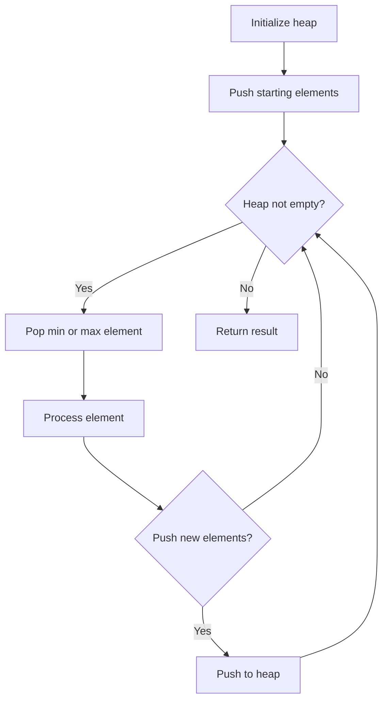
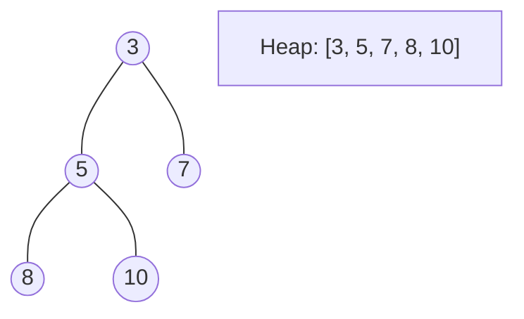
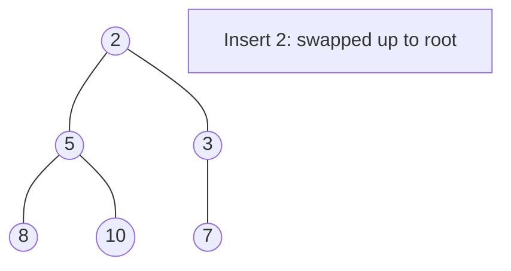
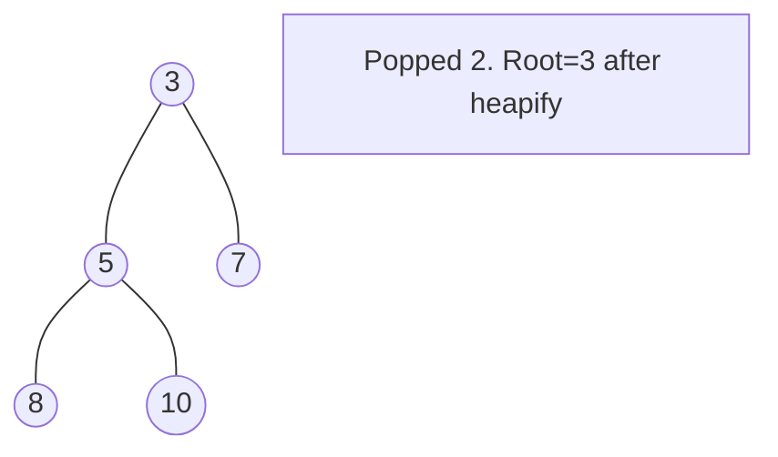

# Problem 1834: Single-Threaded CPU

**Difficulty:** Medium  
**Tags:** Array, Sorting, Heap (Priority Queue)  
**Pattern:** Heap / Priority Queue  
**Link:** [leetcode.com/problems/single-threaded-cpu](https://leetcode.com/problems/single-threaded-cpu/)

## Description

You are given `n`​​​​​​ tasks labeled from `0` to `n - 1` represented by a 2D integer array `tasks`, where `tasks[i] = [enqueueTimei, processingTimei]` means that the `i^​​​​​​th`​​​​ task will be available to process at `enqueueTimei` and will take `processingTimei` to finish processing.

You have a single-threaded CPU that can process **at most one** task at a time and will act in the following way:

	- If the CPU is idle and there are no available tasks to process, the CPU remains idle.
	- If the CPU is idle and there are available tasks, the CPU will choose the one with the **shortest processing time**. If multiple tasks have the same shortest processing time, it will choose the task with the smallest index.
	- Once a task is started, the CPU will **process the entire task** without stopping.
	- The CPU can finish a task then start a new one instantly.

Return *the order in which the CPU will process the tasks.*

 

Example 1:

```

**Input:** tasks = [[1,2],[2,4],[3,2],[4,1]]
**Output:** [0,2,3,1]
**Explanation: **The events go as follows: 
- At time = 1, task 0 is available to process. Available tasks = {0}.
- Also at time = 1, the idle CPU starts processing task 0. Available tasks = {}.
- At time = 2, task 1 is available to process. Available tasks = {1}.
- At time = 3, task 2 is available to process. Available tasks = {1, 2}.
- Also at time = 3, the CPU finishes task 0 and starts processing task 2 as it is the shortest. Available tasks = {1}.
- At time = 4, task 3 is available to process. Available tasks = {1, 3}.
- At time = 5, the CPU finishes task 2 and starts processing task 3 as it is the shortest. Available tasks = {1}.
- At time = 6, the CPU finishes task 3 and starts processing task 1. Available tasks = {}.
- At time = 10, the CPU finishes task 1 and becomes idle.

```

Example 2:

```

**Input:** tasks = [[7,10],[7,12],[7,5],[7,4],[7,2]]
**Output:** [4,3,2,0,1]
**Explanation****: **The events go as follows:
- At time = 7, all the tasks become available. Available tasks = {0,1,2,3,4}.
- Also at time = 7, the idle CPU starts processing task 4. Available tasks = {0,1,2,3}.
- At time = 9, the CPU finishes task 4 and starts processing task 3. Available tasks = {0,1,2}.
- At time = 13, the CPU finishes task 3 and starts processing task 2. Available tasks = {0,1}.
- At time = 18, the CPU finishes task 2 and starts processing task 0. Available tasks = {1}.
- At time = 28, the CPU finishes task 0 and starts processing task 1. Available tasks = {}.
- At time = 40, the CPU finishes task 1 and becomes idle.

```

 

**Constraints:**

	- `tasks.length == n`
	- `1 <= n <= 10^5`
	- `1 <= enqueueTimei, processingTimei <= 10^9`

## Approach: Heap / Priority Queue

Use a min-heap or max-heap to efficiently access the smallest/largest element. Push elements and pop the top to process in priority order.

## Pseudocode

```
1. Initialize heap (min or max)
2. Push initial elements onto heap
3. While heap not empty and condition:
   a. Pop top element (min or max)
   b. Process element
   c. Push new elements if needed
4. Return result
```

## Algorithm Flow



## Visual State Transitions

**Heap Operations (Min-Heap):**

**Frame 1: Initial heap**


**Frame 2: Insert 2 - bubble up**


**Frame 3: Pop minimum (2) - heapify down**



## Complexity Analysis

- **Time:** O(n log n)
- **Space:** O(n)

## Solution (Python3)

```python
class Solution:
    def getOrder(self, tasks: List[List[int]]) -> List[int]:
        # Heap/Priority Queue - O(n log k) time
        import heapq
        if not tasks:
            return []
        # Min heap (negate for max heap)
        heap = []
        for val in tasks:
            heapq.heappush(heap, val)
            if len(heap) > (tasks if isinstance(tasks, int) else len(tasks)):
                heapq.heappop(heap)
        return heap[0] if heap else []
```

## Solution (C++)

```cpp
#include <queue>
#include <string>
#include <vector>
using namespace std;

class Solution {
public:
    vector<int> getOrder(vector<vector<int>>& tasks) {
        // Heap/Priority Queue - O(n log k) time
        priority_queue<int, vector<int>, greater<int>> pq;
        for (int val : tasks) {
            pq.push(val);
            if ((int)pq.size() > tasks)
                pq.pop();
        }
        return pq.empty() ? {} : pq.top();
    }
};
```
