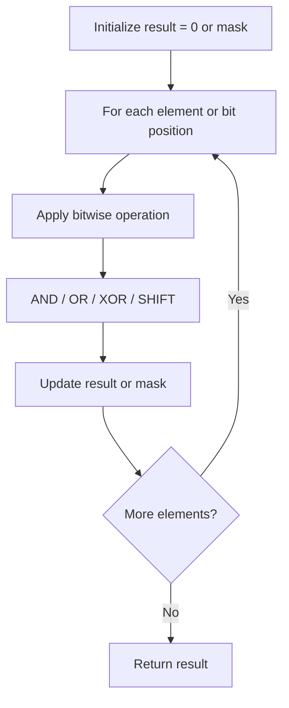

# Problem 1835: Find XOR Sum of All Pairs Bitwise AND

**Difficulty:** Hard  
**Tags:** Array, Math, Bit Manipulation  
**Pattern:** Bit Manipulation  
**Link:** [leetcode.com/problems/find-xor-sum-of-all-pairs-bitwise-and](https://leetcode.com/problems/find-xor-sum-of-all-pairs-bitwise-and/)

## Description

The **XOR sum** of a list is the bitwise `XOR` of all its elements. If the list only contains one element, then its **XOR sum** will be equal to this element.

	- For example, the **XOR sum** of `[1,2,3,4]` is equal to `1 XOR 2 XOR 3 XOR 4 = 4`, and the **XOR sum** of `[3]` is equal to `3`.

You are given two **0-indexed** arrays `arr1` and `arr2` that consist only of non-negative integers.

Consider the list containing the result of `arr1[i] AND arr2[j]` (bitwise `AND`) for every `(i, j)` pair where `0 <= i < arr1.length` and `0 <= j < arr2.length`.

Return *the **XOR sum** of the aforementioned list*.

 

Example 1:

```

**Input:** arr1 = [1,2,3], arr2 = [6,5]
**Output:** 0
**Explanation:** The list = [1 AND 6, 1 AND 5, 2 AND 6, 2 AND 5, 3 AND 6, 3 AND 5] = [0,1,2,0,2,1].
The XOR sum = 0 XOR 1 XOR 2 XOR 0 XOR 2 XOR 1 = 0.

```

Example 2:

```

**Input:** arr1 = [12], arr2 = [4]
**Output:** 4
**Explanation:** The list = [12 AND 4] = [4]. The XOR sum = 4.

```

 

**Constraints:**

	- `1 <= arr1.length, arr2.length <= 10^5`
	- `0 <= arr1[i], arr2[j] <= 10^9`

## Approach: Bit Manipulation

Operate on individual bits using bitwise operators (AND, OR, XOR, shift). Common tricks: x & (x-1) removes lowest set bit, x ^ x = 0, XOR all elements to find unique.

## Pseudocode

```
1. Apply bitwise operations:
   - XOR all elements to cancel paired bits
   - Use bitmask to track state
   - Shift and mask to extract/set individual bits
2. Return result
```

## Algorithm Flow



## Complexity Analysis

- **Time:** O(n) or O(log n)
- **Space:** O(1)

## Solution (Python3)

```python
class Solution:
    def getXORSum(self, arr1: List[int], arr2: List[int]) -> int:
        # Bit manipulation - O(n) time, O(1) space
        result = 0
        for val in arr1:
            result ^= val
        return result
```

## Solution (C++)

```cpp
#include <string>
#include <vector>
using namespace std;

class Solution {
public:
    int getXORSum(vector<int>& arr1, vector<int>& arr2) {
        // Bit manipulation - O(n) time, O(1) space
        int result = 0;
        for (int val : arr1) {
            result ^= val;
        }
        return result;
    }
};
```
