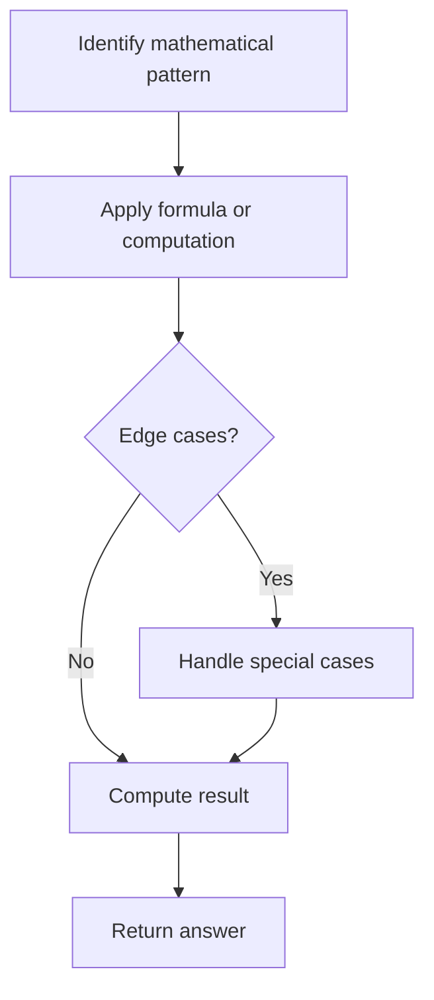

# Problem 1837: Sum of Digits in Base K

**Difficulty:** Easy  
**Tags:** Math  
**Pattern:** Math  
**Link:** [leetcode.com/problems/sum-of-digits-in-base-k](https://leetcode.com/problems/sum-of-digits-in-base-k/)

## Description

Given an integer `n` (in base `10`) and a base `k`, return *the **sum** of the digits of *`n`* **after** converting *`n`* from base *`10`* to base *`k`.

After converting, each digit should be interpreted as a base `10` number, and the sum should be returned in base `10`.

 

Example 1:

```

**Input:** n = 34, k = 6
**Output:** 9
**Explanation: **34 (base 10) expressed in base 6 is 54. 5 + 4 = 9.

```

Example 2:

```

**Input:** n = 10, k = 10
**Output:** 1
**Explanation: **n is already in base 10. 1 + 0 = 1.

```

 

**Constraints:**

	- `1 <= n <= 100`
	- `2 <= k <= 10`

## Approach: Math

Apply mathematical properties, formulas, or number-theoretic concepts. Look for patterns, modular arithmetic, or closed-form solutions.

## Pseudocode

```
1. Identify the mathematical pattern or formula
2. Apply computation:
   - Modular arithmetic for large numbers
   - GCD/LCM for divisibility
   - Sieve for primes
3. Handle edge cases
4. Return result
```

## Algorithm Flow



## Complexity Analysis

- **Time:** O(n) or O(sqrt(n))
- **Space:** O(1)

## Solution (Python3)

```python
class Solution:
    def sumBase(self, n: int, k: int) -> int:
        # Mathematical approach
        result = 0
        x = n
        while x != 0:
            result = result * 10 + x % 10
            x //= 10 if isinstance(x, int) else 1
        return result
```

## Solution (C++)

```cpp
#include <string>
#include <vector>
using namespace std;

class Solution {
public:
    int sumBase(int n, int k) {
        // Mathematical approach
        long long result = 0;
        int x = n;
        while (x != 0) {
            result = result * 10 + x % 10;
            x /= 10;
        }
        return (int)result;
    }
};
```
