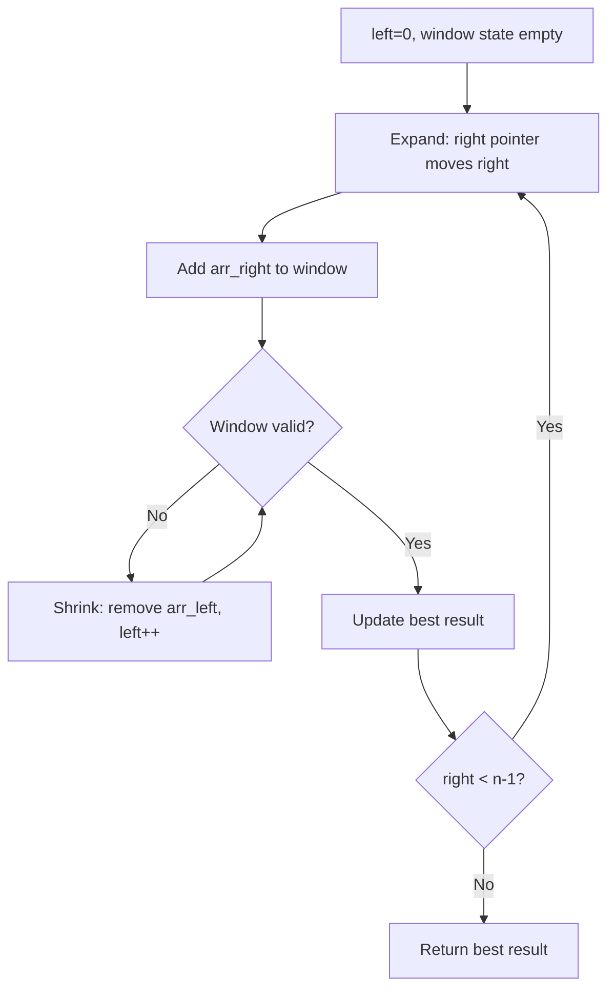
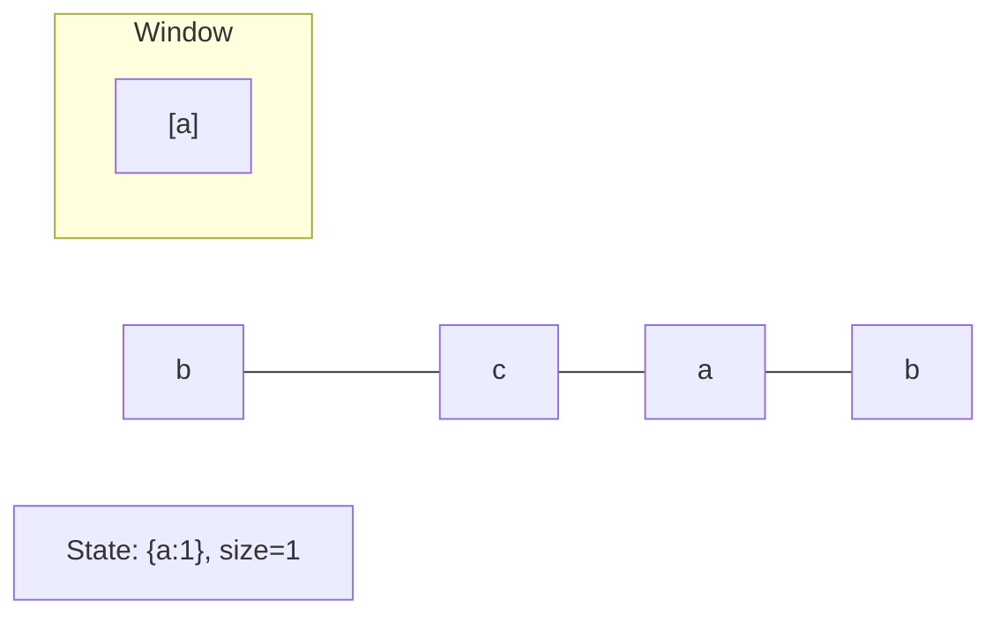
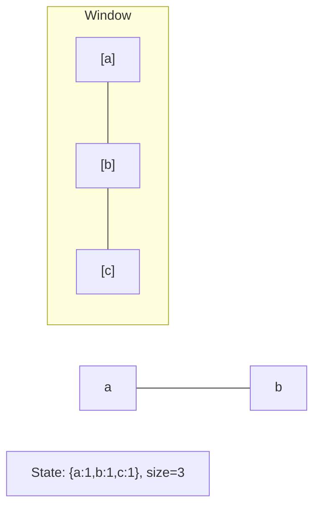
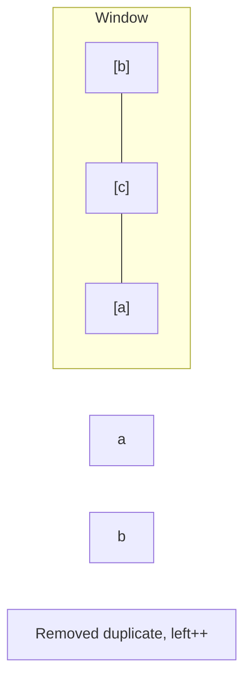
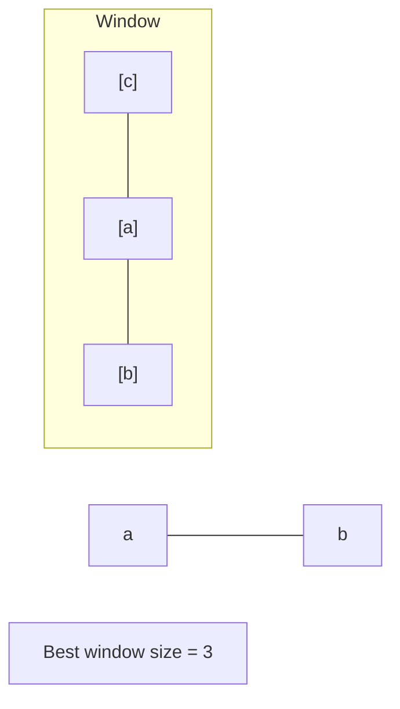

# Problem 1838: Frequency of the Most Frequent Element

**Difficulty:** Medium  
**Tags:** Array, Binary Search, Greedy, Sliding Window, Sorting, Prefix Sum  
**Pattern:** Sliding Window  
**Link:** [leetcode.com/problems/frequency-of-the-most-frequent-element](https://leetcode.com/problems/frequency-of-the-most-frequent-element/)

## Description

The **frequency** of an element is the number of times it occurs in an array.

You are given an integer array `nums` and an integer `k`. In one operation, you can choose an index of `nums` and increment the element at that index by `1`.

Return *the **maximum possible frequency** of an element after performing **at most** *`k`* operations*.

 

Example 1:

```

**Input:** nums = [1,2,4], k = 5
**Output:** 3
Explanation: Increment the first element three times and the second element two times to make nums = [4,4,4].
4 has a frequency of 3.
```

Example 2:

```

**Input:** nums = [1,4,8,13], k = 5
**Output:** 2
**Explanation:** There are multiple optimal solutions:
- Increment the first element three times to make nums = [4,4,8,13]. 4 has a frequency of 2.
- Increment the second element four times to make nums = [1,8,8,13]. 8 has a frequency of 2.
- Increment the third element five times to make nums = [1,4,13,13]. 13 has a frequency of 2.

```

Example 3:

```

**Input:** nums = [3,9,6], k = 2
**Output:** 1

```

 

**Constraints:**

	- `1 <= nums.length <= 10^5`
	- `1 <= nums[i] <= 10^5`
	- `1 <= k <= 10^5`

## Approach: Sliding Window

Maintain a window over the data using two pointers. Expand the right boundary to include new elements, and shrink the left boundary when the window constraint is violated. Track the optimal window.

## Pseudocode

```
1. Initialize left = 0, result = initial_value
2. For right in range(n):
   a. Add element at right to window state
   b. While window is invalid:
      - Remove element at left from window state
      - left++
   c. Update result = best of (result, window size/value)
3. Return result
```

## Algorithm Flow



## Visual State Transitions

**Sliding Window Step-by-Step:**

**Frame 1: Initial window (left=0, right=0)**


**Frame 2: Expand right (right=2)**


**Frame 3: Violation - shrink left**


**Frame 4: Continue expanding**



## Complexity Analysis

- **Time:** O(n)
- **Space:** O(k)

## Solution (Python3)

```python
class Solution:
    def maxFrequency(self, nums: List[int], k: int) -> int:
        # Sliding window approach - O(n) time, O(k) space
        from collections import defaultdict
        window = defaultdict(int)
        left = 0
        result = 0
        for right in range(len(nums)):
            window[nums[right]] += 1
            while len(window) > (k if isinstance(k, int) else len(nums)):
                window[nums[left]] -= 1
                if window[nums[left]] == 0:
                    del window[nums[left]]
                left += 1
            result = max(result, right - left + 1)
        return result
```

## Solution (C++)

```cpp
#include <algorithm>
#include <string>
#include <unordered_map>
#include <vector>
using namespace std;

class Solution {
public:
    int maxFrequency(vector<int>& nums, int k) {
        // Sliding window approach - O(n) time, O(k) space
        unordered_map<char, int> window;
        int left = 0, result = 0;
        for (int right = 0; right < nums.size(); right++) {
            window[nums[right]]++;
            while ((int)window.size() > k) {
                window[nums[left]]--;
                if (window[nums[left]] == 0)
                    window.erase(nums[left]);
                left++;
            }
            result = max(result, right - left + 1);
        }
        return result;
    }
};
```
