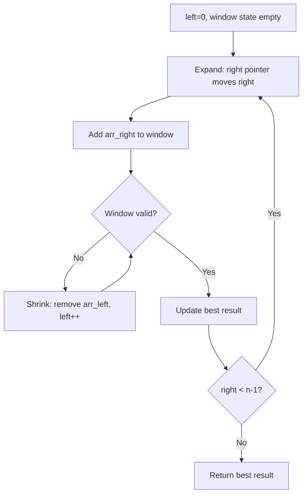
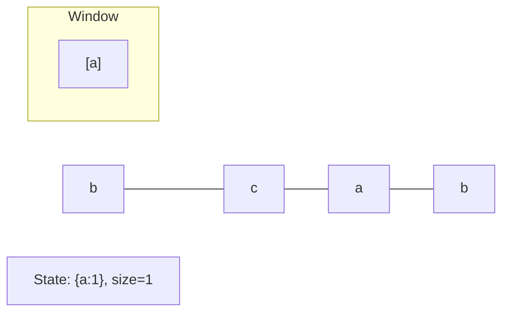
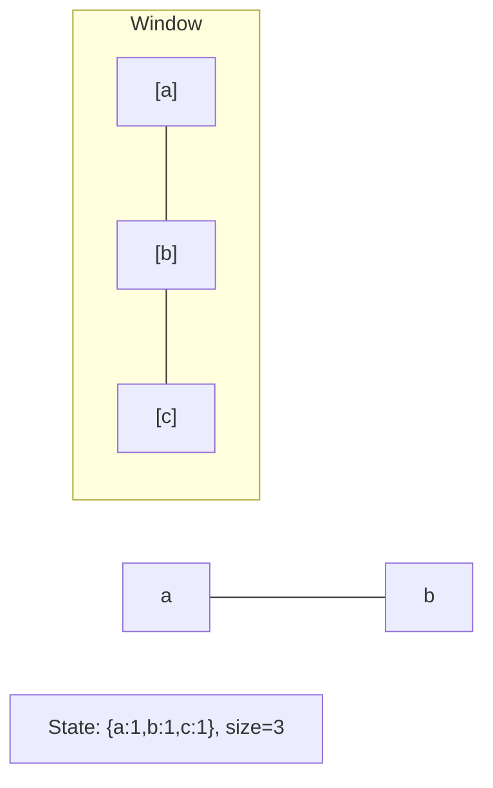
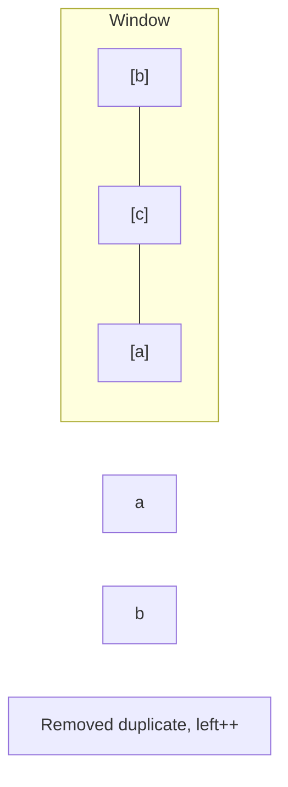
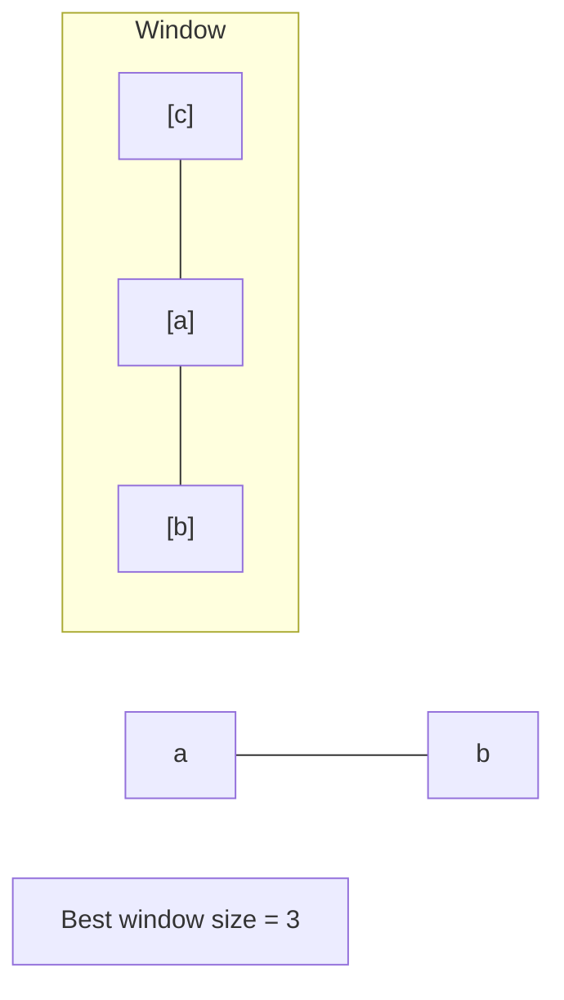

# Problem 1839: Longest Substring Of All Vowels in Order

**Difficulty:** Medium  
**Tags:** String, Sliding Window  
**Pattern:** Sliding Window  
**Link:** [leetcode.com/problems/longest-substring-of-all-vowels-in-order](https://leetcode.com/problems/longest-substring-of-all-vowels-in-order/)

## Description

A string is considered **beautiful** if it satisfies the following conditions:

	- Each of the 5 English vowels (`'a'`, `'e'`, `'i'`, `'o'`, `'u'`) must appear **at least once** in it.
	- The letters must be sorted in **alphabetical order** (i.e. all `'a'`s before `'e'`s, all `'e'`s before `'i'`s, etc.).

For example, strings `"aeiou"` and `"aaaaaaeiiiioou"` are considered **beautiful**, but `"uaeio"`, `"aeoiu"`, and `"aaaeeeooo"` are **not beautiful**.

Given a string `word` consisting of English vowels, return *the **length of the longest beautiful substring** of *`word`*. If no such substring exists, return *`0`.

A **substring** is a contiguous sequence of characters in a string.

 

Example 1:

```

**Input:** word = "aeiaaioaaaaeiiiiouuuooaauuaeiu"
**Output:** 13
**Explanation:** The longest beautiful substring in word is "aaaaeiiiiouuu" of length 13.
```

Example 2:

```

**Input:** word = "aeeeiiiioooauuuaeiou"
**Output:** 5
**Explanation:** The longest beautiful substring in word is "aeiou" of length 5.

```

Example 3:

```

**Input:** word = "a"
**Output:** 0
**Explanation:** There is no beautiful substring, so return 0.

```

 

**Constraints:**

	- `1 <= word.length <= 5 * 10^5`
	- `word` consists of characters `'a'`, `'e'`, `'i'`, `'o'`, and `'u'`.

## Approach: Sliding Window

Maintain a window over the data using two pointers. Expand the right boundary to include new elements, and shrink the left boundary when the window constraint is violated. Track the optimal window.

## Pseudocode

```
1. Initialize left = 0, result = initial_value
2. For right in range(n):
   a. Add element at right to window state
   b. While window is invalid:
      - Remove element at left from window state
      - left++
   c. Update result = best of (result, window size/value)
3. Return result
```

## Algorithm Flow



## Visual State Transitions

**Sliding Window Step-by-Step:**

**Frame 1: Initial window (left=0, right=0)**


**Frame 2: Expand right (right=2)**


**Frame 3: Violation - shrink left**


**Frame 4: Continue expanding**



## Complexity Analysis

- **Time:** O(n)
- **Space:** O(k)

## Solution (Python3)

```python
class Solution:
    def longestBeautifulSubstring(self, word: str) -> int:
        # Sliding window approach - O(n) time, O(k) space
        from collections import defaultdict
        window = defaultdict(int)
        left = 0
        result = 0
        for right in range(len(word)):
            window[word[right]] += 1
            while len(window) > (word if isinstance(word, int) else len(word)):
                window[word[left]] -= 1
                if window[word[left]] == 0:
                    del window[word[left]]
                left += 1
            result = max(result, right - left + 1)
        return result
```

## Solution (C++)

```cpp
#include <algorithm>
#include <string>
#include <unordered_map>
#include <vector>
using namespace std;

class Solution {
public:
    int longestBeautifulSubstring(string& word) {
        // Sliding window approach - O(n) time, O(k) space
        unordered_map<char, int> window;
        int left = 0, result = 0;
        for (int right = 0; right < word.size(); right++) {
            window[word[right]]++;
            while ((int)window.size() > word) {
                window[word[left]]--;
                if (window[word[left]] == 0)
                    window.erase(word[left]);
                left++;
            }
            result = max(result, right - left + 1);
        }
        return result;
    }
};
```
