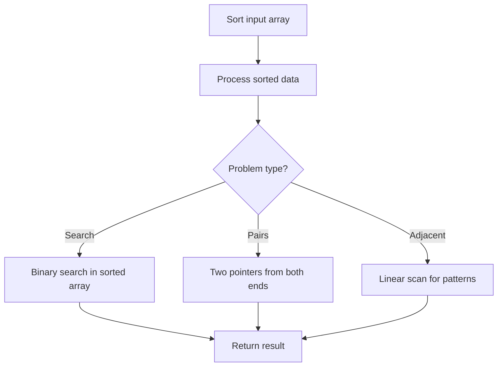

# Problem 1840: Maximum Building Height

**Difficulty:** Hard  
**Tags:** Array, Math, Sorting  
**Pattern:** Sorting  
**Link:** [leetcode.com/problems/maximum-building-height](https://leetcode.com/problems/maximum-building-height/)

## Description

You want to build `n` new buildings in a city. The new buildings will be built in a line and are labeled from `1` to `n`.

However, there are city restrictions on the heights of the new buildings:

	- The height of each building must be a non-negative integer.
	- The height of the first building **must** be `0`.
	- The height difference between any two adjacent buildings **cannot exceed** `1`.

Additionally, there are city restrictions on the maximum height of specific buildings. These restrictions are given as a 2D integer array `restrictions` where `restrictions[i] = [idi, maxHeighti]` indicates that building `idi` must have a height **less than or equal to** `maxHeighti`.

It is guaranteed that each building will appear **at most once** in `restrictions`, and building `1` will **not** be in `restrictions`.

Return *the **maximum possible height** of the **tallest** building*.

 

Example 1:

```

**Input:** n = 5, restrictions = [[2,1],[4,1]]
**Output:** 2
**Explanation:** The green area in the image indicates the maximum allowed height for each building.
We can build the buildings with heights [0,1,2,1,2], and the tallest building has a height of 2.
```

Example 2:

```

**Input:** n = 6, restrictions = []
**Output:** 5
**Explanation:** The green area in the image indicates the maximum allowed height for each building.
We can build the buildings with heights [0,1,2,3,4,5], and the tallest building has a height of 5.

```

Example 3:

```

**Input:** n = 10, restrictions = [[5,3],[2,5],[7,4],[10,3]]
**Output:** 5
**Explanation:** The green area in the image indicates the maximum allowed height for each building.
We can build the buildings with heights [0,1,2,3,3,4,4,5,4,3], and the tallest building has a height of 5.

```

 

**Constraints:**

	- `2 <= n <= 10^9`
	- `0 <= restrictions.length <= min(n - 1, 10^5)`
	- `2 <= idi <= n`
	- `idi` is **unique**.
	- `0 <= maxHeighti <= 10^9`

## Approach: Sorting

Sort the data to enable efficient processing. After sorting, use techniques like binary search, two pointers, or linear scan to solve the problem.

## Pseudocode

```
1. Sort the input array
2. Process sorted data:
   - Use binary search for lookups
   - Use two pointers for pair finding
   - Scan for adjacent patterns
3. Return result
```

## Algorithm Flow



## Complexity Analysis

- **Time:** O(n log n)
- **Space:** O(n)

## Solution (Python3)

```python
class Solution:
    def maxBuilding(self, n: int, restrictions: List[List[int]]) -> int:
        # Sort-based approach - O(n log n) time
        n.sort(key=lambda x: x[0] if isinstance(x, (list, tuple)) else x)
        result = [n[0]]
        for i in range(1, len(n)):
            curr = n[i]
            if isinstance(curr, (list, tuple)) and isinstance(result[-1], (list, tuple)):
                if curr[0] <= result[-1][1]:
                    result[-1] = [result[-1][0], max(result[-1][1], curr[1])]
                else:
                    result.append(curr)
            else:
                result.append(curr)
        return result
```

## Solution (C++)

```cpp
#include <algorithm>
#include <string>
#include <vector>
using namespace std;

class Solution {
public:
    int maxBuilding(int n, vector<vector<int>>& restrictions) {
        // Sort-based approach - O(n log n) time
        sort(n.begin(), n.end());
        vector<vector<int>> result;
        result.push_back(n[0]);
        for (int i = 1; i < (int)n.size(); i++) {
            if (n[i][0] <= result.back()[1]) {
                result.back()[1] = max(result.back()[1], n[i][1]);
            } else {
                result.push_back(n[i]);
            }
        }
        return result;
    }
};
```
