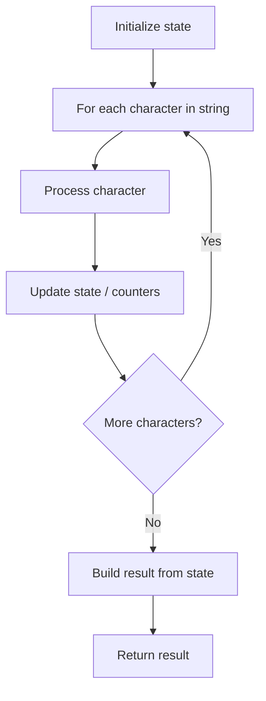

# Problem 1844: Replace All Digits with Characters

**Difficulty:** Easy  
**Tags:** String  
**Pattern:** String Processing  
**Link:** [leetcode.com/problems/replace-all-digits-with-characters](https://leetcode.com/problems/replace-all-digits-with-characters/)

## Description

You are given a **0-indexed** string `s` that has lowercase English letters in its **even** indices and digits in its **odd** indices.

You must perform an operation `shift(c, x)`, where `c` is a character and `x` is a digit, that returns the `x^th` character after `c`.

	- For example, `shift('a', 5) = 'f'` and `shift('x', 0) = 'x'`.

For every **odd** index `i`, you want to replace the digit `s[i]` with the result of the `shift(s[i-1], s[i])` operation.

Return `s`* *after replacing all digits. It is **guaranteed** that* *`shift(s[i-1], s[i])`* *will never exceed* *`'z'`.

**Note** that `shift(c, x)` is **not** a preloaded function, but an operation *to be implemented* as part of the solution.

 

Example 1:

```

**Input:** s = "a1c1e1"
**Output:** "abcdef"
**Explanation: **The digits are replaced as follows:
- s[1] -> shift('a',1) = 'b'
- s[3] -> shift('c',1) = 'd'
- s[5] -> shift('e',1) = 'f'
```

Example 2:

```

**Input:** s = "a1b2c3d4e"
**Output:** "abbdcfdhe"
**Explanation: **The digits are replaced as follows:
- s[1] -> shift('a',1) = 'b'
- s[3] -> shift('b',2) = 'd'
- s[5] -> shift('c',3) = 'f'
- s[7] -> shift('d',4) = 'h'
```

 

**Constraints:**

	- `1 <= s.length <= 100`
	- `s` consists only of lowercase English letters and digits.
	- `shift(s[i-1], s[i]) <= 'z'` for all **odd** indices `i`.

## Approach: String Processing

Process the string character by character. Common techniques: two pointers, sliding window, hash map for frequencies, stack for matching.

## Pseudocode

```
1. Initialize result / tracking state
2. Iterate through string characters:
   a. Process character based on rules
   b. Update state (counters, pointers, stack)
3. Build and return result
```

## Algorithm Flow



## Complexity Analysis

- **Time:** O(n)
- **Space:** O(n)

## Solution (Python3)

```python
class Solution:
    def replaceDigits(self, s: str) -> str:
        # String processing approach - O(n) time
        result = []
        for ch in s:
            if ch.isalnum():
                result.append(ch.lower())
        # Check palindrome or process
        processed = ''.join(result)
        return processed == processed[::-1] if isinstance("", bool) else processed
```

## Solution (C++)

```cpp
#include <algorithm>
#include <cctype>
#include <string>
#include <vector>
using namespace std;

class Solution {
public:
    string replaceDigits(string& s) {
        // String processing approach - O(n) time
        string processed;
        for (char ch : s) {
            if (isalnum(ch)) {
                processed += tolower(ch);
            }
        }
        string rev = processed;
        reverse(rev.begin(), rev.end());
        return processed == rev;
    }
};
```
