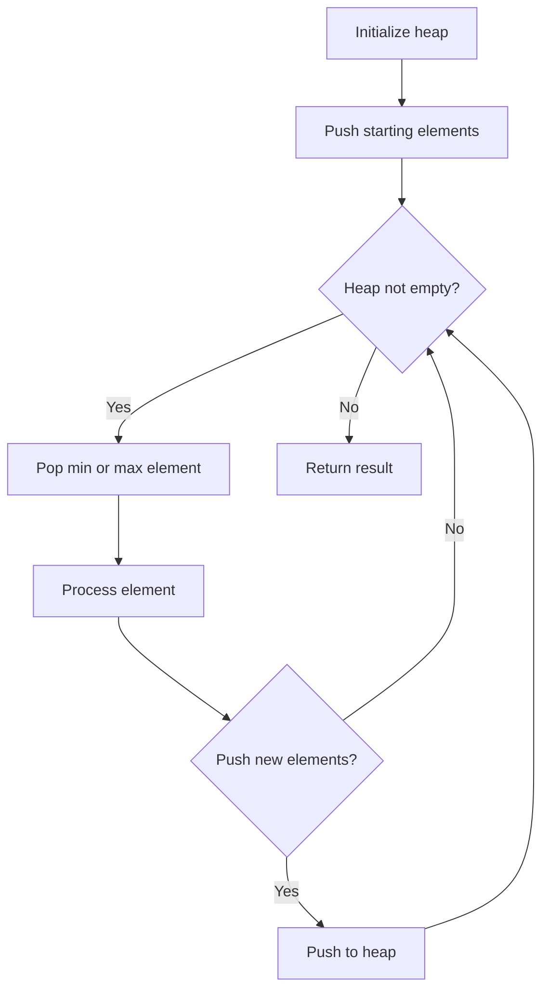
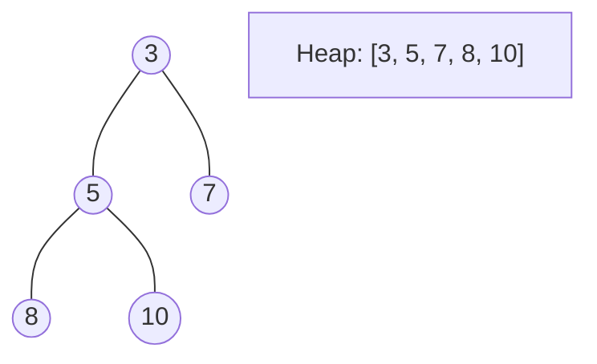
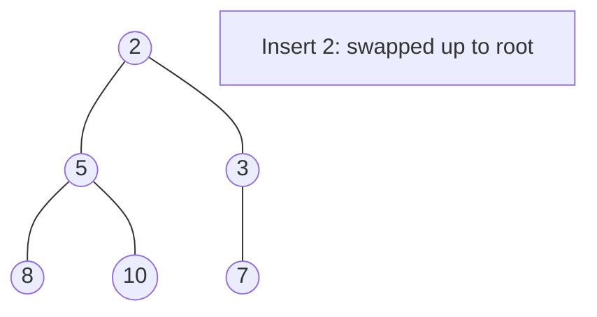
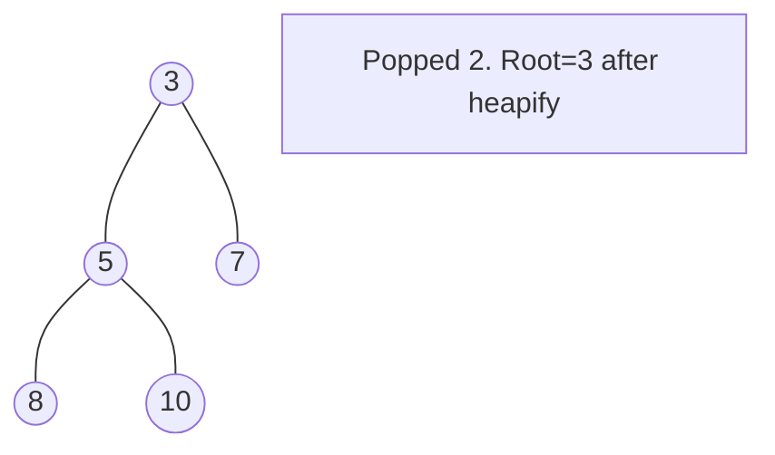

# Problem 1845: Seat Reservation Manager

**Difficulty:** Medium  
**Tags:** Design, Heap (Priority Queue)  
**Pattern:** Heap / Priority Queue  
**Link:** [leetcode.com/problems/seat-reservation-manager](https://leetcode.com/problems/seat-reservation-manager/)

## Description

Design a system that manages the reservation state of `n` seats that are numbered from `1` to `n`.

Implement the `SeatManager` class:

	- `SeatManager(int n)` Initializes a `SeatManager` object that will manage `n` seats numbered from `1` to `n`. All seats are initially available.
	- `int reserve()` Fetches the **smallest-numbered** unreserved seat, reserves it, and returns its number.
	- `void unreserve(int seatNumber)` Unreserves the seat with the given `seatNumber`.

 

Example 1:

```

**Input**
["SeatManager", "reserve", "reserve", "unreserve", "reserve", "reserve", "reserve", "reserve", "unreserve"]
[[5], [], [], [2], [], [], [], [], [5]]
**Output**
[null, 1, 2, null, 2, 3, 4, 5, null]

**Explanation**
SeatManager seatManager = new SeatManager(5); // Initializes a SeatManager with 5 seats.
seatManager.reserve();    // All seats are available, so return the lowest numbered seat, which is 1.
seatManager.reserve();    // The available seats are [2,3,4,5], so return the lowest of them, which is 2.
seatManager.unreserve(2); // Unreserve seat 2, so now the available seats are [2,3,4,5].
seatManager.reserve();    // The available seats are [2,3,4,5], so return the lowest of them, which is 2.
seatManager.reserve();    // The available seats are [3,4,5], so return the lowest of them, which is 3.
seatManager.reserve();    // The available seats are [4,5], so return the lowest of them, which is 4.
seatManager.reserve();    // The only available seat is seat 5, so return 5.
seatManager.unreserve(5); // Unreserve seat 5, so now the available seats are [5].

```

 

**Constraints:**

	- `1 <= n <= 10^5`
	- `1 <= seatNumber <= n`
	- For each call to `reserve`, it is guaranteed that there will be at least one unreserved seat.
	- For each call to `unreserve`, it is guaranteed that `seatNumber` will be reserved.
	- At most `10^5` calls **in total** will be made to `reserve` and `unreserve`.

## Approach: Heap / Priority Queue

Use a min-heap or max-heap to efficiently access the smallest/largest element. Push elements and pop the top to process in priority order.

## Pseudocode

```
1. Initialize heap (min or max)
2. Push initial elements onto heap
3. While heap not empty and condition:
   a. Pop top element (min or max)
   b. Process element
   c. Push new elements if needed
4. Return result
```

## Algorithm Flow



## Visual State Transitions

**Heap Operations (Min-Heap):**

**Frame 1: Initial heap**


**Frame 2: Insert 2 - bubble up**


**Frame 3: Pop minimum (2) - heapify down**



## Complexity Analysis

- **Time:** O(n log n)
- **Space:** O(n)

## Solution (Python3)

```python
class SeatManager:
    def __init__(self, n: int):
        # Initialize data structure
        self.n = n

    def reserve(self) -> int:
        return 0

    def unreserve(self, seatNumber: int) -> None:
        return None

```

## Solution (C++)

```cpp
#include <queue>
#include <string>
#include <vector>
using namespace std;

class SeatManager {
public:
    SeatManager(int n) {
        // Initialize
    }

    int reserve() {
        return 0;
    }

    void unreserve(int seatNumber) {
        return ;
    }

};
```
