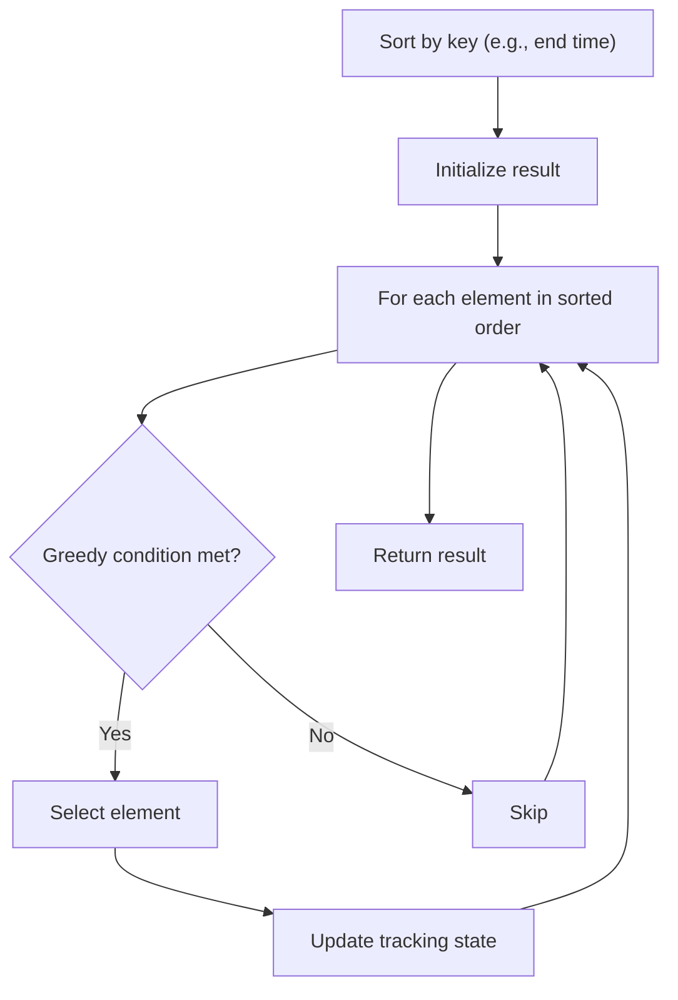

# Problem 1846: Maximum Element After Decreasing and Rearranging

**Difficulty:** Medium  
**Tags:** Array, Greedy, Sorting  
**Pattern:** Greedy with Sorting  
**Link:** [leetcode.com/problems/maximum-element-after-decreasing-and-rearranging](https://leetcode.com/problems/maximum-element-after-decreasing-and-rearranging/)

## Description

You are given an array of positive integers `arr`. Perform some operations (possibly none) on `arr` so that it satisfies these conditions:

	- The value of the **first** element in `arr` must be `1`.
	- The absolute difference between any 2 adjacent elements must be **less than or equal to **`1`. In other words, `abs(arr[i] - arr[i - 1]) <= 1` for each `i` where `1 <= i < arr.length` (**0-indexed**). `abs(x)` is the absolute value of `x`.

There are 2 types of operations that you can perform any number of times:

	- **Decrease** the value of any element of `arr` to a **smaller positive integer**.
	- **Rearrange** the elements of `arr` to be in any order.

Return *the **maximum** possible value of an element in *`arr`* after performing the operations to satisfy the conditions*.

 

Example 1:

```

**Input:** arr = [2,2,1,2,1]
**Output:** 2
**Explanation:** 
We can satisfy the conditions by rearranging `arr` so it becomes `[1,2,2,2,1]`.
The largest element in `arr` is 2.

```

Example 2:

```

**Input:** arr = [100,1,1000]
**Output:** 3
**Explanation:** 
One possible way to satisfy the conditions is by doing the following:
1. Rearrange `arr` so it becomes `[1,100,1000]`.
2. Decrease the value of the second element to 2.
3. Decrease the value of the third element to 3.
Now `arr = [1,2,3]`, which` `satisfies the conditions.
The largest element in `arr is 3.`

```

Example 3:

```

**Input:** arr = [1,2,3,4,5]
**Output:** 5
**Explanation:** The array already satisfies the conditions, and the largest element is 5.

```

 

**Constraints:**

	- `1 <= arr.length <= 10^5`
	- `1 <= arr[i] <= 10^9`

## Approach: Greedy with Sorting

Sort the input by a key criterion, then greedily process elements in sorted order. The sorting ensures the greedy choice is always optimal.

## Pseudocode

```
1. Sort elements by key (start time, weight, etc.)
2. Initialize result, tracking variables
3. For each element in sorted order:
   a. Apply greedy selection rule
   b. Update result
4. Return result
```

## Algorithm Flow



## Complexity Analysis

- **Time:** O(n log n)
- **Space:** O(n)

## Solution (Python3)

```python
class Solution:
    def maximumElementAfterDecrementingAndRearranging(self, arr: List[int]) -> int:
        # Sort + greedy - O(n log n) time
        arr.sort()
        result = 0
        curr_end = 0
        for item in arr:
            if isinstance(item, (list, tuple)):
                if item[0] >= curr_end:
                    result += 1
                    curr_end = item[1]
            else:
                result += 1
        return result
```

## Solution (C++)

```cpp
#include <algorithm>
#include <string>
#include <vector>
using namespace std;

class Solution {
public:
    int maximumElementAfterDecrementingAndRearranging(vector<int>& arr) {
        // Sort + greedy - O(n log n) time
        sort(arr.begin(), arr.end());
        int result = 0, curr_end = 0;
        for (auto& item : arr) {
            result++;
        }
        return result;
    }
};
```
