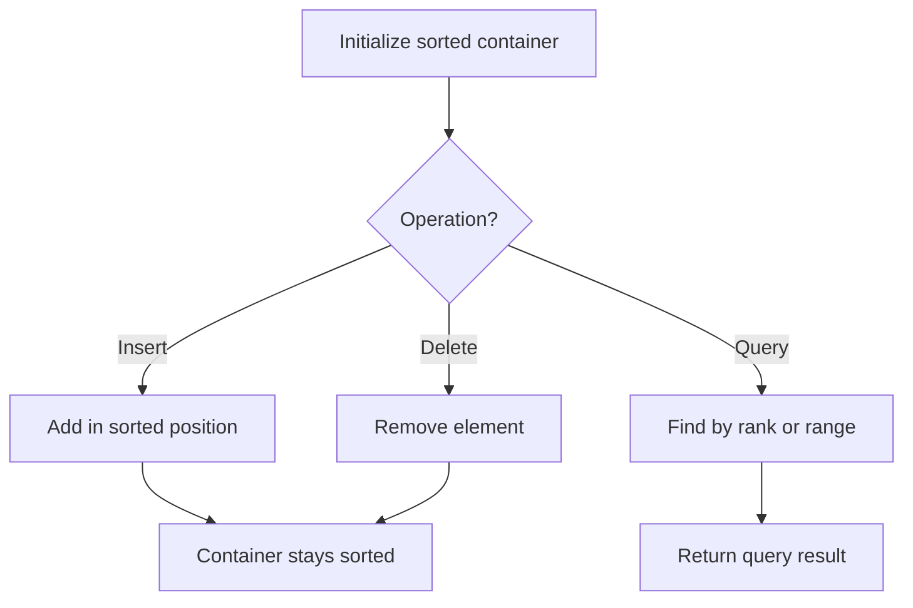

# Problem 1847: Closest Room

**Difficulty:** Hard  
**Tags:** Array, Binary Search, Sorting, Ordered Set  
**Pattern:** Ordered Set / SortedList  
**Link:** [leetcode.com/problems/closest-room](https://leetcode.com/problems/closest-room/)

## Description

There is a hotel with `n` rooms. The rooms are represented by a 2D integer array `rooms` where `rooms[i] = [roomIdi, sizei]` denotes that there is a room with room number `roomIdi` and size equal to `sizei`. Each `roomIdi` is guaranteed to be **unique**.

You are also given `k` queries in a 2D array `queries` where `queries[j] = [preferredj, minSizej]`. The answer to the `j^th` query is the room number `id` of a room such that:

	- The room has a size of **at least** `minSizej`, and
	- `abs(id - preferredj)` is **minimized**, where `abs(x)` is the absolute value of `x`.

If there is a **tie** in the absolute difference, then use the room with the **smallest** such `id`. If there is **no such room**, the answer is `-1`.

Return *an array *`answer`* of length *`k`* where *`answer[j]`* contains the answer to the *`j^th`* query*.

 

Example 1:

```

**Input:** rooms = [[2,2],[1,2],[3,2]], queries = [[3,1],[3,3],[5,2]]
**Output:** [3,-1,3]
**Explanation: **The answers to the queries are as follows:
Query = [3,1]: Room number 3 is the closest as abs(3 - 3) = 0, and its size of 2 is at least 1. The answer is 3.
Query = [3,3]: There are no rooms with a size of at least 3, so the answer is -1.
Query = [5,2]: Room number 3 is the closest as abs(3 - 5) = 2, and its size of 2 is at least 2. The answer is 3.
```

Example 2:

```

**Input:** rooms = [[1,4],[2,3],[3,5],[4,1],[5,2]], queries = [[2,3],[2,4],[2,5]]
**Output:** [2,1,3]
**Explanation: **The answers to the queries are as follows:
Query = [2,3]: Room number 2 is the closest as abs(2 - 2) = 0, and its size of 3 is at least 3. The answer is 2.
Query = [2,4]: Room numbers 1 and 3 both have sizes of at least 4. The answer is 1 since it is smaller.
Query = [2,5]: Room number 3 is the only room with a size of at least 5. The answer is 3.
```

 

**Constraints:**

	- `n == rooms.length`
	- `1 <= n <= 10^5`
	- `k == queries.length`
	- `1 <= k <= 10^4`
	- `1 <= roomIdi, preferredj <= 10^7`
	- `1 <= sizei, minSizej <= 10^7`

## Approach: Ordered Set / SortedList

Maintain elements in sorted order for efficient insertion, deletion, and rank queries. Use balanced BST, skip list, or sorted container.

## Pseudocode

```
1. Initialize sorted container
2. For each operation:
   - Insert: add element in sorted position O(log n)
   - Delete: remove element O(log n)
   - Query: find kth element, count, or range O(log n)
3. Return results
```

## Algorithm Flow



## Complexity Analysis

- **Time:** O(n log n)
- **Space:** O(n)

## Solution (Python3)

```python
class Solution:
    def closestRoom(self, rooms: List[List[int]], queries: List[List[int]]) -> List[int]:
        # Ordered set / SortedList - O(n log n) time
        from sortedcontainers import SortedList
        sl = SortedList()
        result = 0
        for val in rooms:
            pos = sl.bisect_left(val)
            if pos < len(sl):
                result = max(result, sl[pos] - val)
            sl.add(val)
        return result
```

## Solution (C++)

```cpp
#include <algorithm>
#include <set>
#include <string>
#include <vector>
using namespace std;

class Solution {
public:
    vector<int> closestRoom(vector<vector<int>>& rooms, vector<vector<int>>& queries) {
        // Ordered set - O(n log n) time
        set<int> ordered;
        int result = 0;
        for (int val : rooms) {
            auto it = ordered.lower_bound(val);
            if (it != ordered.end()) {
                result = max(result, *it - val);
            }
            ordered.insert(val);
        }
        return result;
    }
};
```
