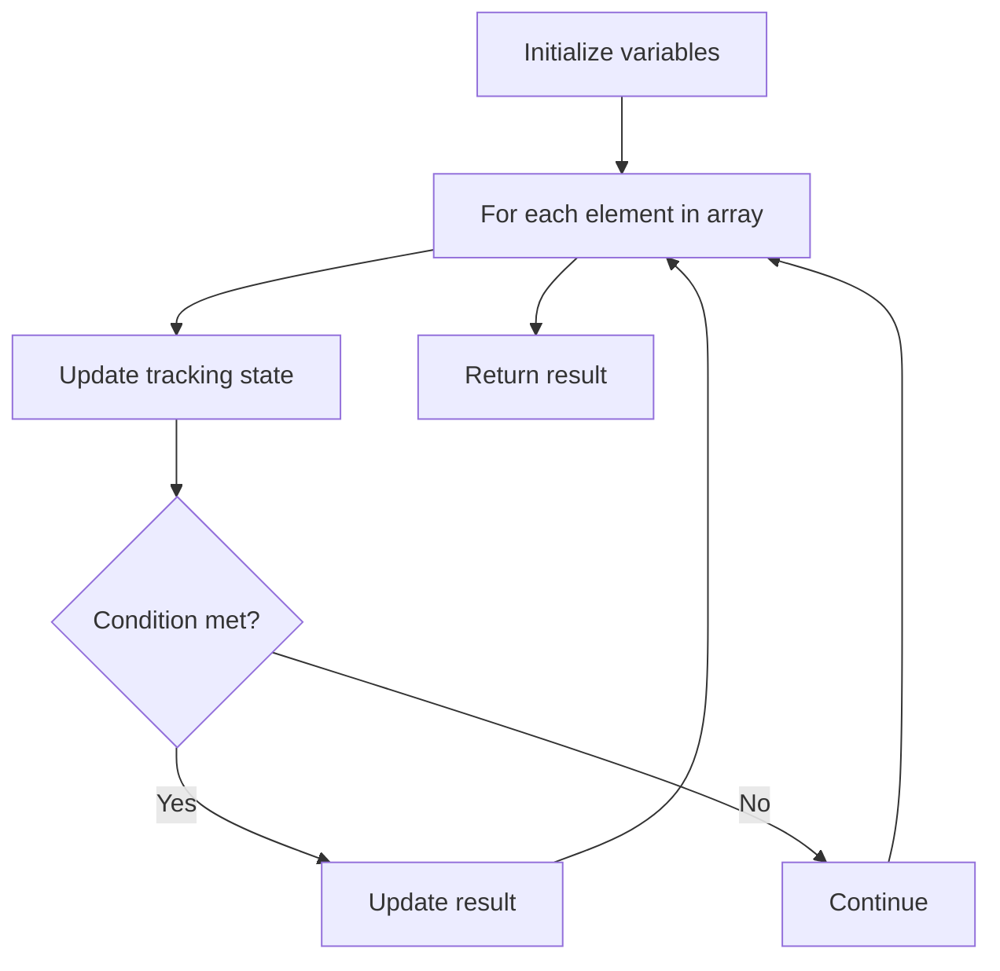

# Problem 1848: Minimum Distance to the Target Element

**Difficulty:** Easy  
**Tags:** Array  
**Pattern:** Array Processing  
**Link:** [leetcode.com/problems/minimum-distance-to-the-target-element](https://leetcode.com/problems/minimum-distance-to-the-target-element/)

## Description

Given an integer array `nums` **(0-indexed)** and two integers `target` and `start`, find an index `i` such that `nums[i] == target` and `abs(i - start)` is **minimized**. Note that `abs(x)` is the absolute value of `x`.

Return `abs(i - start)`.

It is **guaranteed** that `target` exists in `nums`.

 

Example 1:

```

**Input:** nums = [1,2,3,4,5], target = 5, start = 3
**Output:** 1
**Explanation:** nums[4] = 5 is the only value equal to target, so the answer is abs(4 - 3) = 1.

```

Example 2:

```

**Input:** nums = [1], target = 1, start = 0
**Output:** 0
**Explanation:** nums[0] = 1 is the only value equal to target, so the answer is abs(0 - 0) = 0.

```

Example 3:

```

**Input:** nums = [1,1,1,1,1,1,1,1,1,1], target = 1, start = 0
**Output:** 0
**Explanation:** Every value of nums is 1, but nums[0] minimizes abs(i - start), which is abs(0 - 0) = 0.

```

 

**Constraints:**

	- `1 <= nums.length <= 1000`
	- `1 <= nums[i] <= 10^4`
	- `0 <= start < nums.length`
	- `target` is in `nums`.

## Approach: Array Processing

Process the array with a linear scan, tracking state variables. Look for patterns: running maximum/minimum, counting, or transformations.

## Pseudocode

```
1. Initialize tracking variables
2. Iterate through array:
   a. Update tracking state
   b. Check conditions
   c. Update result
3. Return result
```

## Algorithm Flow



## Complexity Analysis

- **Time:** O(n)
- **Space:** O(1)

## Solution (Python3)

```python
class Solution:
    def getMinDistance(self, nums: List[int], target: int, start: int) -> int:
        # Array processing - O(n) time
        result = 0
        for i in range(len(nums)):
            # Process element
            pass
        return result
```

## Solution (C++)

```cpp
#include <string>
#include <vector>
using namespace std;

class Solution {
public:
    int getMinDistance(vector<int>& nums, int target, int start) {
        // Array processing - O(n) time
        for (int i = 0; i < (int)nums.size(); i++) {
            // Process element
        }
        return 0;
    }
};
```
