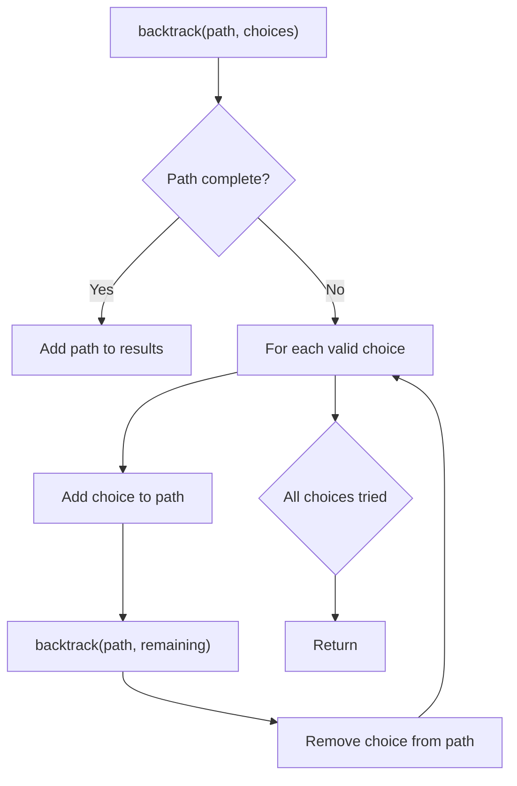
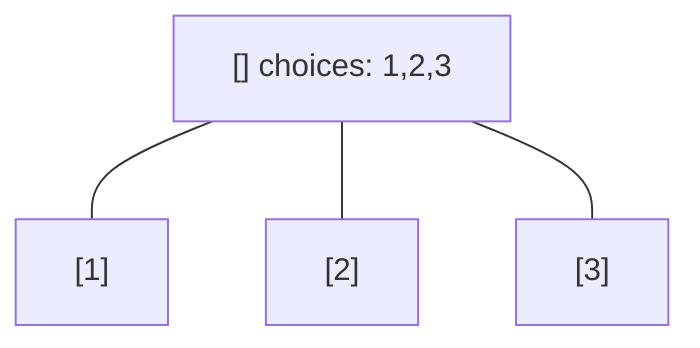
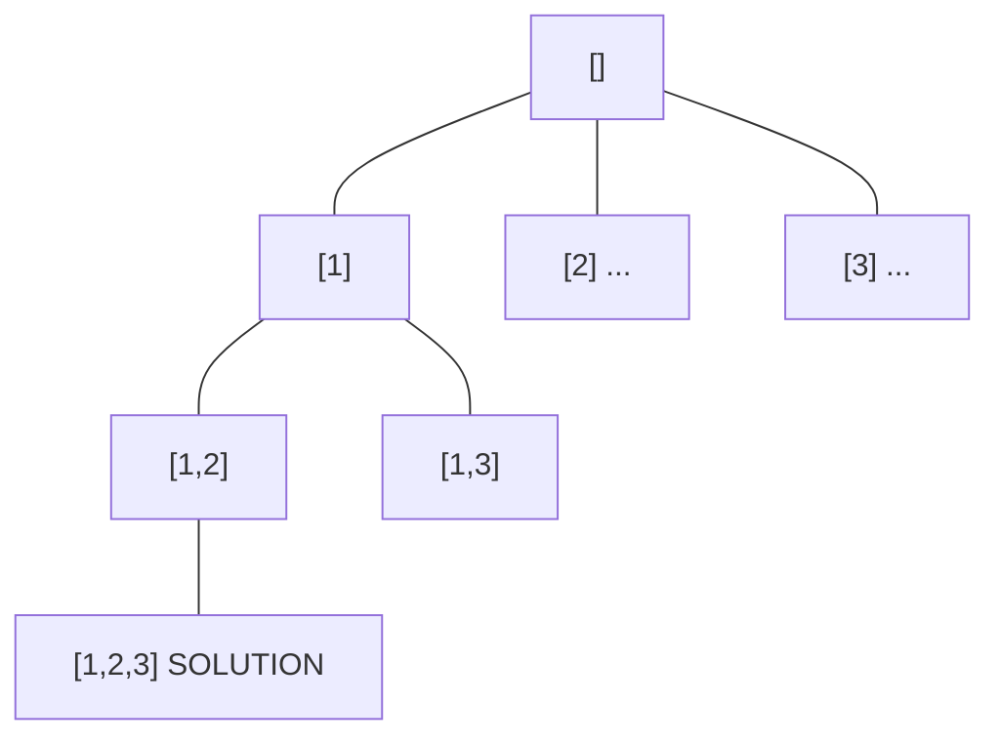
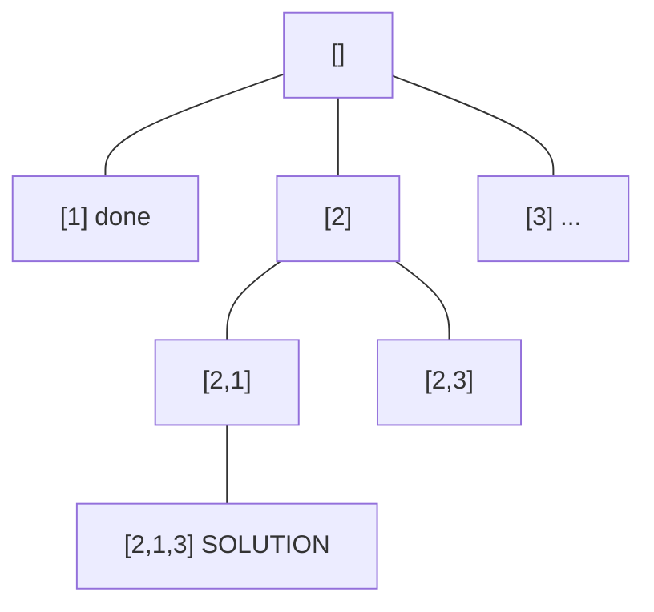
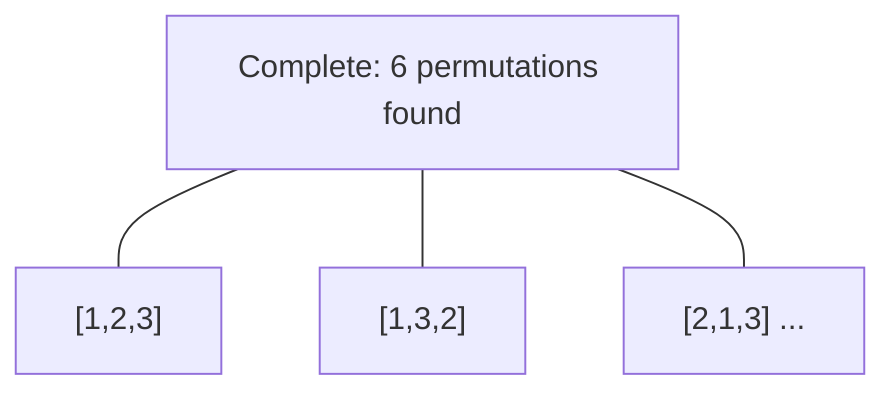

# Problem 1849: Splitting a String Into Descending Consecutive Values

**Difficulty:** Medium  
**Tags:** String, Backtracking, Enumeration  
**Pattern:** Backtracking  
**Link:** [leetcode.com/problems/splitting-a-string-into-descending-consecutive-values](https://leetcode.com/problems/splitting-a-string-into-descending-consecutive-values/)

## Description

You are given a string `s` that consists of only digits.

Check if we can split `s` into **two or more non-empty substrings** such that the **numerical values** of the substrings are in **descending order** and the **difference** between numerical values of every two **adjacent** **substrings** is equal to `1`.

	- For example, the string `s = "0090089"` can be split into `["0090", "089"]` with numerical values `[90,89]`. The values are in descending order and adjacent values differ by `1`, so this way is valid.
	- Another example, the string `s = "001"` can be split into `["0", "01"]`, `["00", "1"]`, or `["0", "0", "1"]`. However all the ways are invalid because they have numerical values `[0,1]`, `[0,1]`, and `[0,0,1]` respectively, all of which are not in descending order.

Return `true` *if it is possible to split* `s`​​​​​​ *as described above**, or *`false`* otherwise.*

A **substring** is a contiguous sequence of characters in a string.

 

Example 1:

```

**Input:** s = "1234"
**Output:** false
**Explanation:** There is no valid way to split s.

```

Example 2:

```

**Input:** s = "050043"
**Output:** true
**Explanation:** s can be split into ["05", "004", "3"] with numerical values [5,4,3].
The values are in descending order with adjacent values differing by 1.

```

Example 3:

```

**Input:** s = "9080701"
**Output:** false
**Explanation:** There is no valid way to split s.

```

 

**Constraints:**

	- `1 <= s.length <= 20`
	- `s` only consists of digits.

## Approach: Backtracking

Explore all possible solutions by building candidates incrementally. At each step, make a choice and recurse. If the choice leads to a dead end, undo the choice (backtrack) and try the next option.

## Pseudocode

```
1. Define backtrack(path, choices):
   a. If path is a complete solution: add to results
   b. For each choice in choices:
      - If choice is valid:
        * Add choice to path
        * backtrack(path, remaining_choices)
        * Remove choice from path (backtrack)
2. Call backtrack([], all_choices)
```

## Algorithm Flow



## Visual State Transitions

**Backtracking Decision Tree:**

**Frame 1: Root - start with empty path**


**Frame 2: Explore branch [1]**


**Frame 3: Backtrack, explore [2]**


**Frame 4: All solutions found**



## Complexity Analysis

- **Time:** O(k^n) or O(n!)
- **Space:** O(n)

## Solution (Python3)

```python
class Solution:
    def splitString(self, s: str) -> bool:
        # Backtracking - O(2^n) or O(n!) time
        result = []
        
        def backtrack(path, start):
            result.append(path[:])
            for i in range(start, len(s)):
                path.append(s[i])
                backtrack(path, i + 1)
                path.pop()
        
        backtrack([], 0)
        return result
```

## Solution (C++)

```cpp
#include <functional>
#include <string>
#include <vector>
using namespace std;

class Solution {
public:
    bool splitString(string& s) {
        // Backtracking - O(2^n) or O(n!) time
        vector<vector<int>> result;
        vector<int> path;
        function<void(int)> backtrack = [&](int start) {
            result.push_back(path);
            for (int i = start; i < (int)s.size(); i++) {
                path.push_back(s[i]);
                backtrack(i + 1);
                path.pop_back();
            }
        };
        backtrack(0);
        return result;
    }
};
```
