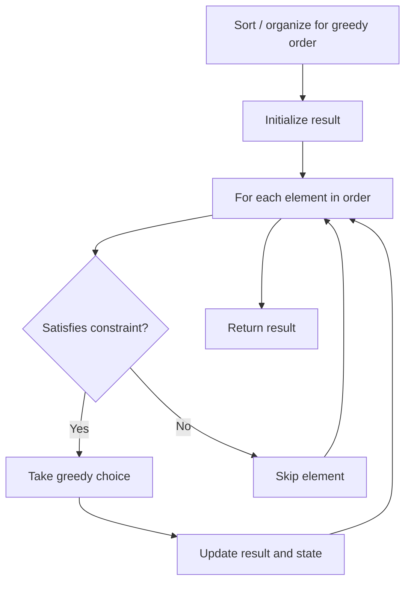

# Problem 1850: Minimum Adjacent Swaps to Reach the Kth Smallest Number

**Difficulty:** Medium  
**Tags:** Two Pointers, String, Greedy  
**Pattern:** Greedy  
**Link:** [leetcode.com/problems/minimum-adjacent-swaps-to-reach-the-kth-smallest-number](https://leetcode.com/problems/minimum-adjacent-swaps-to-reach-the-kth-smallest-number/)

## Description

You are given a string `num`, representing a large integer, and an integer `k`.

We call some integer **wonderful** if it is a **permutation** of the digits in `num` and is **greater in value** than `num`. There can be many wonderful integers. However, we only care about the **smallest-valued** ones.

	- For example, when `num = "5489355142"`:

	
		The 1^st smallest wonderful integer is `"5489355214"`.
		- The 2^nd smallest wonderful integer is `"5489355241"`.
		- The 3^rd smallest wonderful integer is `"5489355412"`.
		- The 4^th smallest wonderful integer is `"5489355421"`.
	
	

Return *the **minimum number of adjacent digit swaps** that needs to be applied to *`num`* to reach the *`k^th`*** smallest wonderful** integer*.

The tests are generated in such a way that `k^th` smallest wonderful integer exists.

 

Example 1:

```

**Input:** num = "5489355142", k = 4
**Output:** 2
**Explanation:** The 4th smallest wonderful number is "5489355421". To get this number:
- Swap index 7 with index 8: "5489355142" -> "5489355412"
- Swap index 8 with index 9: "5489355412" -> "5489355421"

```

Example 2:

```

**Input:** num = "11112", k = 4
**Output:** 4
**Explanation:** The 4th smallest wonderful number is "21111". To get this number:
- Swap index 3 with index 4: "11112" -> "11121"
- Swap index 2 with index 3: "11121" -> "11211"
- Swap index 1 with index 2: "11211" -> "12111"
- Swap index 0 with index 1: "12111" -> "21111"

```

Example 3:

```

**Input:** num = "00123", k = 1
**Output:** 1
**Explanation:** The 1st smallest wonderful number is "00132". To get this number:
- Swap index 3 with index 4: "00123" -> "00132"

```

 

**Constraints:**

	- `2 <= num.length <= 1000`
	- `1 <= k <= 1000`
	- `num` only consists of digits.

## Approach: Greedy

Make the locally optimal choice at each step, trusting it leads to a global optimum. Greedy works when the problem has the greedy-choice property and optimal substructure.

## Pseudocode

```
1. Sort or organize data for greedy ordering
2. Initialize result
3. For each element in greedy order:
   a. If element satisfies constraint:
      - Take the greedy choice
      - Update result and state
4. Return result
```

## Algorithm Flow



## Complexity Analysis

- **Time:** O(n log n)
- **Space:** O(1)

## Solution (Python3)

```python
class Solution:
    def getMinSwaps(self, num: str, k: int) -> int:
        # Greedy approach - O(n) time
        result = 0
        curr_max = 0
        for i in range(len(num)):
            if isinstance(num[i], int):
                curr_max = max(curr_max, num[i])
                result = max(result, curr_max)
            else:
                result += 1
        return result
```

## Solution (C++)

```cpp
#include <algorithm>
#include <string>
#include <vector>
using namespace std;

class Solution {
public:
    int getMinSwaps(string& num, int k) {
        // Greedy approach - O(n) time
        int result = 0, curr_max = 0;
        for (int i = 0; i < (int)num.size(); i++) {
            curr_max = max(curr_max, num[i]);
            result = max(result, curr_max);
        }
        return result;
    }
};
```
