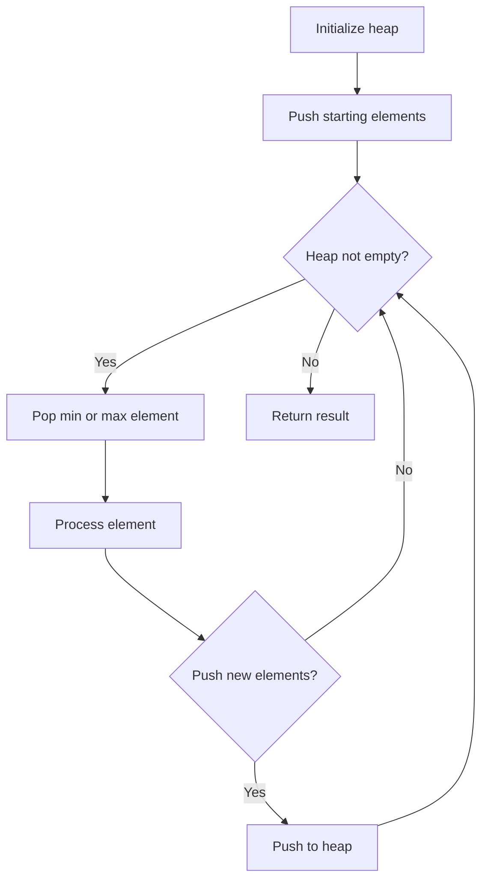
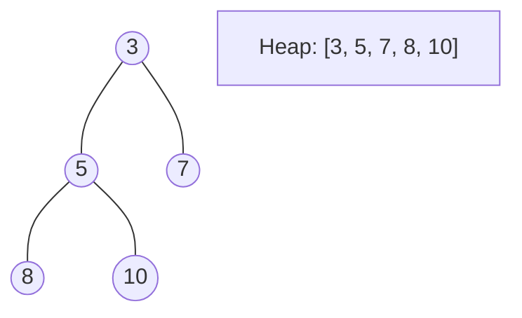
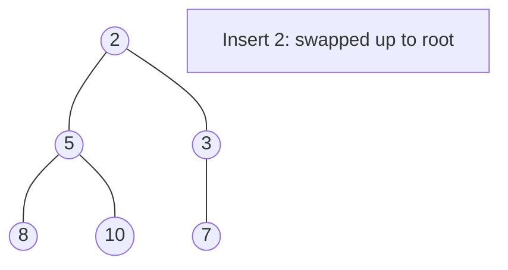
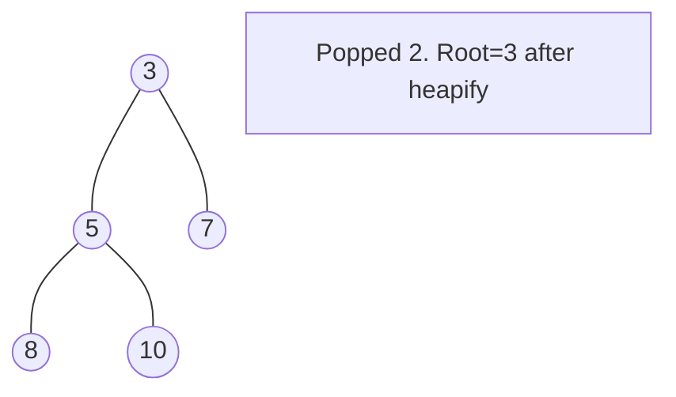

# Problem 1851: Minimum Interval to Include Each Query

**Difficulty:** Hard  
**Tags:** Array, Binary Search, Sweep Line, Sorting, Heap (Priority Queue)  
**Pattern:** Heap + Sorting  
**Link:** [leetcode.com/problems/minimum-interval-to-include-each-query](https://leetcode.com/problems/minimum-interval-to-include-each-query/)

## Description

You are given a 2D integer array `intervals`, where `intervals[i] = [lefti, righti]` describes the `i^th` interval starting at `lefti` and ending at `righti` **(inclusive)**. The **size** of an interval is defined as the number of integers it contains, or more formally `righti - lefti + 1`.

You are also given an integer array `queries`. The answer to the `j^th` query is the **size of the smallest interval** `i` such that `lefti <= queries[j] <= righti`. If no such interval exists, the answer is `-1`.

Return *an array containing the answers to the queries*.

 

Example 1:

```

**Input:** intervals = [[1,4],[2,4],[3,6],[4,4]], queries = [2,3,4,5]
**Output:** [3,3,1,4]
**Explanation:** The queries are processed as follows:
- Query = 2: The interval [2,4] is the smallest interval containing 2. The answer is 4 - 2 + 1 = 3.
- Query = 3: The interval [2,4] is the smallest interval containing 3. The answer is 4 - 2 + 1 = 3.
- Query = 4: The interval [4,4] is the smallest interval containing 4. The answer is 4 - 4 + 1 = 1.
- Query = 5: The interval [3,6] is the smallest interval containing 5. The answer is 6 - 3 + 1 = 4.

```

Example 2:

```

**Input:** intervals = [[2,3],[2,5],[1,8],[20,25]], queries = [2,19,5,22]
**Output:** [2,-1,4,6]
**Explanation:** The queries are processed as follows:
- Query = 2: The interval [2,3] is the smallest interval containing 2. The answer is 3 - 2 + 1 = 2.
- Query = 19: None of the intervals contain 19. The answer is -1.
- Query = 5: The interval [2,5] is the smallest interval containing 5. The answer is 5 - 2 + 1 = 4.
- Query = 22: The interval [20,25] is the smallest interval containing 22. The answer is 25 - 20 + 1 = 6.

```

 

**Constraints:**

	- `1 <= intervals.length <= 10^5`
	- `1 <= queries.length <= 10^5`
	- `intervals[i].length == 2`
	- `1 <= lefti <= righti <= 10^7`
	- `1 <= queries[j] <= 10^7`

## Approach: Heap + Sorting

Sort intervals and queries. For each query, add qualifying intervals to heap, remove expired. Min-heap by size.

## Pseudocode

```
1. Initialize heap (min or max)
2. Push initial elements onto heap
3. While heap not empty and condition:
   a. Pop top element (min or max)
   b. Process element
   c. Push new elements if needed
4. Return result
```

## Algorithm Flow



## Visual State Transitions

**Heap Operations (Min-Heap):**

**Frame 1: Initial heap**


**Frame 2: Insert 2 - bubble up**


**Frame 3: Pop minimum (2) - heapify down**



## Complexity Analysis

- **Time:** O((n+q) log n)
- **Space:** O(n+q)

## Solution (Python3)

```python
import heapq

class Solution:
    def minInterval(self, intervals, queries):
        intervals.sort()
        sorted_q = sorted(enumerate(queries), key=lambda x: x[1])
        result = [-1] * len(queries)
        heap = []
        i = 0
        for qi, q in sorted_q:
            while i < len(intervals) and intervals[i][0] <= q:
                l, r = intervals[i]
                heapq.heappush(heap, (r - l + 1, r))
                i += 1
            while heap and heap[0][1] < q:
                heapq.heappop(heap)
            if heap:
                result[qi] = heap[0][0]
        return result
```

## Solution (C++)

```cpp
#include <queue>
#include <string>
#include <vector>
using namespace std;

class Solution {
public:
    vector<int> minInterval(vector<vector<int>>& intervals, vector<int>& queries) {
        // Heap/Priority Queue - O(n log k) time
        priority_queue<int, vector<int>, greater<int>> pq;
        for (int val : intervals) {
            pq.push(val);
            if ((int)pq.size() > queries)
                pq.pop();
        }
        return pq.empty() ? {} : pq.top();
    }
};
```
