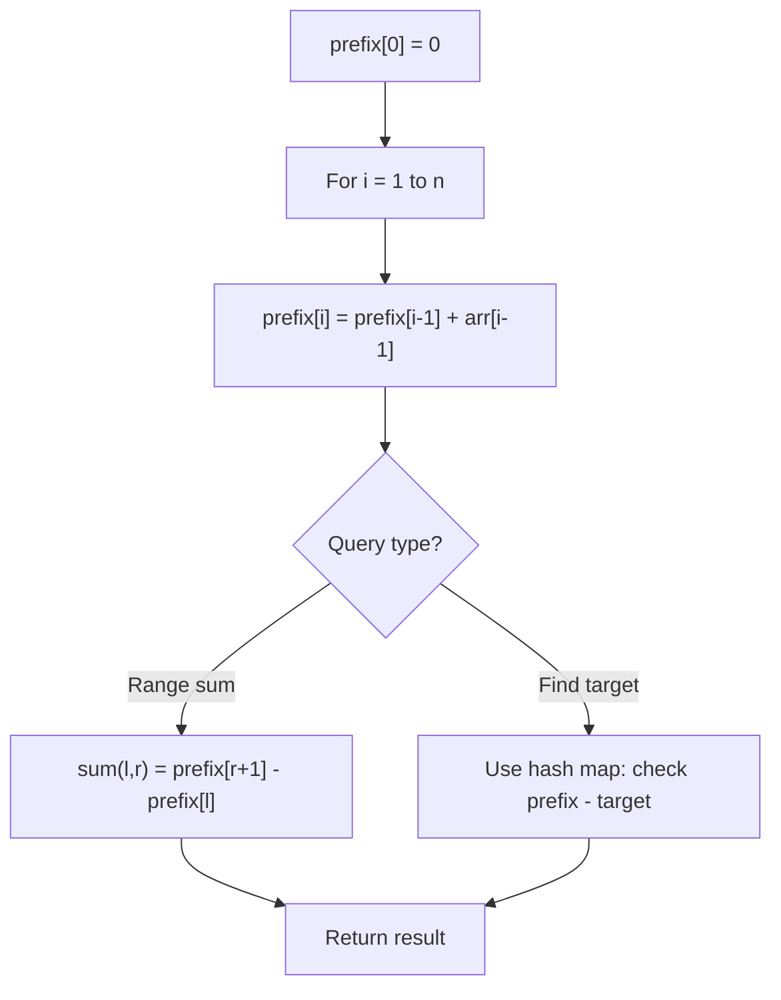

# Problem 1854: Maximum Population Year

**Difficulty:** Easy  
**Tags:** Array, Counting, Prefix Sum  
**Pattern:** Prefix Sum  
**Link:** [leetcode.com/problems/maximum-population-year](https://leetcode.com/problems/maximum-population-year/)

## Description

You are given a 2D integer array `logs` where each `logs[i] = [birthi, deathi]` indicates the birth and death years of the `i^th` person.

The **population** of some year `x` is the number of people alive during that year. The `i^th` person is counted in year `x`'s population if `x` is in the **inclusive** range `[birthi, deathi - 1]`. Note that the person is **not** counted in the year that they die.

Return *the **earliest** year with the **maximum population***.

 

Example 1:

```

**Input:** logs = [[1993,1999],[2000,2010]]
**Output:** 1993
**Explanation:** The maximum population is 1, and 1993 is the earliest year with this population.

```

Example 2:

```

**Input:** logs = [[1950,1961],[1960,1971],[1970,1981]]
**Output:** 1960
**Explanation:** 
The maximum population is 2, and it had happened in years 1960 and 1970.
The earlier year between them is 1960.
```

 

**Constraints:**

	- `1 <= logs.length <= 100`
	- `1950 <= birthi < deathi <= 2050`

## Approach: Prefix Sum

Build a prefix sum array where prefix[i] = sum of elements 0..i-1. Any subarray sum [l..r] = prefix[r+1] - prefix[l]. Combine with hash map for O(n) subarray sum queries.

## Pseudocode

```
1. Build prefix sum array: prefix[0]=0, prefix[i]=prefix[i-1]+arr[i-1]
2. Use prefix sums to answer queries:
   - Subarray sum [l..r] = prefix[r+1] - prefix[l]
   - Or use hash map to find prefix[j]-prefix[i] == target
3. Return result
```

## Algorithm Flow



## Complexity Analysis

- **Time:** O(n)
- **Space:** O(n)

## Solution (Python3)

```python
class Solution:
    def maximumPopulation(self, logs: List[List[int]]) -> int:
        # Prefix sum approach - O(n) time, O(n) space
        prefix = {0: -1}
        curr_sum = 0
        result = 0
        target = logs if isinstance(logs, int) else 0
        for i, val in enumerate(logs):
            curr_sum += val
            if curr_sum - target in prefix:
                result = max(result, i - prefix[curr_sum - target])
            if curr_sum not in prefix:
                prefix[curr_sum] = i
        return result
```

## Solution (C++)

```cpp
#include <algorithm>
#include <string>
#include <unordered_map>
#include <vector>
using namespace std;

class Solution {
public:
    int maximumPopulation(vector<vector<int>>& logs) {
        // Prefix sum approach - O(n) time, O(n) space
        unordered_map<int, int> prefix;
        prefix[0] = -1;
        int curr_sum = 0, result = 0;
        int target = logs;
        for (int i = 0; i < (int)logs.size(); i++) {
            curr_sum += logs[i];
            if (prefix.count(curr_sum - target)) {
                result = max(result, i - prefix[curr_sum - target]);
            }
            if (!prefix.count(curr_sum)) {
                prefix[curr_sum] = i;
            }
        }
        return result;
    }
};
```
