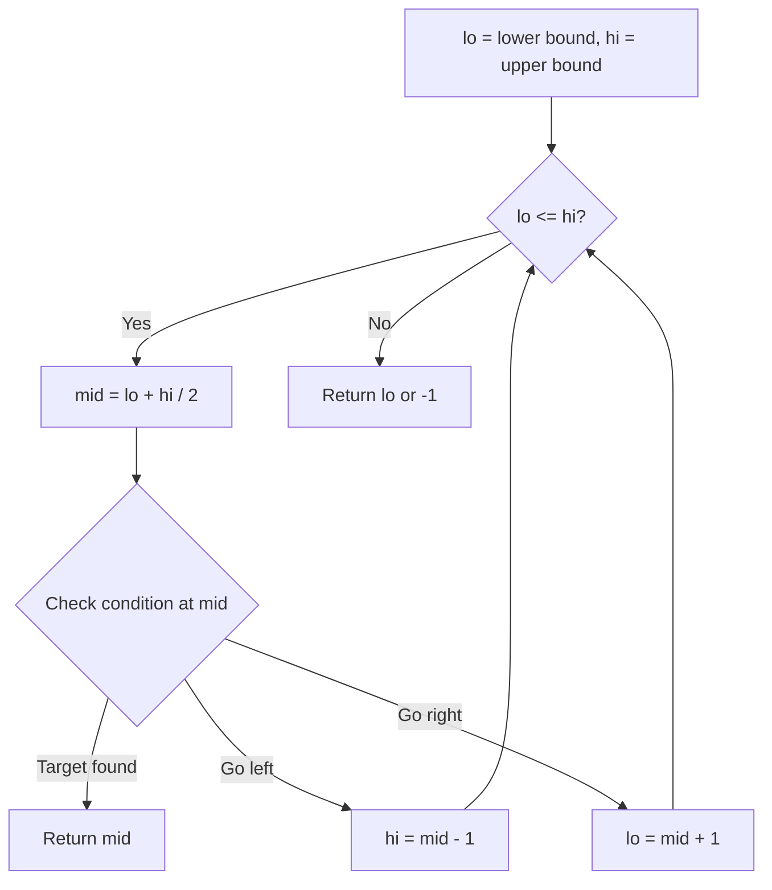
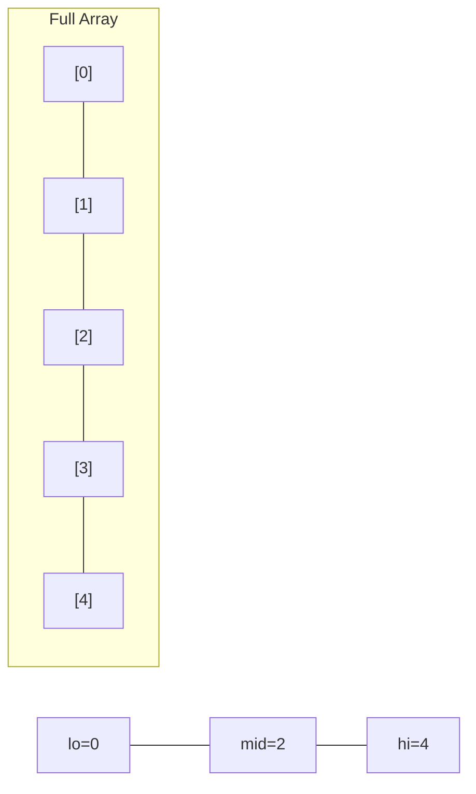
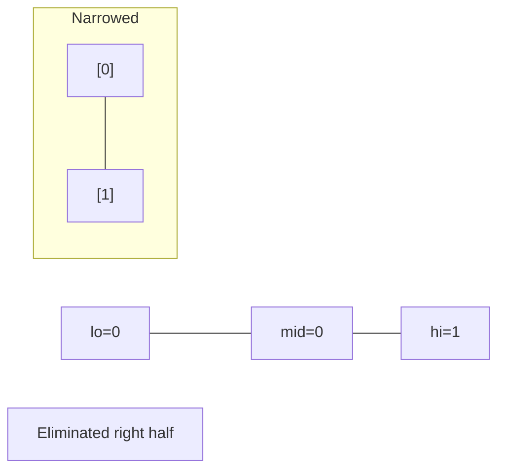
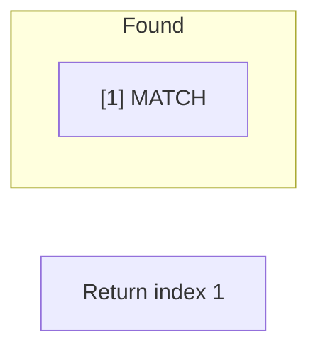

# Problem 1855: Maximum Distance Between a Pair of Values

**Difficulty:** Medium  
**Tags:** Array, Two Pointers, Binary Search  
**Pattern:** Binary Search  
**Link:** [leetcode.com/problems/maximum-distance-between-a-pair-of-values](https://leetcode.com/problems/maximum-distance-between-a-pair-of-values/)

## Description

You are given two **non-increasing 0-indexed **integer arrays `nums1`​​​​​​ and `nums2`​​​​​​.

A pair of indices `(i, j)`, where `0 <= i < nums1.length` and `0 <= j < nums2.length`, is **valid** if both `i <= j` and `nums1[i] <= nums2[j]`. The **distance** of the pair is `j - i`​​​​.

Return *the **maximum distance** of any **valid** pair *`(i, j)`*. If there are no valid pairs, return *`0`.

An array `arr` is **non-increasing** if `arr[i-1] >= arr[i]` for every `1 <= i < arr.length`.

 

Example 1:

```

**Input:** nums1 = [55,30,5,4,2], nums2 = [100,20,10,10,5]
**Output:** 2
**Explanation:** The valid pairs are (0,0), (2,2), (2,3), (2,4), (3,3), (3,4), and (4,4).
The maximum distance is 2 with pair (2,4).

```

Example 2:

```

**Input:** nums1 = [2,2,2], nums2 = [10,10,1]
**Output:** 1
**Explanation:** The valid pairs are (0,0), (0,1), and (1,1).
The maximum distance is 1 with pair (0,1).

```

Example 3:

```

**Input:** nums1 = [30,29,19,5], nums2 = [25,25,25,25,25]
**Output:** 2
**Explanation:** The valid pairs are (2,2), (2,3), (2,4), (3,3), and (3,4).
The maximum distance is 2 with pair (2,4).

```

 

**Constraints:**

	- `1 <= nums1.length, nums2.length <= 10^5`
	- `1 <= nums1[i], nums2[j] <= 10^5`
	- Both `nums1` and `nums2` are **non-increasing**.

## Approach: Binary Search

Use binary search to halve the search space each iteration. Define the search range [lo, hi], compute mid, and decide which half to keep based on the problem's monotonic condition.

## Pseudocode

```
1. lo = lower_bound, hi = upper_bound
2. While lo <= hi (or lo < hi):
   a. mid = (lo + hi) // 2
   b. If condition(mid) is satisfied: record answer, search left half
   c. Else: search right half
3. Return answer
```

## Algorithm Flow



## Visual State Transitions

**Binary Search Step-by-Step:**

**Frame 1: Initial search space**


**Frame 2: Compare mid, narrow search**


**Frame 3: Found target**



## Complexity Analysis

- **Time:** O(log n)
- **Space:** O(1)

## Solution (Python3)

```python
class Solution:
    def maxDistance(self, nums1: List[int], nums2: List[int]) -> int:
        # Binary search - O(log n) time, O(1) space
        lo, hi = 0, len(nums1) - 1
        while lo <= hi:
            mid = lo + (hi - lo) // 2
            if nums1[mid] == nums2:
                return mid
            elif nums1[mid] < nums2:
                lo = mid + 1
            else:
                hi = mid - 1
        return 0
```

## Solution (C++)

```cpp
#include <string>
#include <vector>
using namespace std;

class Solution {
public:
    int maxDistance(vector<int>& nums1, vector<int>& nums2) {
        // Binary search - O(log n) time, O(1) space
        int lo = 0, hi = nums1.size() - 1;
        while (lo <= hi) {
            int mid = lo + (hi - lo) / 2;
            if (nums1[mid] == nums2) {
                return mid;
            } else if (nums1[mid] < nums2) {
                lo = mid + 1;
            } else {
                hi = mid - 1;
            }
        }
        return 0;
    }
};
```
