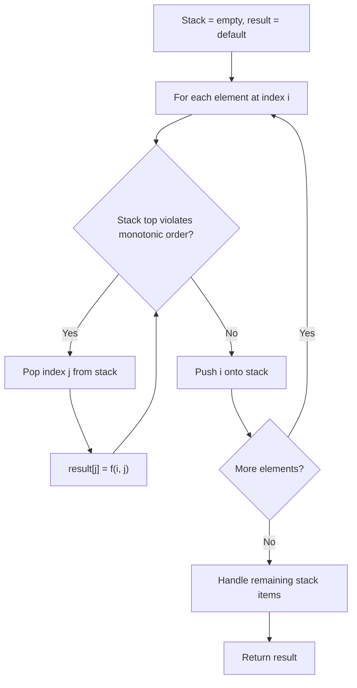
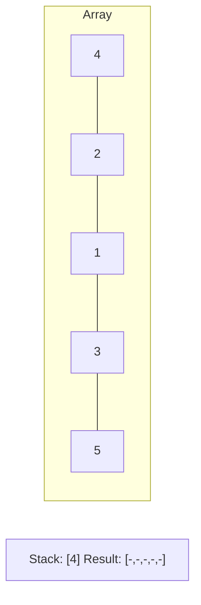
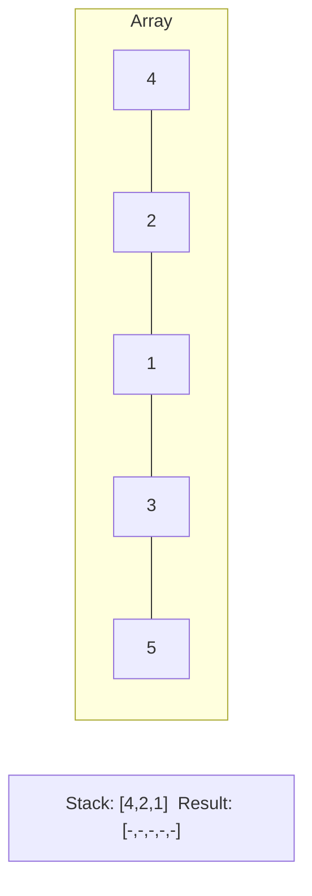
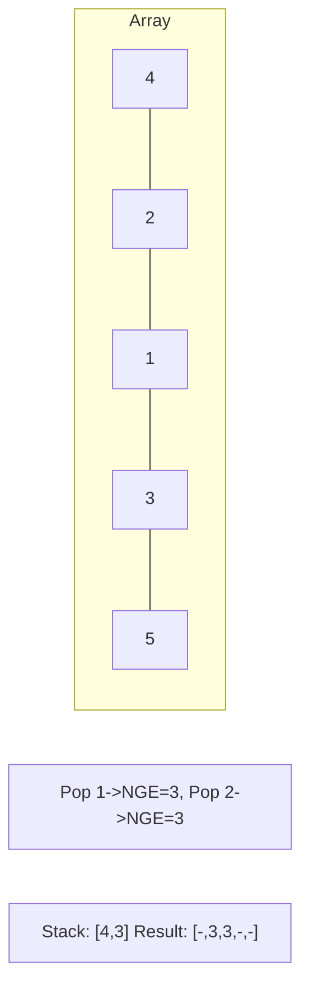
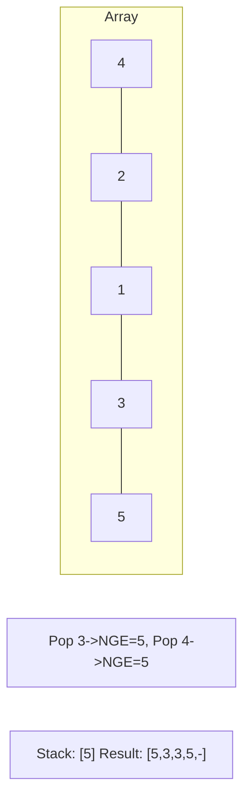

# Problem 1856: Maximum Subarray Min-Product

**Difficulty:** Medium  
**Tags:** Array, Stack, Monotonic Stack, Prefix Sum  
**Pattern:** Monotonic Stack  
**Link:** [leetcode.com/problems/maximum-subarray-min-product](https://leetcode.com/problems/maximum-subarray-min-product/)

## Description

The **min-product** of an array is equal to the **minimum value** in the array **multiplied by** the array's **sum**.

	- For example, the array `[3,2,5]` (minimum value is `2`) has a min-product of `2 * (3+2+5) = 2 * 10 = 20`.

Given an array of integers `nums`, return *the **maximum min-product** of any **non-empty subarray** of *`nums`. Since the answer may be large, return it **modulo** `10^9 + 7`.

Note that the min-product should be maximized **before** performing the modulo operation. Testcases are generated such that the maximum min-product **without** modulo will fit in a **64-bit signed integer**.

A **subarray** is a **contiguous** part of an array.

 

Example 1:

```

**Input:** nums = [1,2,3,2]
**Output:** 14
**Explanation:** The maximum min-product is achieved with the subarray [2,3,2] (minimum value is 2).
2 * (2+3+2) = 2 * 7 = 14.

```

Example 2:

```

**Input:** nums = [2,3,3,1,2]
**Output:** 18
**Explanation:** The maximum min-product is achieved with the subarray [3,3] (minimum value is 3).
3 * (3+3) = 3 * 6 = 18.

```

Example 3:

```

**Input:** nums = [3,1,5,6,4,2]
**Output:** 60
**Explanation:** The maximum min-product is achieved with the subarray [5,6,4] (minimum value is 4).
4 * (5+6+4) = 4 * 15 = 60.

```

 

**Constraints:**

	- `1 <= nums.length <= 10^5`
	- `1 <= nums[i] <= 10^7`

## Approach: Monotonic Stack

Maintain a stack where elements are always in monotonic order (increasing or decreasing). When a new element violates the monotonic property, pop elements and compute results (e.g., next greater/smaller element, spans, areas).

## Pseudocode

```
1. Initialize empty stack, result array
2. For each element (index i):
   a. While stack not empty and arr[i] breaks monotonic order:
      - Pop index j from stack
      - result[j] = compute(i, j)
   b. Push i onto stack
3. Handle remaining elements in stack
4. Return result
```

## Algorithm Flow



## Visual State Transitions

**Monotonic Stack (Next Greater Element):**

**Frame 1: Process first elements**


**Frame 2: Push smaller elements**


**Frame 3: Element 3 pops 1 and 2**


**Frame 4: Element 5 pops all**



## Complexity Analysis

- **Time:** O(n)
- **Space:** O(n)

## Solution (Python3)

```python
class Solution:
    def maxSumMinProduct(self, nums: List[int]) -> int:
        # Monotonic stack - O(n) time, O(n) space
        n = len(nums)
        result = [0] * n
        stack = []  # indices
        for i in range(n):
            while stack and nums[i] > nums[stack[-1]]:
                idx = stack.pop()
                result[idx] = i - idx
            stack.append(i)
        return result
```

## Solution (C++)

```cpp
#include <stack>
#include <string>
#include <vector>
using namespace std;

class Solution {
public:
    int maxSumMinProduct(vector<int>& nums) {
        // Monotonic stack - O(n) time, O(n) space
        int n = nums.size();
        vector<int> result(n, 0);
        stack<int> st;
        for (int i = 0; i < n; i++) {
            while (!st.empty() && nums[i] > nums[st.top()]) {
                int idx = st.top(); st.pop();
                result[idx] = i - idx;
            }
            st.push(i);
        }
        return result;
    }
};
```
