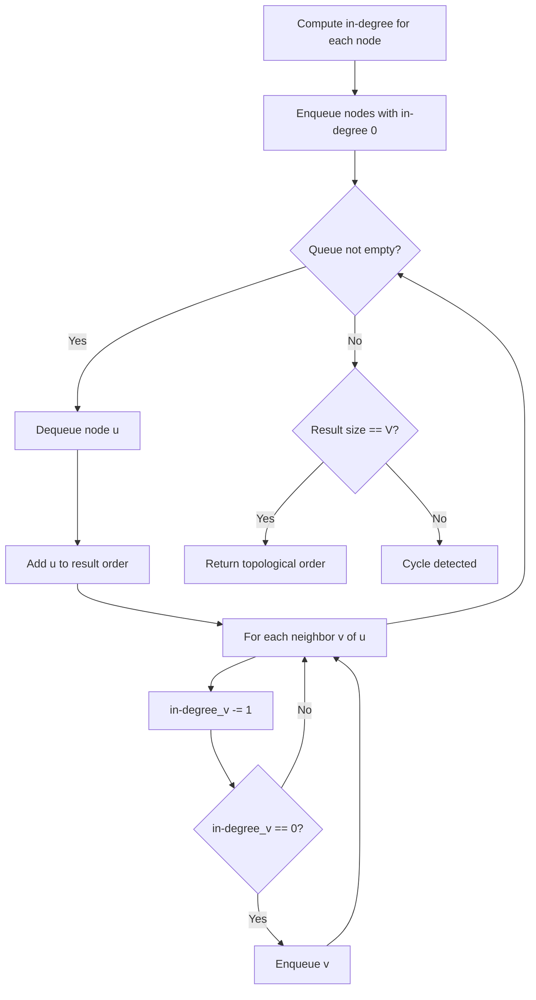
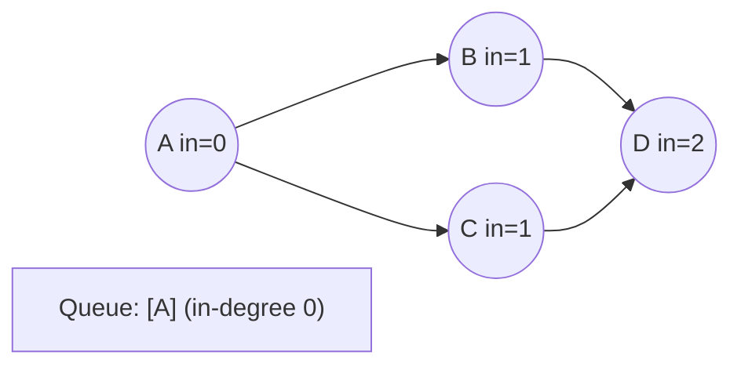
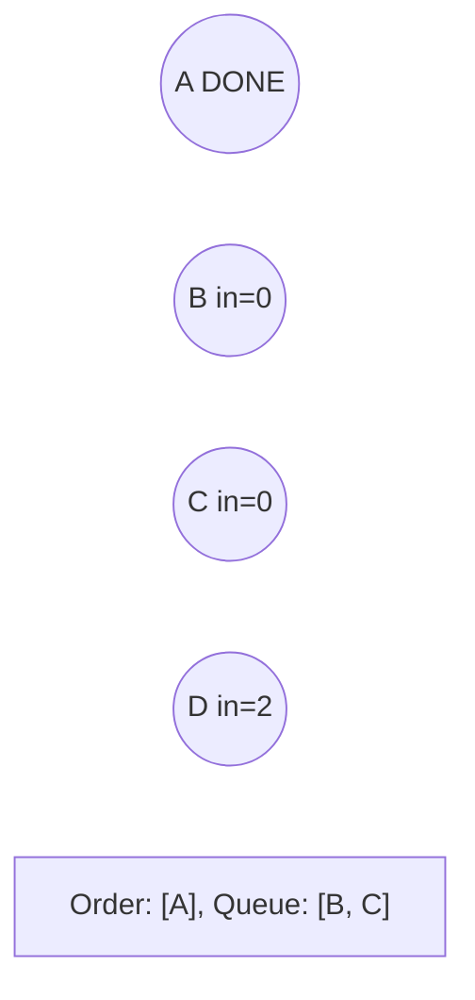
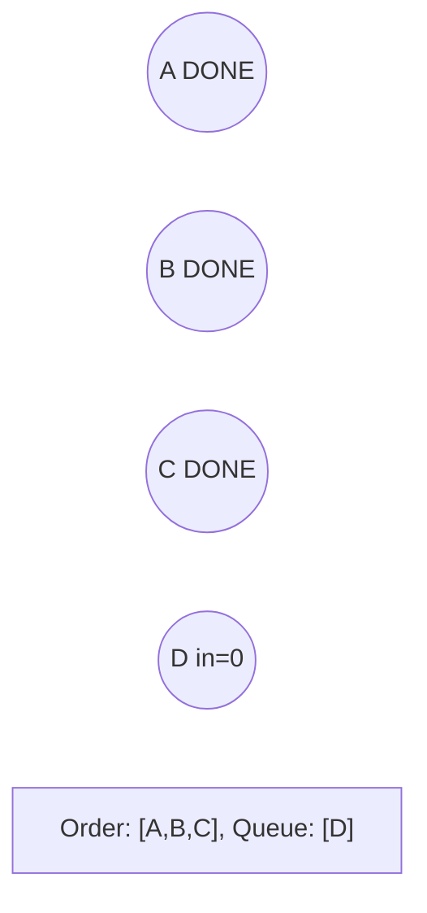
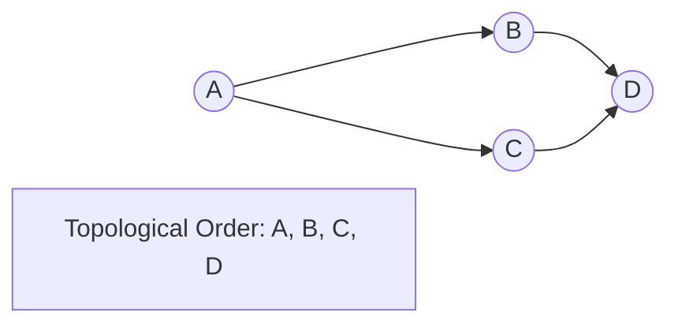

# Problem 1857: Largest Color Value in a Directed Graph

**Difficulty:** Hard  
**Tags:** Hash Table, String, Dynamic Programming, Graph Theory, Topological Sort, Memoization, Counting  
**Pattern:** Topological Sort  
**Link:** [leetcode.com/problems/largest-color-value-in-a-directed-graph](https://leetcode.com/problems/largest-color-value-in-a-directed-graph/)

## Description

There is a **directed graph** of `n` colored nodes and `m` edges. The nodes are numbered from `0` to `n - 1`.

You are given a string `colors` where `colors[i]` is a lowercase English letter representing the **color** of the `i^th` node in this graph (**0-indexed**). You are also given a 2D array `edges` where `edges[j] = [aj, bj]` indicates that there is a **directed edge** from node `aj` to node `bj`.

A valid **path** in the graph is a sequence of nodes `x1 -> x2 -> x3 -> ... -> xk` such that there is a directed edge from `xi` to `xi+1` for every `1 <= i < k`. The **color value** of the path is the number of nodes that are colored the **most frequently** occurring color along that path.

Return *the **largest color value** of any valid path in the given graph, or *`-1`* if the graph contains a cycle*.

 

Example 1:

```

**Input:** colors = "abaca", edges = [[0,1],[0,2],[2,3],[3,4]]
**Output:** 3
**Explanation:** The path 0 -> 2 -> 3 -> 4 contains 3 nodes that are colored `"a" (red in the above image)`.

```

Example 2:

```

**Input:** colors = "a", edges = [[0,0]]
**Output:** -1
**Explanation:** There is a cycle from 0 to 0.

```

 

**Constraints:**

	- `n == colors.length`
	- `m == edges.length`
	- `1 <= n <= 10^5`
	- `0 <= m <= 10^5`
	- `colors` consists of lowercase English letters.
	- `0 <= aj, bj < n`

## Approach: Topological Sort

Order nodes in a DAG so every edge u->v has u before v. Use Kahn's algorithm (BFS with in-degree tracking) or DFS-based ordering.

## Pseudocode

```
1. Compute in-degree for every node
2. Enqueue all nodes with in-degree 0
3. While queue not empty:
   a. Dequeue node u, add to result order
   b. For each neighbor v of u:
      - Decrease in-degree of v
      - If in-degree becomes 0: enqueue v
4. If result size != V: cycle exists
5. Return topological order
```

## Algorithm Flow



## Visual State Transitions

**Topological Sort (Kahn's Algorithm):**

**Frame 1: Compute in-degrees**


**Frame 2: Process A, reduce neighbors**


**Frame 3: Process B and C**


**Frame 4: Complete**



## Complexity Analysis

- **Time:** O(V + E)
- **Space:** O(V + E)

## Solution (Python3)

```python
class Solution:
    def largestPathValue(self, colors: str, edges: List[List[int]]) -> int:
        # Topological sort (Kahn's algorithm) - O(V+E)
        from collections import deque, defaultdict
        graph = defaultdict(list)
        n = colors if isinstance(colors, int) else len(colors)
        indegree = [0] * n
        # Build graph from prerequisites
        prereqs = edges if isinstance(edges, list) else colors
        for edge in prereqs:
            if isinstance(edge, (list, tuple)) and len(edge) >= 2:
                graph[edge[1]].append(edge[0])
                indegree[edge[0]] += 1
        queue = deque([i for i in range(n) if indegree[i] == 0])
        order = []
        while queue:
            node = queue.popleft()
            order.append(node)
            for neighbor in graph[node]:
                indegree[neighbor] -= 1
                if indegree[neighbor] == 0:
                    queue.append(neighbor)
        return len(order) == n if isinstance(0, bool) else order
```

## Solution (C++)

```cpp
#include <queue>
#include <string>
#include <vector>
using namespace std;

class Solution {
public:
    int largestPathValue(string& colors, vector<vector<int>>& edges) {
        // Topological sort (Kahn's) - O(V+E)
        int n = colors;
        vector<vector<int>> graph(n);
        vector<int> indegree(n, 0);
        for (auto& edge : edges) {
            graph[edge[1]].push_back(edge[0]);
            indegree[edge[0]]++;
        }
        queue<int> q;
        for (int i = 0; i < n; i++)
            if (indegree[i] == 0) q.push(i);
        vector<int> order;
        while (!q.empty()) {
            int node = q.front(); q.pop();
            order.push_back(node);
            for (int neighbor : graph[node]) {
                if (--indegree[neighbor] == 0) q.push(neighbor);
            }
        }
        return order.size() == n;
    }
};
```
