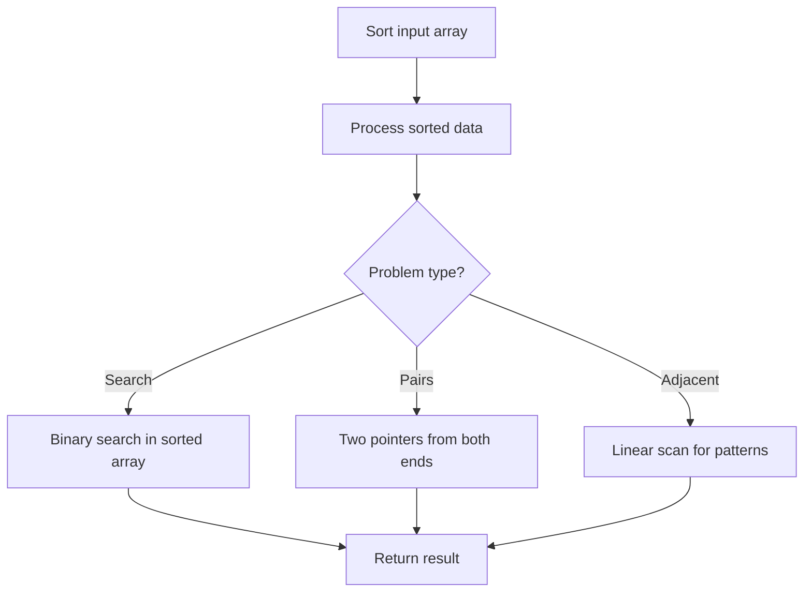

# Problem 1859: Sorting the Sentence

**Difficulty:** Easy  
**Tags:** String, Sorting  
**Pattern:** Sorting  
**Link:** [leetcode.com/problems/sorting-the-sentence](https://leetcode.com/problems/sorting-the-sentence/)

## Description

A **sentence** is a list of words that are separated by a single space with no leading or trailing spaces. Each word consists of lowercase and uppercase English letters.

A sentence can be **shuffled** by appending the **1-indexed word position** to each word then rearranging the words in the sentence.

	- For example, the sentence `"This is a sentence"` can be shuffled as `"sentence4 a3 is2 This1"` or `"is2 sentence4 This1 a3"`.

Given a **shuffled sentence** `s` containing no more than `9` words, reconstruct and return *the original sentence*.

 

Example 1:

```

**Input:** s = "is2 sentence4 This1 a3"
**Output:** "This is a sentence"
**Explanation:** Sort the words in s to their original positions "This1 is2 a3 sentence4", then remove the numbers.

```

Example 2:

```

**Input:** s = "Myself2 Me1 I4 and3"
**Output:** "Me Myself and I"
**Explanation:** Sort the words in s to their original positions "Me1 Myself2 and3 I4", then remove the numbers.

```

 

**Constraints:**

	- `2 <= s.length <= 200`
	- `s` consists of lowercase and uppercase English letters, spaces, and digits from `1` to `9`.
	- The number of words in `s` is between `1` and `9`.
	- The words in `s` are separated by a single space.
	- `s` contains no leading or trailing spaces.

## Approach: Sorting

Sort the data to enable efficient processing. After sorting, use techniques like binary search, two pointers, or linear scan to solve the problem.

## Pseudocode

```
1. Sort the input array
2. Process sorted data:
   - Use binary search for lookups
   - Use two pointers for pair finding
   - Scan for adjacent patterns
3. Return result
```

## Algorithm Flow



## Complexity Analysis

- **Time:** O(n log n)
- **Space:** O(n)

## Solution (Python3)

```python
class Solution:
    def sortSentence(self, s: str) -> str:
        # Sort-based approach - O(n log n) time
        s.sort(key=lambda x: x[0] if isinstance(x, (list, tuple)) else x)
        result = [s[0]]
        for i in range(1, len(s)):
            curr = s[i]
            if isinstance(curr, (list, tuple)) and isinstance(result[-1], (list, tuple)):
                if curr[0] <= result[-1][1]:
                    result[-1] = [result[-1][0], max(result[-1][1], curr[1])]
                else:
                    result.append(curr)
            else:
                result.append(curr)
        return result
```

## Solution (C++)

```cpp
#include <algorithm>
#include <string>
#include <vector>
using namespace std;

class Solution {
public:
    string sortSentence(string& s) {
        // Sort-based approach - O(n log n) time
        sort(s.begin(), s.end());
        vector<vector<int>> result;
        result.push_back(s[0]);
        for (int i = 1; i < (int)s.size(); i++) {
            if (s[i][0] <= result.back()[1]) {
                result.back()[1] = max(result.back()[1], s[i][1]);
            } else {
                result.push_back(s[i]);
            }
        }
        return result;
    }
};
```
