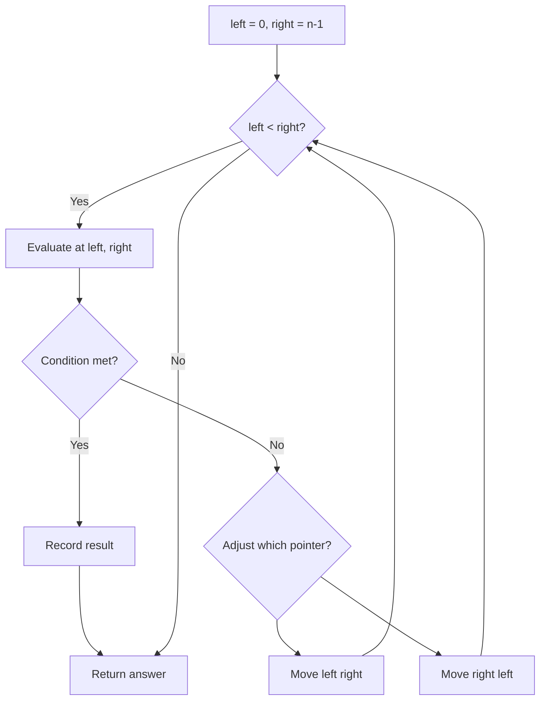
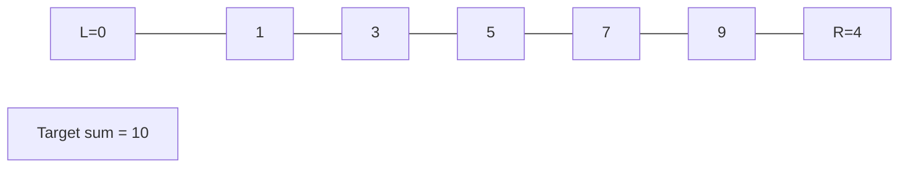
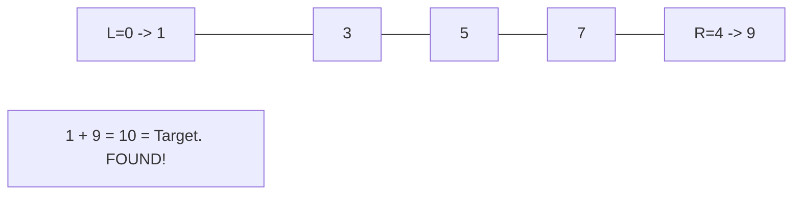

# Problem 1861: Rotating the Box

**Difficulty:** Medium  
**Tags:** Array, Two Pointers, Matrix  
**Pattern:** Two Pointers  
**Link:** [leetcode.com/problems/rotating-the-box](https://leetcode.com/problems/rotating-the-box/)

## Description

You are given an `m x n` matrix of characters `boxGrid` representing a side-view of a box. Each cell of the box is one of the following:

	- A stone `'#'`
	- A stationary obstacle `'*'`
	- Empty `'.'`

The box is rotated **90 degrees clockwise**, causing some of the stones to fall due to gravity. Each stone falls down until it lands on an obstacle, another stone, or the bottom of the box. Gravity **does not** affect the obstacles' positions, and the inertia from the box's rotation **does not **affect the stones' horizontal positions.

It is **guaranteed** that each stone in `boxGrid` rests on an obstacle, another stone, or the bottom of the box.

Return *an *`n x m`* matrix representing the box after the rotation described above*.

 

Example 1:

```

**Input:** boxGrid = [["#",".","#"]]
**Output:** [["."],
         ["#"],
         ["#"]]

```

Example 2:

```

**Input:** boxGrid = [["#",".","*","."],
              ["#","#","*","."]]
**Output:** [["#","."],
         ["#","#"],
         ["*","*"],
         [".","."]]

```

Example 3:

```

**Input:** boxGrid = [["#","#","*",".","*","."],
              ["#","#","#","*",".","."],
              ["#","#","#",".","#","."]]
**Output:** [[".","#","#"],
         [".","#","#"],
         ["#","#","*"],
         ["#","*","."],
         ["#",".","*"],
         ["#",".","."]]

```

 

**Constraints:**

	- `m == boxGrid.length`
	- `n == boxGrid[i].length`
	- `1 <= m, n <= 500`
	- `boxGrid[i][j]` is either `'#'`, `'*'`, or `'.'`.

## Approach: Two Pointers

Use two pointers moving through the data structure. Depending on the problem, pointers may move toward each other (converging), in the same direction (fast/slow), or independently.

## Pseudocode

```
1. Initialize left = 0, right = n-1 (or two independent pointers)
2. While pointers haven't crossed:
   a. Evaluate condition at pointer positions
   b. Move left pointer right or right pointer left
3. Return result
```

## Algorithm Flow



## Visual State Transitions

**Two Pointer Convergence:**

**Frame 1: Initialize pointers**


**Frame 2: Sum = 1+9 = 10, found!**



## Complexity Analysis

- **Time:** O(n)
- **Space:** O(1)

## Solution (Python3)

```python
class Solution:
    def rotateTheBox(self, boxGrid: List[List[str]]) -> List[List[str]]:
        # Two pointer approach - O(n) time, O(1) space
        left, right = 0, len(boxGrid) - 1
        while left < right:
            curr = boxGrid[left] + boxGrid[right]
            if curr == boxGrid:
                return [left, right]
            elif curr < boxGrid:
                left += 1
            else:
                right -= 1
        return []
```

## Solution (C++)

```cpp
#include <string>
#include <vector>
using namespace std;

class Solution {
public:
    vector<vector<string>> rotateTheBox(vector<vector<string>>& boxGrid) {
        // Two pointer approach - O(n) time, O(1) space
        int left = 0, right = boxGrid.size() - 1;
        while (left < right) {
            int curr = boxGrid[left] + boxGrid[right];
            if (curr == boxGrid) {
                return {left, right};
            } else if (curr < boxGrid) {
                left++;
            } else {
                right--;
            }
        }
        return {};
    }
};
```
