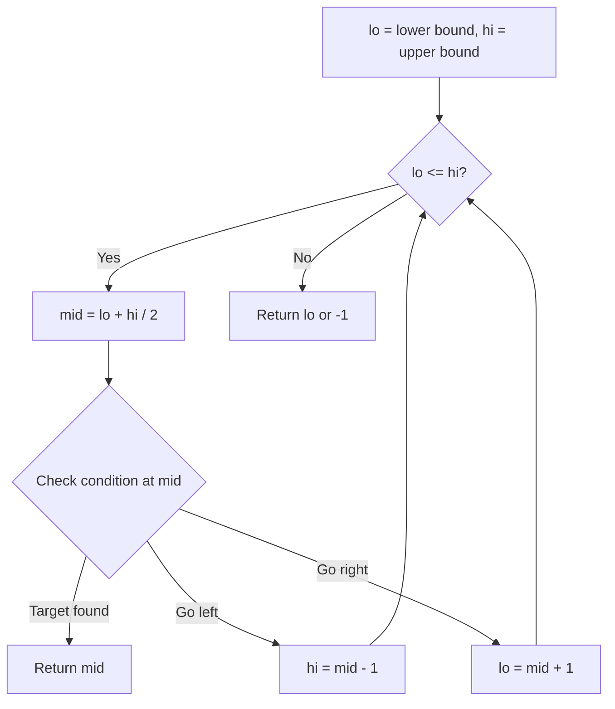
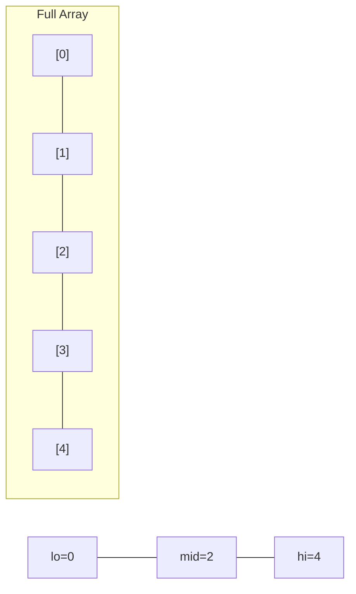
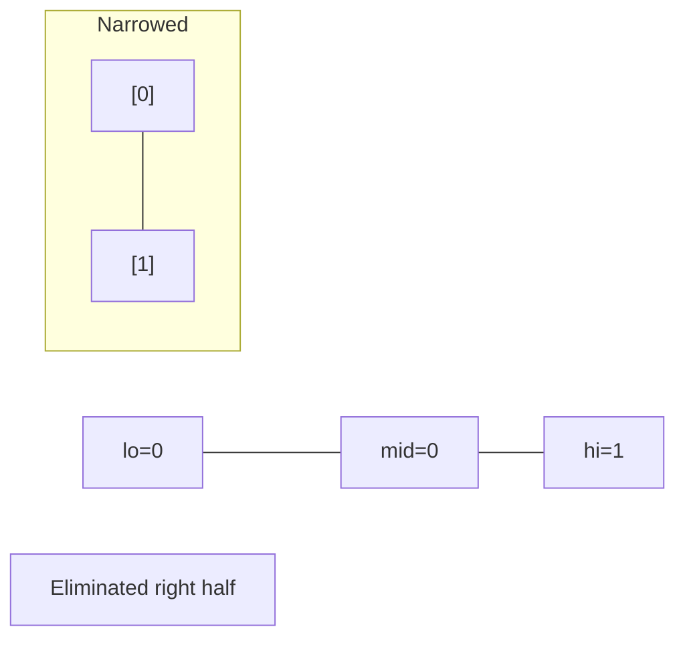
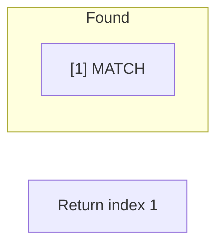

# Problem 1862: Sum of Floored Pairs

**Difficulty:** Hard  
**Tags:** Array, Math, Binary Search, Counting, Enumeration, Prefix Sum  
**Pattern:** Binary Search  
**Link:** [leetcode.com/problems/sum-of-floored-pairs](https://leetcode.com/problems/sum-of-floored-pairs/)

## Description

Given an integer array `nums`, return the sum of `floor(nums[i] / nums[j])` for all pairs of indices `0 <= i, j < nums.length` in the array. Since the answer may be too large, return it **modulo** `10^9 + 7`.

The `floor()` function returns the integer part of the division.

 

Example 1:

```

**Input:** nums = [2,5,9]
**Output:** 10
**Explanation:**
floor(2 / 5) = floor(2 / 9) = floor(5 / 9) = 0
floor(2 / 2) = floor(5 / 5) = floor(9 / 9) = 1
floor(5 / 2) = 2
floor(9 / 2) = 4
floor(9 / 5) = 1
We calculate the floor of the division for every pair of indices in the array then sum them up.

```

Example 2:

```

**Input:** nums = [7,7,7,7,7,7,7]
**Output:** 49

```

 

**Constraints:**

	- `1 <= nums.length <= 10^5`
	- `1 <= nums[i] <= 10^5`

## Approach: Binary Search

Use binary search to halve the search space each iteration. Define the search range [lo, hi], compute mid, and decide which half to keep based on the problem's monotonic condition.

## Pseudocode

```
1. lo = lower_bound, hi = upper_bound
2. While lo <= hi (or lo < hi):
   a. mid = (lo + hi) // 2
   b. If condition(mid) is satisfied: record answer, search left half
   c. Else: search right half
3. Return answer
```

## Algorithm Flow



## Visual State Transitions

**Binary Search Step-by-Step:**

**Frame 1: Initial search space**


**Frame 2: Compare mid, narrow search**


**Frame 3: Found target**



## Complexity Analysis

- **Time:** O(log n)
- **Space:** O(1)

## Solution (Python3)

```python
class Solution:
    def sumOfFlooredPairs(self, nums: List[int]) -> int:
        # Binary search - O(log n) time, O(1) space
        lo, hi = 0, len(nums) - 1
        while lo <= hi:
            mid = lo + (hi - lo) // 2
            if nums[mid] == nums:
                return mid
            elif nums[mid] < nums:
                lo = mid + 1
            else:
                hi = mid - 1
        return 0
```

## Solution (C++)

```cpp
#include <string>
#include <vector>
using namespace std;

class Solution {
public:
    int sumOfFlooredPairs(vector<int>& nums) {
        // Binary search - O(log n) time, O(1) space
        int lo = 0, hi = nums.size() - 1;
        while (lo <= hi) {
            int mid = lo + (hi - lo) / 2;
            if (nums[mid] == nums) {
                return mid;
            } else if (nums[mid] < nums) {
                lo = mid + 1;
            } else {
                hi = mid - 1;
            }
        }
        return 0;
    }
};
```
