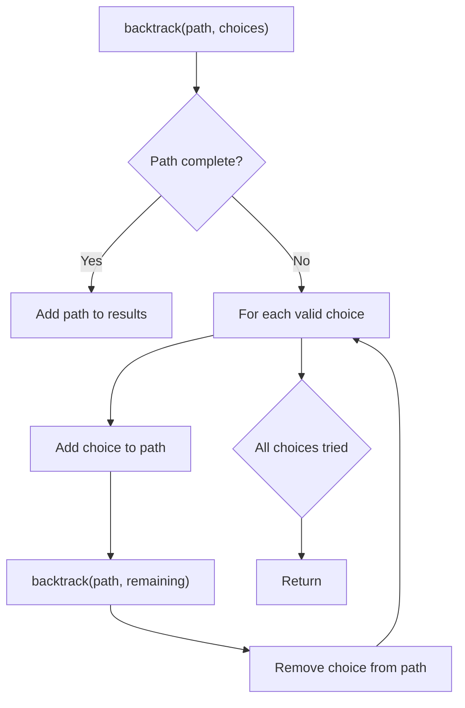
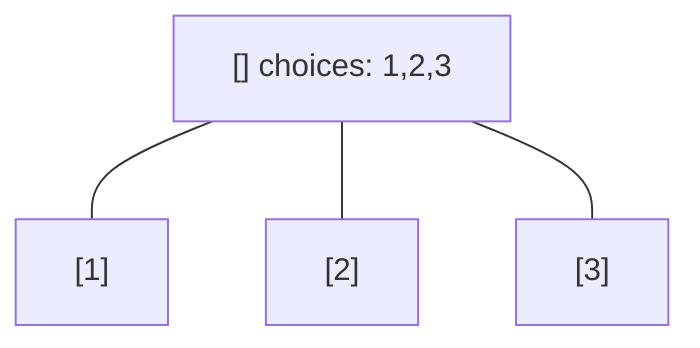
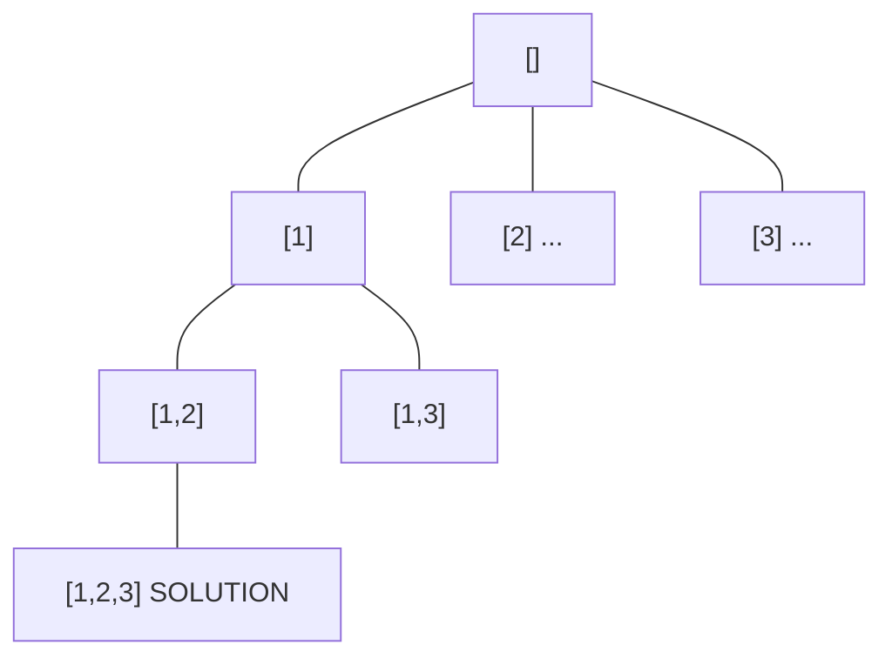
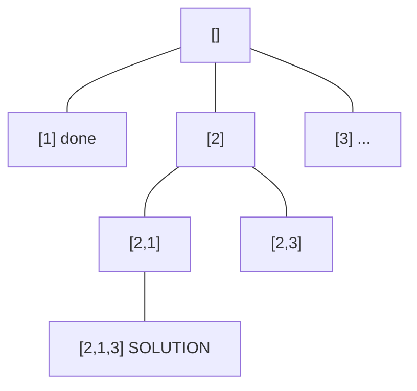
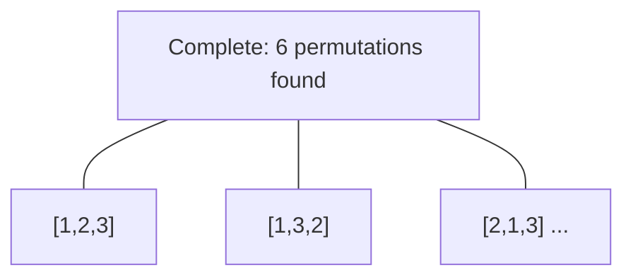

# Problem 1863: Sum of All Subset XOR Totals

**Difficulty:** Easy  
**Tags:** Array, Math, Backtracking, Bit Manipulation, Combinatorics, Enumeration  
**Pattern:** Backtracking  
**Link:** [leetcode.com/problems/sum-of-all-subset-xor-totals](https://leetcode.com/problems/sum-of-all-subset-xor-totals/)

## Description

The **XOR total** of an array is defined as the bitwise `XOR` of** all its elements**, or `0` if the array is** empty**.

	- For example, the **XOR total** of the array `[2,5,6]` is `2 XOR 5 XOR 6 = 1`.

Given an array `nums`, return *the **sum** of all **XOR totals** for every **subset** of *`nums`. 

**Note:** Subsets with the **same** elements should be counted **multiple** times.

An array `a` is a **subset** of an array `b` if `a` can be obtained from `b` by deleting some (possibly zero) elements of `b`.

 

Example 1:

```

**Input:** nums = [1,3]
**Output:** 6
**Explanation: **The 4 subsets of [1,3] are:
- The empty subset has an XOR total of 0.
- [1] has an XOR total of 1.
- [3] has an XOR total of 3.
- [1,3] has an XOR total of 1 XOR 3 = 2.
0 + 1 + 3 + 2 = 6

```

Example 2:

```

**Input:** nums = [5,1,6]
**Output:** 28
**Explanation: **The 8 subsets of [5,1,6] are:
- The empty subset has an XOR total of 0.
- [5] has an XOR total of 5.
- [1] has an XOR total of 1.
- [6] has an XOR total of 6.
- [5,1] has an XOR total of 5 XOR 1 = 4.
- [5,6] has an XOR total of 5 XOR 6 = 3.
- [1,6] has an XOR total of 1 XOR 6 = 7.
- [5,1,6] has an XOR total of 5 XOR 1 XOR 6 = 2.
0 + 5 + 1 + 6 + 4 + 3 + 7 + 2 = 28

```

Example 3:

```

**Input:** nums = [3,4,5,6,7,8]
**Output:** 480
**Explanation:** The sum of all XOR totals for every subset is 480.

```

 

**Constraints:**

	- `1 <= nums.length <= 12`
	- `1 <= nums[i] <= 20`

## Approach: Backtracking

Explore all possible solutions by building candidates incrementally. At each step, make a choice and recurse. If the choice leads to a dead end, undo the choice (backtrack) and try the next option.

## Pseudocode

```
1. Define backtrack(path, choices):
   a. If path is a complete solution: add to results
   b. For each choice in choices:
      - If choice is valid:
        * Add choice to path
        * backtrack(path, remaining_choices)
        * Remove choice from path (backtrack)
2. Call backtrack([], all_choices)
```

## Algorithm Flow



## Visual State Transitions

**Backtracking Decision Tree:**

**Frame 1: Root - start with empty path**


**Frame 2: Explore branch [1]**


**Frame 3: Backtrack, explore [2]**


**Frame 4: All solutions found**



## Complexity Analysis

- **Time:** O(k^n) or O(n!)
- **Space:** O(n)

## Solution (Python3)

```python
class Solution:
    def subsetXORSum(self, nums: List[int]) -> int:
        # Backtracking - O(2^n) or O(n!) time
        result = []
        
        def backtrack(path, start):
            result.append(path[:])
            for i in range(start, len(nums)):
                path.append(nums[i])
                backtrack(path, i + 1)
                path.pop()
        
        backtrack([], 0)
        return result
```

## Solution (C++)

```cpp
#include <functional>
#include <string>
#include <vector>
using namespace std;

class Solution {
public:
    int subsetXORSum(vector<int>& nums) {
        // Backtracking - O(2^n) or O(n!) time
        vector<vector<int>> result;
        vector<int> path;
        function<void(int)> backtrack = [&](int start) {
            result.push_back(path);
            for (int i = start; i < (int)nums.size(); i++) {
                path.push_back(nums[i]);
                backtrack(i + 1);
                path.pop_back();
            }
        };
        backtrack(0);
        return result;
    }
};
```
