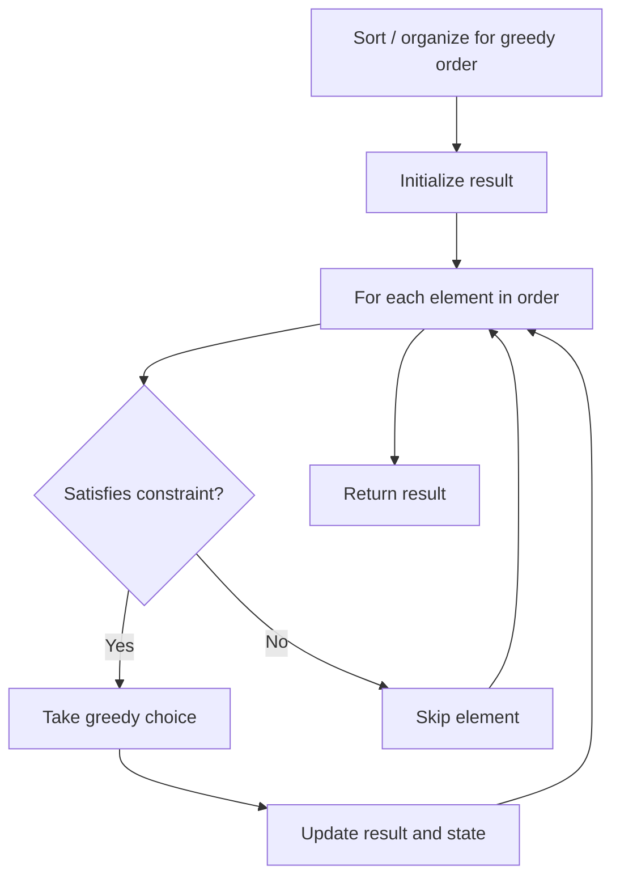

# Problem 1864: Minimum Number of Swaps to Make the Binary String Alternating

**Difficulty:** Medium  
**Tags:** String, Greedy  
**Pattern:** Greedy  
**Link:** [leetcode.com/problems/minimum-number-of-swaps-to-make-the-binary-string-alternating](https://leetcode.com/problems/minimum-number-of-swaps-to-make-the-binary-string-alternating/)

## Description

Given a binary string `s`, return *the **minimum** number of character swaps to make it **alternating**, or *`-1`* if it is impossible.*

The string is called **alternating** if no two adjacent characters are equal. For example, the strings `"010"` and `"1010"` are alternating, while the string `"0100"` is not.

Any two characters may be swapped, even if they are **not adjacent**.

 

Example 1:

```

**Input:** s = "111000"
**Output:** 1
**Explanation:** Swap positions 1 and 4: "111000" -> "101010"
The string is now alternating.

```

Example 2:

```

**Input:** s = "010"
**Output:** 0
**Explanation:** The string is already alternating, no swaps are needed.

```

Example 3:

```

**Input:** s = "1110"
**Output:** -1

```

 

**Constraints:**

	- `1 <= s.length <= 1000`
	- `s[i]` is either `'0'` or `'1'`.

## Approach: Greedy

Make the locally optimal choice at each step, trusting it leads to a global optimum. Greedy works when the problem has the greedy-choice property and optimal substructure.

## Pseudocode

```
1. Sort or organize data for greedy ordering
2. Initialize result
3. For each element in greedy order:
   a. If element satisfies constraint:
      - Take the greedy choice
      - Update result and state
4. Return result
```

## Algorithm Flow



## Complexity Analysis

- **Time:** O(n log n)
- **Space:** O(1)

## Solution (Python3)

```python
class Solution:
    def minSwaps(self, s: str) -> int:
        # Greedy approach - O(n) time
        result = 0
        curr_max = 0
        for i in range(len(s)):
            if isinstance(s[i], int):
                curr_max = max(curr_max, s[i])
                result = max(result, curr_max)
            else:
                result += 1
        return result
```

## Solution (C++)

```cpp
#include <algorithm>
#include <string>
#include <vector>
using namespace std;

class Solution {
public:
    int minSwaps(string& s) {
        // Greedy approach - O(n) time
        int result = 0, curr_max = 0;
        for (int i = 0; i < (int)s.size(); i++) {
            curr_max = max(curr_max, s[i]);
            result = max(result, curr_max);
        }
        return result;
    }
};
```
