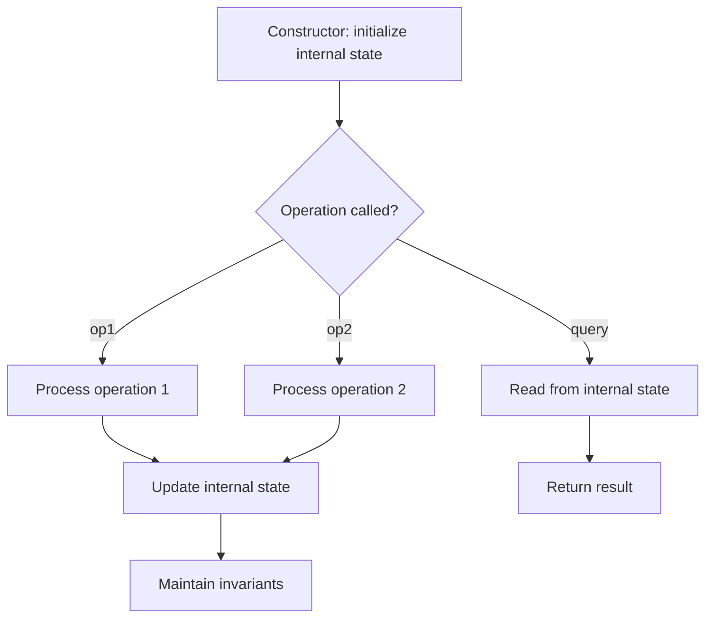

# Problem 1865: Finding Pairs With a Certain Sum

**Difficulty:** Medium  
**Tags:** Array, Hash Table, Design  
**Pattern:** Design  
**Link:** [leetcode.com/problems/finding-pairs-with-a-certain-sum](https://leetcode.com/problems/finding-pairs-with-a-certain-sum/)

## Description

You are given two integer arrays `nums1` and `nums2`. You are tasked to implement a data structure that supports queries of two types:

	- **Add** a positive integer to an element of a given index in the array `nums2`.
	- **Count** the number of pairs `(i, j)` such that `nums1[i] + nums2[j]` equals a given value (`0 <= i < nums1.length` and `0 <= j < nums2.length`).

Implement the `FindSumPairs` class:

	- `FindSumPairs(int[] nums1, int[] nums2)` Initializes the `FindSumPairs` object with two integer arrays `nums1` and `nums2`.
	- `void add(int index, int val)` Adds `val` to `nums2[index]`, i.e., apply `nums2[index] += val`.
	- `int count(int tot)` Returns the number of pairs `(i, j)` such that `nums1[i] + nums2[j] == tot`.

 

Example 1:

```

**Input**
["FindSumPairs", "count", "add", "count", "count", "add", "add", "count"]
[[[1, 1, 2, 2, 2, 3], [1, 4, 5, 2, 5, 4]], [7], [3, 2], [8], [4], [0, 1], [1, 1], [7]]
**Output**
[null, 8, null, 2, 1, null, null, 11]

**Explanation**
FindSumPairs findSumPairs = new FindSumPairs([1, 1, 2, 2, 2, 3], [1, 4, 5, 2, 5, 4]);
findSumPairs.count(7);  // return 8; pairs (2,2), (3,2), (4,2), (2,4), (3,4), (4,4) make 2 + 5 and pairs (5,1), (5,5) make 3 + 4
findSumPairs.add(3, 2); // now nums2 = [1,4,5,**4**`,5,4`]
findSumPairs.count(8);  // return 2; pairs (5,2), (5,4) make 3 + 5
findSumPairs.count(4);  // return 1; pair (5,0) makes 3 + 1
findSumPairs.add(0, 1); // now nums2 = [**`2`**,4,5,4`,5,4`]
findSumPairs.add(1, 1); // now nums2 = [`2`,**5**,5,4`,5,4`]
findSumPairs.count(7);  // return 11; pairs (2,1), (2,2), (2,4), (3,1), (3,2), (3,4), (4,1), (4,2), (4,4) make 2 + 5 and pairs (5,3), (5,5) make 3 + 4

```

 

**Constraints:**

	- `1 <= nums1.length <= 1000`
	- `1 <= nums2.length <= 10^5`
	- `1 <= nums1[i] <= 10^9`
	- `1 <= nums2[i] <= 10^5`
	- `0 <= index < nums2.length`
	- `1 <= val <= 10^5`
	- `1 <= tot <= 10^9`
	- At most `1000` calls are made to `add` and `count` **each**.

## Approach: Design

Design a data structure or system that supports specific operations efficiently. Choose appropriate underlying data structures (hash map, linked list, heap, etc.).

## Pseudocode

```
1. Choose data structures for internal state
2. Implement constructor: initialize state
3. Implement each operation:
   - Maintain invariants
   - Optimize for target time complexity
4. Handle edge cases
```

## Algorithm Flow



## Complexity Analysis

- **Time:** O(1) per operation
- **Space:** O(n)

## Solution (Python3)

```python
class FindSumPairs:
    def __init__(self, nums1: List[int], nums2: List[int]):
        # Initialize data structure
        self.nums1 = nums1
        self.nums2 = nums2

    def add(self, index: int, val: int) -> None:
        return None

    def count(self, tot: int) -> int:
        return 0

```

## Solution (C++)

```cpp
#include <string>
#include <vector>
using namespace std;

class FindSumPairs {
public:
    FindSumPairs(vector<int>& nums1, vector<int>& nums2) {
        // Initialize
    }

    void add(int index, int val) {
        return ;
    }

    int count(int tot) {
        return 0;
    }

};
```
