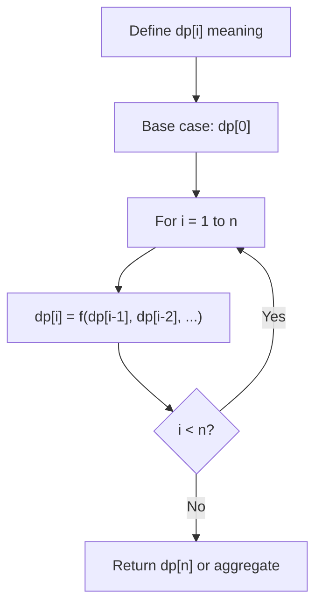
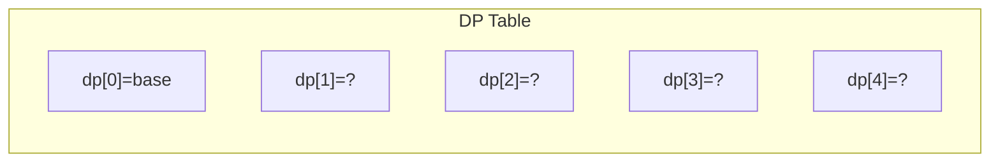
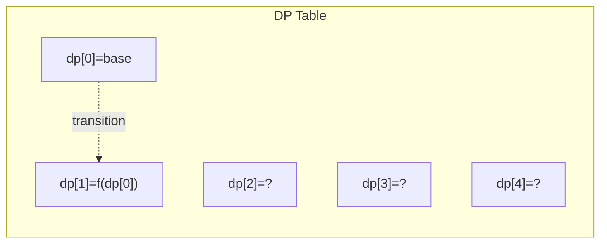
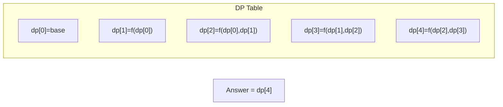

# Problem 1866: Number of Ways to Rearrange Sticks With K Sticks Visible

**Difficulty:** Hard  
**Tags:** Math, Dynamic Programming, Combinatorics  
**Pattern:** Dynamic Programming (1D)  
**Link:** [leetcode.com/problems/number-of-ways-to-rearrange-sticks-with-k-sticks-visible](https://leetcode.com/problems/number-of-ways-to-rearrange-sticks-with-k-sticks-visible/)

## Description

There are `n` uniquely-sized sticks whose lengths are integers from `1` to `n`. You want to arrange the sticks such that **exactly** `k` sticks are **visible** from the left. A stick is **visible** from the left if there are no **longer** sticks to the **left** of it.

	- For example, if the sticks are arranged `[1,3,2,5,4]`, then the sticks with lengths `1`, `3`, and `5` are visible from the left.

Given `n` and `k`, return *the **number** of such arrangements*. Since the answer may be large, return it **modulo** `10^9 + 7`.

 

Example 1:

```

**Input:** n = 3, k = 2
**Output:** 3
**Explanation:** [1,3,2], [2,3,1], and [2,1,3] are the only arrangements such that exactly 2 sticks are visible.
The visible sticks are underlined.

```

Example 2:

```

**Input:** n = 5, k = 5
**Output:** 1
**Explanation:** [1,2,3,4,5] is the only arrangement such that all 5 sticks are visible.
The visible sticks are underlined.

```

Example 3:

```

**Input:** n = 20, k = 11
**Output:** 647427950
**Explanation:** There are 647427950 (mod 109 + 7) ways to rearrange the sticks such that exactly 11 sticks are visible.

```

 

**Constraints:**

	- `1 <= n <= 1000`
	- `1 <= k <= n`

## Approach: Dynamic Programming (1D)

Break the problem into overlapping subproblems. Define dp[i] as the optimal value for the subproblem ending at or considering index i. Build the solution bottom-up, using previously computed dp values.

## Pseudocode

```
1. Define dp[i] = optimal value for subproblem i
2. Base case: dp[0] = initial value
3. For i from 1 to n:
   a. dp[i] = recurrence(dp[i-1], dp[i-2], ...)
4. Return dp[n] or max/min of dp
```

## Algorithm Flow



## Visual State Transitions

**1D Dynamic Programming Table Build:**

**Frame 1: Initialize base cases**


**Frame 2: Fill dp[1] from dp[0]**


**Frame 3: Fill remaining cells**



## Complexity Analysis

- **Time:** O(n)
- **Space:** O(n)

## Solution (Python3)

```python
class Solution:
    def rearrangeSticks(self, n: int, k: int) -> int:
        # Dynamic programming (1D) - O(n) time, O(n) space
        if not n:
            return 0
        n = len(n) if isinstance(n, list) else n
        dp = [0] * (n + 1)
        dp[0] = 1  # base case
        for i in range(1, n + 1):
            dp[i] = dp[i-1]  # transition (customize per problem)
            if i >= 2:
                dp[i] += dp[i-2]
        return dp[n]
```

## Solution (C++)

```cpp
#include <string>
#include <vector>
using namespace std;

class Solution {
public:
    int rearrangeSticks(int n, int k) {
        // Dynamic programming (1D) - O(n) time, O(n) space
        int n = n;
        if (n <= 0) return 0;
        vector<int> dp(n + 1, 0);
        dp[0] = 1;
        for (int i = 1; i <= n; i++) {
            dp[i] = dp[i-1];
            if (i >= 2) dp[i] += dp[i-2];
        }
        return dp[n];
    }
};
```
