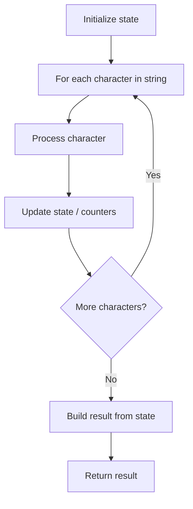

# Problem 1869: Longer Contiguous Segments of Ones than Zeros

**Difficulty:** Easy  
**Tags:** String  
**Pattern:** String Processing  
**Link:** [leetcode.com/problems/longer-contiguous-segments-of-ones-than-zeros](https://leetcode.com/problems/longer-contiguous-segments-of-ones-than-zeros/)

## Description

Given a binary string `s`, return `true`* if the **longest** contiguous segment of *`1`'*s is **strictly longer** than the **longest** contiguous segment of *`0`'*s in *`s`, or return `false`* otherwise*.

	- For example, in `s = "110100010"` the longest continuous segment of `1`s has length `2`, and the longest continuous segment of `0`s has length `3`.

Note that if there are no `0`'s, then the longest continuous segment of `0`'s is considered to have a length `0`. The same applies if there is no `1`'s.

 

Example 1:

```

**Input:** s = "1101"
**Output:** true
**Explanation:**
The longest contiguous segment of 1s has length 2: "1101"
The longest contiguous segment of 0s has length 1: "1101"
The segment of 1s is longer, so return true.

```

Example 2:

```

**Input:** s = "111000"
**Output:** false
**Explanation:**
The longest contiguous segment of 1s has length 3: "111000"
The longest contiguous segment of 0s has length 3: "111000"
The segment of 1s is not longer, so return false.

```

Example 3:

```

**Input:** s = "110100010"
**Output:** false
**Explanation:**
The longest contiguous segment of 1s has length 2: "110100010"
The longest contiguous segment of 0s has length 3: "110100010"
The segment of 1s is not longer, so return false.

```

 

**Constraints:**

	- `1 <= s.length <= 100`
	- `s[i]` is either `'0'` or `'1'`.

## Approach: String Processing

Process the string character by character. Common techniques: two pointers, sliding window, hash map for frequencies, stack for matching.

## Pseudocode

```
1. Initialize result / tracking state
2. Iterate through string characters:
   a. Process character based on rules
   b. Update state (counters, pointers, stack)
3. Build and return result
```

## Algorithm Flow



## Complexity Analysis

- **Time:** O(n)
- **Space:** O(n)

## Solution (Python3)

```python
class Solution:
    def checkZeroOnes(self, s: str) -> bool:
        # String processing approach - O(n) time
        result = []
        for ch in s:
            if ch.isalnum():
                result.append(ch.lower())
        # Check palindrome or process
        processed = ''.join(result)
        return processed == processed[::-1] if isinstance(False, bool) else processed
```

## Solution (C++)

```cpp
#include <algorithm>
#include <cctype>
#include <string>
#include <vector>
using namespace std;

class Solution {
public:
    bool checkZeroOnes(string& s) {
        // String processing approach - O(n) time
        string processed;
        for (char ch : s) {
            if (isalnum(ch)) {
                processed += tolower(ch);
            }
        }
        string rev = processed;
        reverse(rev.begin(), rev.end());
        return processed == rev;
    }
};
```
