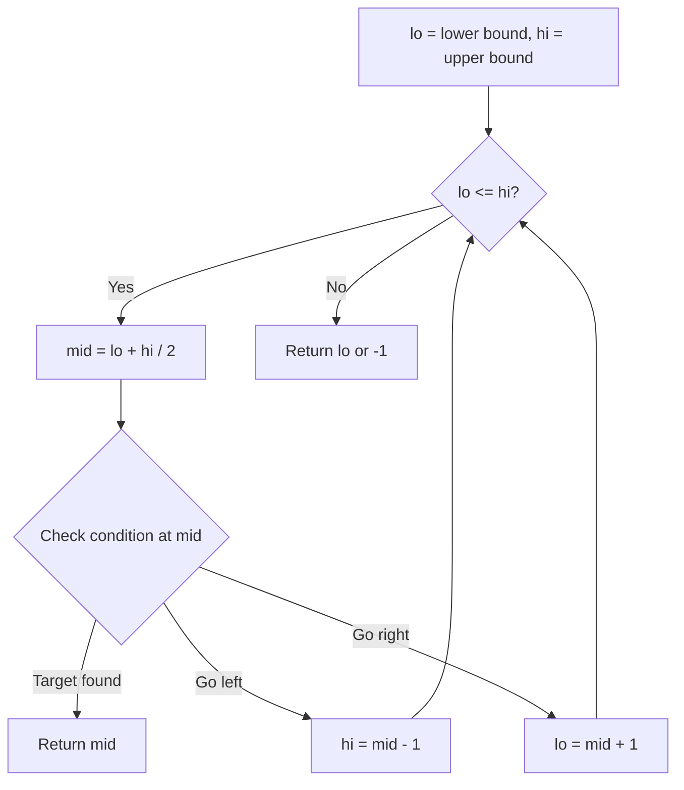
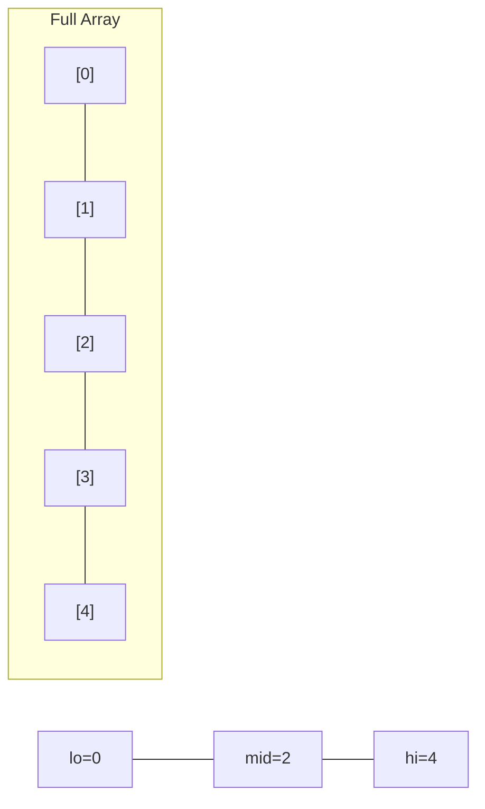
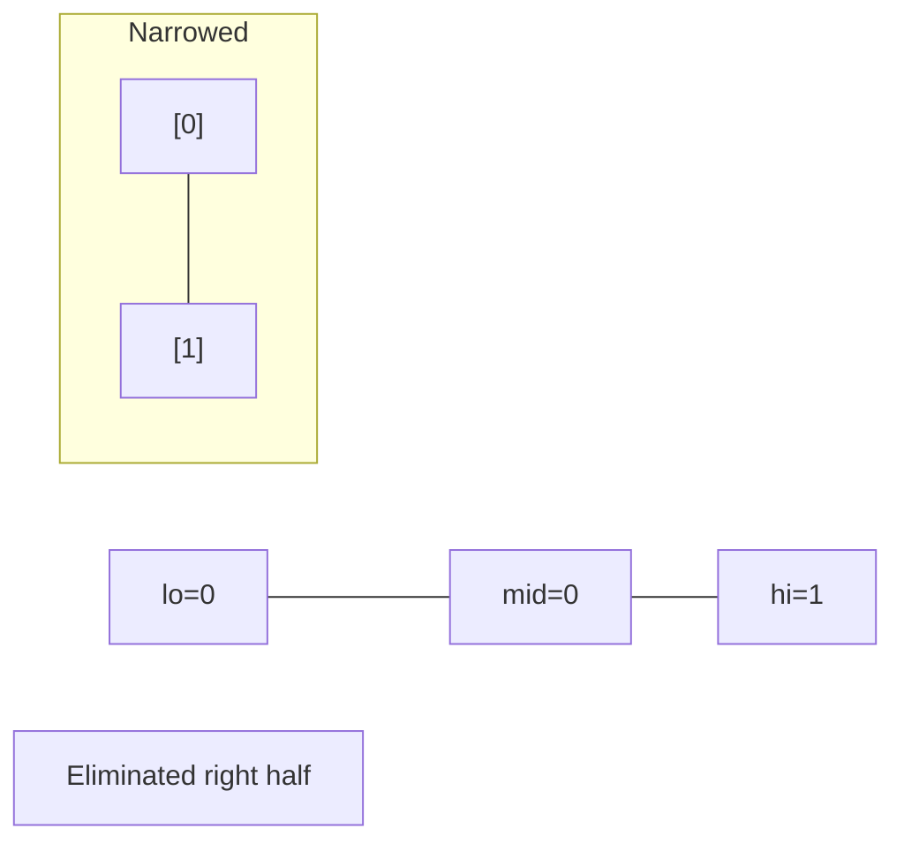
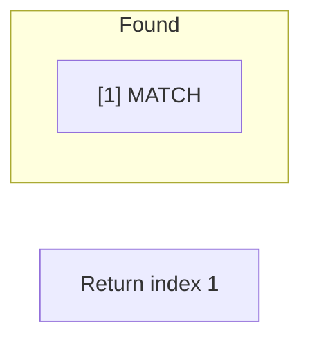

# Problem 1870: Minimum Speed to Arrive on Time

**Difficulty:** Medium  
**Tags:** Array, Binary Search  
**Pattern:** Binary Search  
**Link:** [leetcode.com/problems/minimum-speed-to-arrive-on-time](https://leetcode.com/problems/minimum-speed-to-arrive-on-time/)

## Description

You are given a floating-point number `hour`, representing the amount of time you have to reach the office. To commute to the office, you must take `n` trains in sequential order. You are also given an integer array `dist` of length `n`, where `dist[i]` describes the distance (in kilometers) of the `i^th` train ride.

Each train can only depart at an integer hour, so you may need to wait in between each train ride.

	- For example, if the `1^st` train ride takes `1.5` hours, you must wait for an additional `0.5` hours before you can depart on the `2^nd` train ride at the 2 hour mark.

Return *the **minimum positive integer** speed **(in kilometers per hour)** that all the trains must travel at for you to reach the office on time, or *`-1`* if it is impossible to be on time*.

Tests are generated such that the answer will not exceed `10^7` and `hour` will have **at most two digits after the decimal point**.

 

Example 1:

```

**Input:** dist = [1,3,2], hour = 6
**Output:** 1
**Explanation: **At speed 1:
- The first train ride takes 1/1 = 1 hour.
- Since we are already at an integer hour, we depart immediately at the 1 hour mark. The second train takes 3/1 = 3 hours.
- Since we are already at an integer hour, we depart immediately at the 4 hour mark. The third train takes 2/1 = 2 hours.
- You will arrive at exactly the 6 hour mark.

```

Example 2:

```

**Input:** dist = [1,3,2], hour = 2.7
**Output:** 3
**Explanation: **At speed 3:
- The first train ride takes 1/3 = 0.33333 hours.
- Since we are not at an integer hour, we wait until the 1 hour mark to depart. The second train ride takes 3/3 = 1 hour.
- Since we are already at an integer hour, we depart immediately at the 2 hour mark. The third train takes 2/3 = 0.66667 hours.
- You will arrive at the 2.66667 hour mark.

```

Example 3:

```

**Input:** dist = [1,3,2], hour = 1.9
**Output:** -1
**Explanation:** It is impossible because the earliest the third train can depart is at the 2 hour mark.

```

 

**Constraints:**

	- `n == dist.length`
	- `1 <= n <= 10^5`
	- `1 <= dist[i] <= 10^5`
	- `1 <= hour <= 10^9`
	- There will be at most two digits after the decimal point in `hour`.

## Approach: Binary Search

Use binary search to halve the search space each iteration. Define the search range [lo, hi], compute mid, and decide which half to keep based on the problem's monotonic condition.

## Pseudocode

```
1. lo = lower_bound, hi = upper_bound
2. While lo <= hi (or lo < hi):
   a. mid = (lo + hi) // 2
   b. If condition(mid) is satisfied: record answer, search left half
   c. Else: search right half
3. Return answer
```

## Algorithm Flow



## Visual State Transitions

**Binary Search Step-by-Step:**

**Frame 1: Initial search space**


**Frame 2: Compare mid, narrow search**


**Frame 3: Found target**



## Complexity Analysis

- **Time:** O(log n)
- **Space:** O(1)

## Solution (Python3)

```python
class Solution:
    def minSpeedOnTime(self, dist: List[int], hour: float) -> int:
        # Binary search - O(log n) time, O(1) space
        lo, hi = 0, len(dist) - 1
        while lo <= hi:
            mid = lo + (hi - lo) // 2
            if dist[mid] == hour:
                return mid
            elif dist[mid] < hour:
                lo = mid + 1
            else:
                hi = mid - 1
        return 0
```

## Solution (C++)

```cpp
#include <string>
#include <vector>
using namespace std;

class Solution {
public:
    int minSpeedOnTime(vector<int>& dist, double hour) {
        // Binary search - O(log n) time, O(1) space
        int lo = 0, hi = dist.size() - 1;
        while (lo <= hi) {
            int mid = lo + (hi - lo) / 2;
            if (dist[mid] == hour) {
                return mid;
            } else if (dist[mid] < hour) {
                lo = mid + 1;
            } else {
                hi = mid - 1;
            }
        }
        return 0;
    }
};
```
