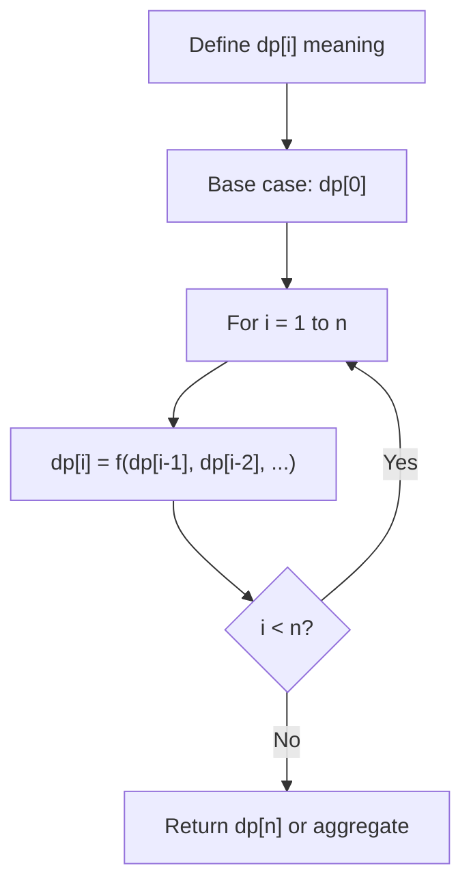
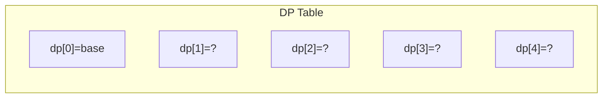
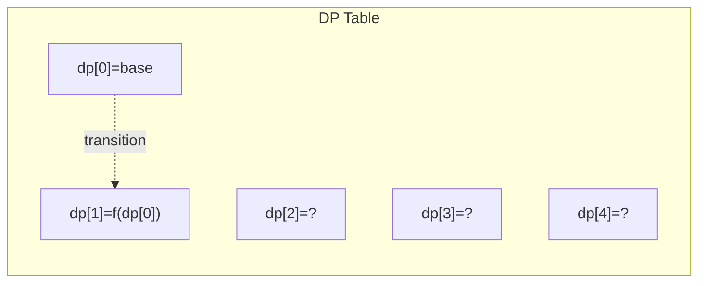
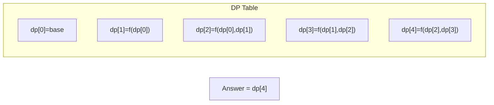

# Problem 1872: Stone Game VIII

**Difficulty:** Hard  
**Tags:** Array, Math, Dynamic Programming, Prefix Sum, Game Theory  
**Pattern:** Dynamic Programming (1D)  
**Link:** [leetcode.com/problems/stone-game-viii](https://leetcode.com/problems/stone-game-viii/)

## Description

Alice and Bob take turns playing a game, with **Alice starting first**.


There are `n` stones arranged in a row. On each player's turn, while the number of stones is **more than one**, they will do the following:


	- Choose an integer `x > 1`, and **remove** the leftmost `x` stones from the row.
	- Add the **sum** of the **removed** stones' values to the player's score.
	- Place a **new stone**, whose value is equal to that sum, on the left side of the row.


The game stops when **only** **one** stone is left in the row.


The **score difference** between Alice and Bob is `(Alice's score - Bob's score)`. Alice's goal is to **maximize** the score difference, and Bob's goal is the **minimize** the score difference.


Given an integer array `stones` of length `n` where `stones[i]` represents the value of the `i^th` stone **from the left**, return *the **score difference** between Alice and Bob if they both play **optimally**.*


 

Example 1:


```

**Input:** stones = [-1,2,-3,4,-5]
**Output:** 5
**Explanation:**
- Alice removes the first 4 stones, adds (-1) + 2 + (-3) + 4 = 2 to her score, and places a stone of
  value 2 on the left. stones = [2,-5].
- Bob removes the first 2 stones, adds 2 + (-5) = -3 to his score, and places a stone of value -3 on
  the left. stones = [-3].
The difference between their scores is 2 - (-3) = 5.

```


Example 2:


```

**Input:** stones = [7,-6,5,10,5,-2,-6]
**Output:** 13
**Explanation:**
- Alice removes all stones, adds 7 + (-6) + 5 + 10 + 5 + (-2) + (-6) = 13 to her score, and places a
  stone of value 13 on the left. stones = [13].
The difference between their scores is 13 - 0 = 13.

```


Example 3:


```

**Input:** stones = [-10,-12]
**Output:** -22
**Explanation:**
- Alice can only make one move, which is to remove both stones. She adds (-10) + (-12) = -22 to her
  score and places a stone of value -22 on the left. stones = [-22].
The difference between their scores is (-22) - 0 = -22.

```


 

**Constraints:**


	- `n == stones.length`
	- `2 <= n <= 10^5`
	- `-10^4 <= stones[i] <= 10^4`

## Approach: Dynamic Programming (1D)

Break the problem into overlapping subproblems. Define dp[i] as the optimal value for the subproblem ending at or considering index i. Build the solution bottom-up, using previously computed dp values.

## Pseudocode

```
1. Define dp[i] = optimal value for subproblem i
2. Base case: dp[0] = initial value
3. For i from 1 to n:
   a. dp[i] = recurrence(dp[i-1], dp[i-2], ...)
4. Return dp[n] or max/min of dp
```

## Algorithm Flow



## Visual State Transitions

**1D Dynamic Programming Table Build:**

**Frame 1: Initialize base cases**


**Frame 2: Fill dp[1] from dp[0]**


**Frame 3: Fill remaining cells**



## Complexity Analysis

- **Time:** O(n)
- **Space:** O(n)

## Solution (Python3)

```python
class Solution:
    def stoneGameVIII(self, stones: List[int]) -> int:
        # Dynamic programming (1D) - O(n) time, O(n) space
        if not stones:
            return 0
        n = len(stones) if isinstance(stones, list) else stones
        dp = [0] * (n + 1)
        dp[0] = 1  # base case
        for i in range(1, n + 1):
            dp[i] = dp[i-1]  # transition (customize per problem)
            if i >= 2:
                dp[i] += dp[i-2]
        return dp[n]
```

## Solution (C++)

```cpp
#include <string>
#include <vector>
using namespace std;

class Solution {
public:
    int stoneGameVIII(vector<int>& stones) {
        // Dynamic programming (1D) - O(n) time, O(n) space
        int n = stones;
        if (n <= 0) return 0;
        vector<int> dp(n + 1, 0);
        dp[0] = 1;
        for (int i = 1; i <= n; i++) {
            dp[i] = dp[i-1];
            if (i >= 2) dp[i] += dp[i-2];
        }
        return dp[n];
    }
};
```
