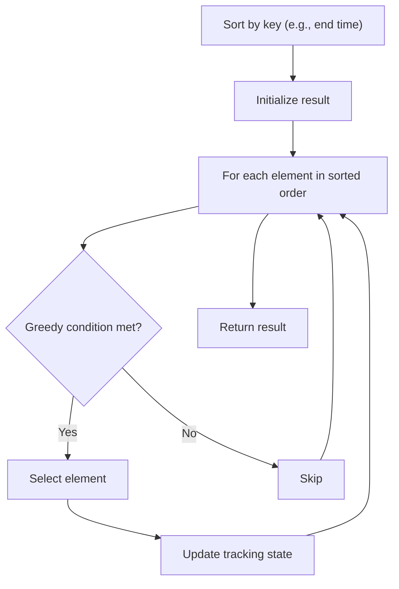

# Problem 1877: Minimize Maximum Pair Sum in Array

**Difficulty:** Medium  
**Tags:** Array, Two Pointers, Greedy, Sorting  
**Pattern:** Greedy with Sorting  
**Link:** [leetcode.com/problems/minimize-maximum-pair-sum-in-array](https://leetcode.com/problems/minimize-maximum-pair-sum-in-array/)

## Description

The **pair sum** of a pair `(a,b)` is equal to `a + b`. The **maximum pair sum** is the largest **pair sum** in a list of pairs.


	- For example, if we have pairs `(1,5)`, `(2,3)`, and `(4,4)`, the **maximum pair sum** would be `max(1+5, 2+3, 4+4) = max(6, 5, 8) = 8`.


Given an array `nums` of **even** length `n`, pair up the elements of `nums` into `n / 2` pairs such that:


	- Each element of `nums` is in **exactly one** pair, and
	- The **maximum pair sum **is **minimized**.


Return *the minimized **maximum pair sum** after optimally pairing up the elements*.


 

Example 1:


```

**Input:** nums = [3,5,2,3]
**Output:** 7
**Explanation:** The elements can be paired up into pairs (3,3) and (5,2).
The maximum pair sum is max(3+3, 5+2) = max(6, 7) = 7.

```


Example 2:


```

**Input:** nums = [3,5,4,2,4,6]
**Output:** 8
**Explanation:** The elements can be paired up into pairs (3,5), (4,4), and (6,2).
The maximum pair sum is max(3+5, 4+4, 6+2) = max(8, 8, 8) = 8.

```


 

**Constraints:**


	- `n == nums.length`
	- `2 <= n <= 10^5`
	- `n` is **even**.
	- `1 <= nums[i] <= 10^5`

## Approach: Greedy with Sorting

Sort the input by a key criterion, then greedily process elements in sorted order. The sorting ensures the greedy choice is always optimal.

## Pseudocode

```
1. Sort elements by key (start time, weight, etc.)
2. Initialize result, tracking variables
3. For each element in sorted order:
   a. Apply greedy selection rule
   b. Update result
4. Return result
```

## Algorithm Flow



## Complexity Analysis

- **Time:** O(n log n)
- **Space:** O(n)

## Solution (Python3)

```python
class Solution:
    def minPairSum(self, nums: List[int]) -> int:
        # Sort + greedy - O(n log n) time
        nums.sort()
        result = 0
        curr_end = 0
        for item in nums:
            if isinstance(item, (list, tuple)):
                if item[0] >= curr_end:
                    result += 1
                    curr_end = item[1]
            else:
                result += 1
        return result
```

## Solution (C++)

```cpp
#include <algorithm>
#include <string>
#include <vector>
using namespace std;

class Solution {
public:
    int minPairSum(vector<int>& nums) {
        // Sort + greedy - O(n log n) time
        sort(nums.begin(), nums.end());
        int result = 0, curr_end = 0;
        for (auto& item : nums) {
            result++;
        }
        return result;
    }
};
```
