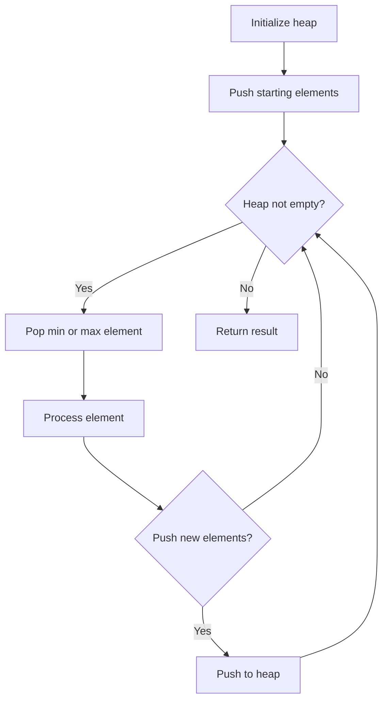
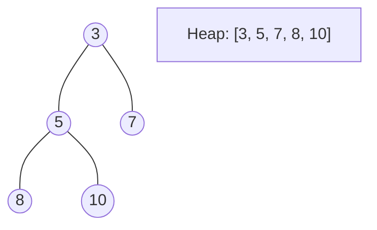
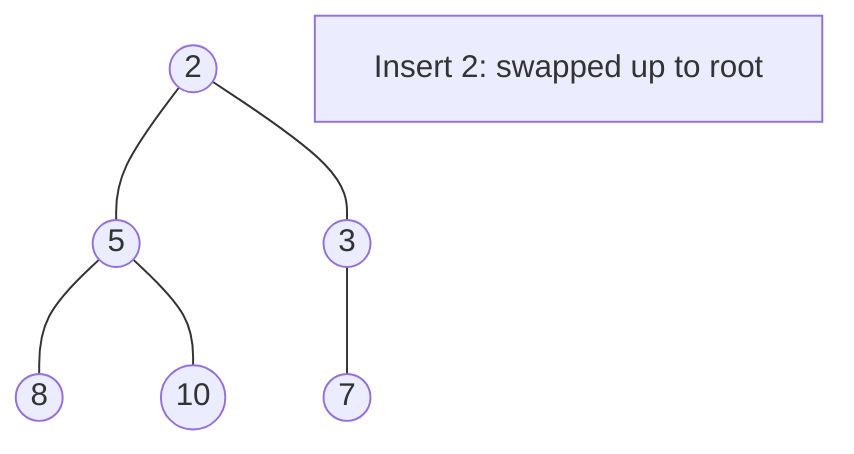
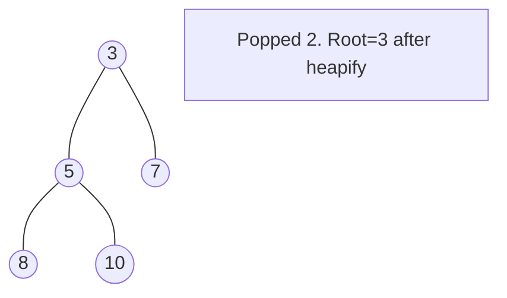

# Problem 1878: Get Biggest Three Rhombus Sums in a Grid

**Difficulty:** Medium  
**Tags:** Array, Math, Sorting, Heap (Priority Queue), Matrix, Prefix Sum  
**Pattern:** Heap / Priority Queue  
**Link:** [leetcode.com/problems/get-biggest-three-rhombus-sums-in-a-grid](https://leetcode.com/problems/get-biggest-three-rhombus-sums-in-a-grid/)

## Description

You are given an `m x n` integer matrix `grid`​​​.

A **rhombus sum** is the sum of the elements that form **the** **border** of a regular rhombus shape in `grid`​​​. The rhombus must have the shape of a square rotated 45 degrees with each of the corners centered in a grid cell. Below is an image of four valid rhombus shapes with the corresponding colored cells that should be included in each **rhombus sum**:

Note that the rhombus can have an area of 0, which is depicted by the purple rhombus in the bottom right corner.

Return *the biggest three **distinct rhombus sums** in the *`grid`* in **descending order****. If there are less than three distinct values, return all of them*.

 

Example 1:

```

**Input:** grid = [[3,4,5,1,3],[3,3,4,2,3],[20,30,200,40,10],[1,5,5,4,1],[4,3,2,2,5]]
**Output:** [228,216,211]
**Explanation:** The rhombus shapes for the three biggest distinct rhombus sums are depicted above.
- Blue: 20 + 3 + 200 + 5 = 228
- Red: 200 + 2 + 10 + 4 = 216
- Green: 5 + 200 + 4 + 2 = 211

```

Example 2:

```

**Input:** grid = [[1,2,3],[4,5,6],[7,8,9]]
**Output:** [20,9,8]
**Explanation:** The rhombus shapes for the three biggest distinct rhombus sums are depicted above.
- Blue: 4 + 2 + 6 + 8 = 20
- Red: 9 (area 0 rhombus in the bottom right corner)
- Green: 8 (area 0 rhombus in the bottom middle)

```

Example 3:

```

**Input:** grid = [[7,7,7]]
**Output:** [7]
**Explanation:** All three possible rhombus sums are the same, so return [7].

```

 

**Constraints:**

	- `m == grid.length`
	- `n == grid[i].length`
	- `1 <= m, n <= 50`
	- `1 <= grid[i][j] <= 10^5`

## Approach: Heap / Priority Queue

Use a min-heap or max-heap to efficiently access the smallest/largest element. Push elements and pop the top to process in priority order.

## Pseudocode

```
1. Initialize heap (min or max)
2. Push initial elements onto heap
3. While heap not empty and condition:
   a. Pop top element (min or max)
   b. Process element
   c. Push new elements if needed
4. Return result
```

## Algorithm Flow



## Visual State Transitions

**Heap Operations (Min-Heap):**

**Frame 1: Initial heap**


**Frame 2: Insert 2 - bubble up**


**Frame 3: Pop minimum (2) - heapify down**



## Complexity Analysis

- **Time:** O(n log n)
- **Space:** O(n)

## Solution (Python3)

```python
class Solution:
    def getBiggestThree(self, grid: List[List[int]]) -> List[int]:
        # Heap/Priority Queue - O(n log k) time
        import heapq
        if not grid:
            return []
        # Min heap (negate for max heap)
        heap = []
        for val in grid:
            heapq.heappush(heap, val)
            if len(heap) > (grid if isinstance(grid, int) else len(grid)):
                heapq.heappop(heap)
        return heap[0] if heap else []
```

## Solution (C++)

```cpp
#include <queue>
#include <string>
#include <vector>
using namespace std;

class Solution {
public:
    vector<int> getBiggestThree(vector<vector<int>>& grid) {
        // Heap/Priority Queue - O(n log k) time
        priority_queue<int, vector<int>, greater<int>> pq;
        for (int val : grid) {
            pq.push(val);
            if ((int)pq.size() > grid)
                pq.pop();
        }
        return pq.empty() ? {} : pq.top();
    }
};
```
