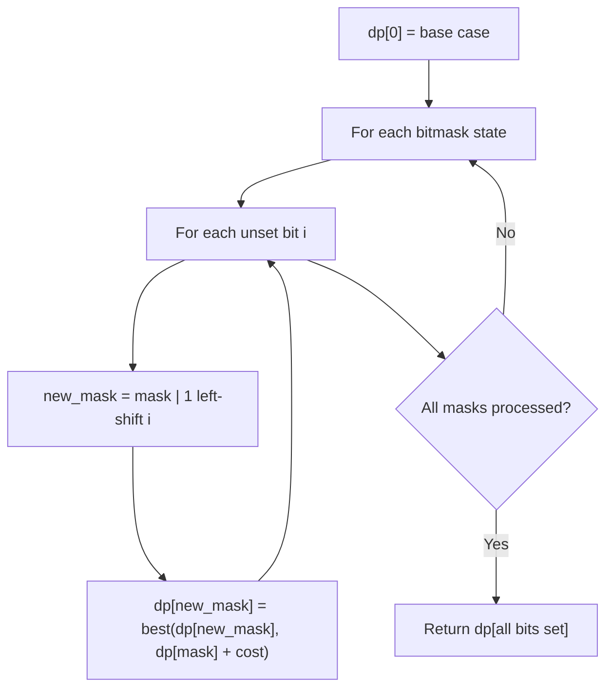

# Problem 1879: Minimum XOR Sum of Two Arrays

**Difficulty:** Hard  
**Tags:** Array, Dynamic Programming, Bit Manipulation, Bitmask  
**Pattern:** Dynamic Programming (Bitmask)  
**Link:** [leetcode.com/problems/minimum-xor-sum-of-two-arrays](https://leetcode.com/problems/minimum-xor-sum-of-two-arrays/)

## Description

You are given two integer arrays `nums1` and `nums2` of length `n`.

The **XOR sum** of the two integer arrays is `(nums1[0] XOR nums2[0]) + (nums1[1] XOR nums2[1]) + ... + (nums1[n - 1] XOR nums2[n - 1])` (**0-indexed**).

	- For example, the **XOR sum** of `[1,2,3]` and `[3,2,1]` is equal to `(1 XOR 3) + (2 XOR 2) + (3 XOR 1) = 2 + 0 + 2 = 4`.

Rearrange the elements of `nums2` such that the resulting **XOR sum** is **minimized**.

Return *the **XOR sum** after the rearrangement*.

 

Example 1:

```

**Input:** nums1 = [1,2], nums2 = [2,3]
**Output:** 2
**Explanation:** Rearrange `nums2` so that it becomes `[3,2]`.
The XOR sum is (1 XOR 3) + (2 XOR 2) = 2 + 0 = 2.
```

Example 2:

```

**Input:** nums1 = [1,0,3], nums2 = [5,3,4]
**Output:** 8
**Explanation:** Rearrange `nums2` so that it becomes `[5,4,3]`. 
The XOR sum is (1 XOR 5) + (0 XOR 4) + (3 XOR 3) = 4 + 4 + 0 = 8.

```

 

**Constraints:**

	- `n == nums1.length`
	- `n == nums2.length`
	- `1 <= n <= 14`
	- `0 <= nums1[i], nums2[i] <= 10^7`

## Approach: Dynamic Programming (Bitmask)

Use bitmask to represent subsets of n elements. dp[mask] = optimal value when the selected subset is represented by mask. Iterate over all masks and transitions.

## Pseudocode

```
1. dp[0] = base case
2. For mask from 0 to 2^n - 1:
   a. For each bit i not set in mask:
      - new_mask = mask | (1 << i)
      - dp[new_mask] = best of dp[new_mask], dp[mask] + cost(i)
3. Return dp[(1 << n) - 1]
```

## Algorithm Flow



## Complexity Analysis

- **Time:** O(2^n * n)
- **Space:** O(2^n)

## Solution (Python3)

```python
class Solution:
    def minimumXORSum(self, nums1: List[int], nums2: List[int]) -> int:
        # Bitmask DP - O(2^n * n) time
        n = len(nums1)
        dp = [float('inf')] * (1 << n)
        dp[0] = 0
        for mask in range(1 << n):
            bits = bin(mask).count('1')
            for i in range(n):
                if mask & (1 << i):
                    continue
                new_mask = mask | (1 << i)
                dp[new_mask] = min(dp[new_mask], dp[mask] + 1)
        return dp[(1 << n) - 1]
```

## Solution (C++)

```cpp
#include <algorithm>
#include <climits>
#include <string>
#include <vector>
using namespace std;

class Solution {
public:
    int minimumXORSum(vector<int>& nums1, vector<int>& nums2) {
        // Bitmask DP - O(2^n * n) time
        int n = nums1.size();
        vector<int> dp(1 << n, INT_MAX);
        dp[0] = 0;
        for (int mask = 0; mask < (1 << n); mask++) {
            for (int i = 0; i < n; i++) {
                if (mask & (1 << i)) continue;
                int new_mask = mask | (1 << i);
                dp[new_mask] = min(dp[new_mask], dp[mask] + 1);
            }
        }
        return dp[(1 << n) - 1];
    }
};
```
