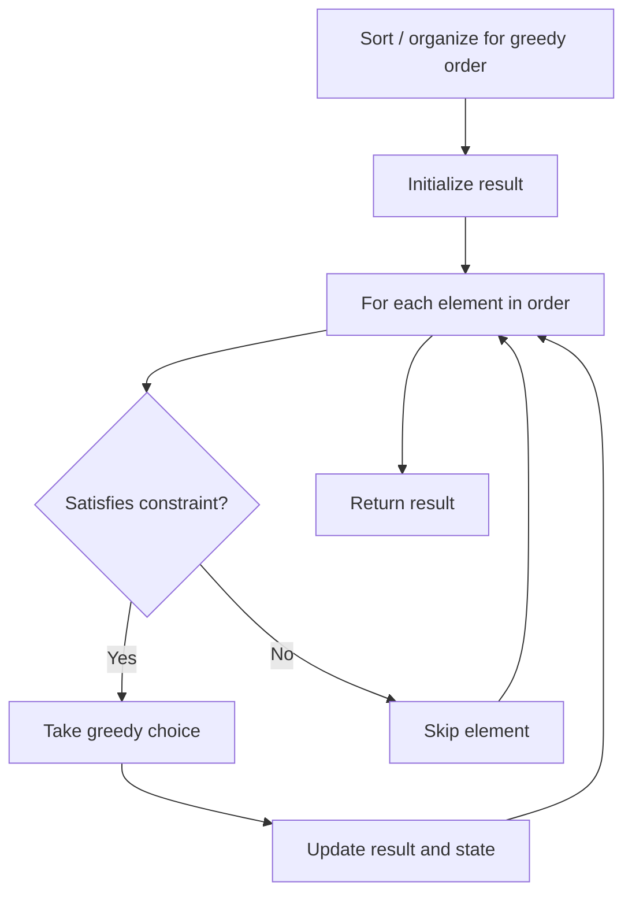

# Problem 1881: Maximum Value after Insertion

**Difficulty:** Medium  
**Tags:** String, Greedy  
**Pattern:** Greedy  
**Link:** [leetcode.com/problems/maximum-value-after-insertion](https://leetcode.com/problems/maximum-value-after-insertion/)

## Description

You are given a very large integer `n`, represented as a string,​​​​​​ and an integer digit `x`. The digits in `n` and the digit `x` are in the **inclusive** range `[1, 9]`, and `n` may represent a **negative** number.

You want to **maximize **`n`**'s numerical value** by inserting `x` anywhere in the decimal representation of `n`​​​​​​. You **cannot** insert `x` to the left of the negative sign.

	- For example, if `n = 73` and `x = 6`, it would be best to insert it between `7` and `3`, making `n = 763`.
	- If `n = -55` and `x = 2`, it would be best to insert it before the first `5`, making `n = -255`.

Return *a string representing the **maximum** value of *`n`*​​​​​​ after the insertion*.

 

Example 1:

```

**Input:** n = "99", x = 9
**Output:** "999"
**Explanation:** The result is the same regardless of where you insert 9.

```

Example 2:

```

**Input:** n = "-13", x = 2
**Output:** "-123"
**Explanation:** You can make n one of {-213, -123, -132}, and the largest of those three is -123.

```

 

**Constraints:**

	- `1 <= n.length <= 10^5`
	- `1 <= x <= 9`
	- The digits in `n`​​​ are in the range `[1, 9]`.
	- `n` is a valid representation of an integer.
	- In the case of a negative `n`,​​​​​​ it will begin with `'-'`.

## Approach: Greedy

Make the locally optimal choice at each step, trusting it leads to a global optimum. Greedy works when the problem has the greedy-choice property and optimal substructure.

## Pseudocode

```
1. Sort or organize data for greedy ordering
2. Initialize result
3. For each element in greedy order:
   a. If element satisfies constraint:
      - Take the greedy choice
      - Update result and state
4. Return result
```

## Algorithm Flow



## Complexity Analysis

- **Time:** O(n log n)
- **Space:** O(1)

## Solution (Python3)

```python
class Solution:
    def maxValue(self, n: str, x: int) -> str:
        # Greedy approach - O(n) time
        result = 0
        curr_max = 0
        for i in range(len(n)):
            if isinstance(n[i], int):
                curr_max = max(curr_max, n[i])
                result = max(result, curr_max)
            else:
                result += 1
        return result
```

## Solution (C++)

```cpp
#include <algorithm>
#include <string>
#include <vector>
using namespace std;

class Solution {
public:
    string maxValue(string& n, int x) {
        // Greedy approach - O(n) time
        int result = 0, curr_max = 0;
        for (int i = 0; i < (int)n.size(); i++) {
            curr_max = max(curr_max, n[i]);
            result = max(result, curr_max);
        }
        return result;
    }
};
```
