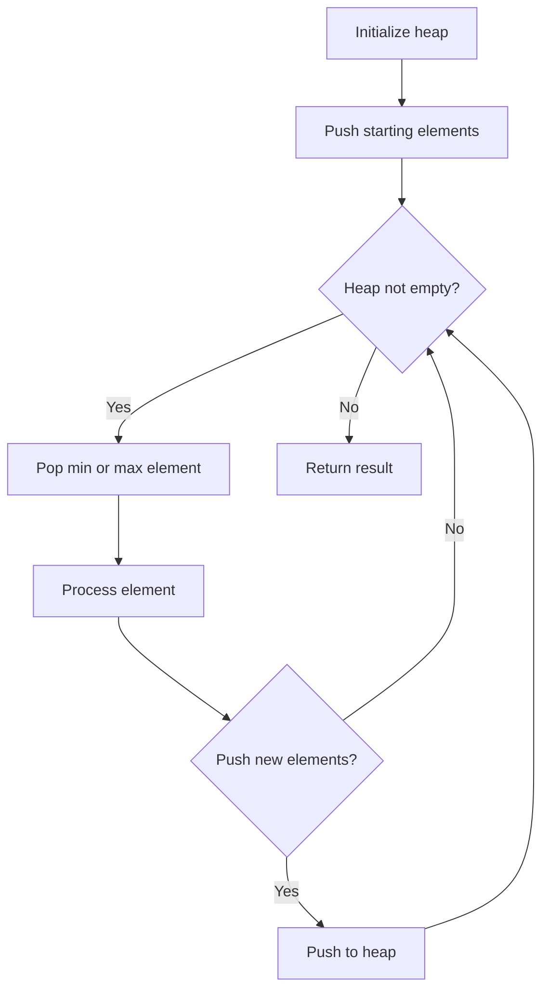
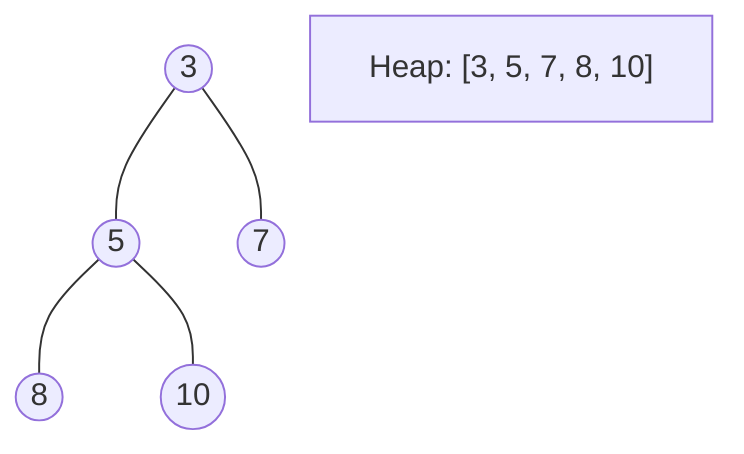
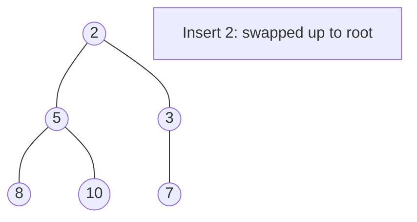
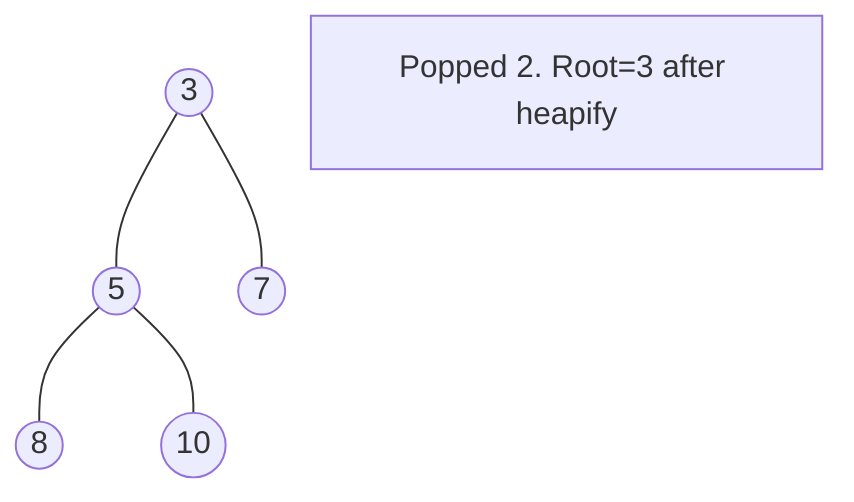

# Problem 1882: Process Tasks Using Servers

**Difficulty:** Medium  
**Tags:** Array, Heap (Priority Queue)  
**Pattern:** Heap / Priority Queue  
**Link:** [leetcode.com/problems/process-tasks-using-servers](https://leetcode.com/problems/process-tasks-using-servers/)

## Description

You are given two **0-indexed** integer arrays `servers` and `tasks` of lengths `n`​​​​​​ and `m`​​​​​​ respectively. `servers[i]` is the **weight** of the `i^​​​​​​th`​​​​ server, and `tasks[j]` is the **time needed** to process the `j^​​​​​​th`​​​​ task **in seconds**.

Tasks are assigned to the servers using a **task queue**. Initially, all servers are free, and the queue is **empty**.

At second `j`, the `j^th` task is **inserted** into the queue (starting with the `0^th` task being inserted at second `0`). As long as there are free servers and the queue is not empty, the task in the front of the queue will be assigned to a free server with the **smallest weight**, and in case of a tie, it is assigned to a free server with the **smallest index**.

If there are no free servers and the queue is not empty, we wait until a server becomes free and immediately assign the next task. If multiple servers become free at the same time, then multiple tasks from the queue will be assigned **in order of insertion** following the weight and index priorities above.

A server that is assigned task `j` at second `t` will be free again at second `t + tasks[j]`.

Build an array `ans`​​​​ of length `m`, where `ans[j]` is the **index** of the server the `j^​​​​​​th` task will be assigned to.

Return *the array *`ans`​​​​.

 

Example 1:

```

**Input:** servers = [3,3,2], tasks = [1,2,3,2,1,2]
**Output:** [2,2,0,2,1,2]
**Explanation: **Events in chronological order go as follows:
- At second 0, task 0 is added and processed using server 2 until second 1.
- At second 1, server 2 becomes free. Task 1 is added and processed using server 2 until second 3.
- At second 2, task 2 is added and processed using server 0 until second 5.
- At second 3, server 2 becomes free. Task 3 is added and processed using server 2 until second 5.
- At second 4, task 4 is added and processed using server 1 until second 5.
- At second 5, all servers become free. Task 5 is added and processed using server 2 until second 7.
```

Example 2:

```

**Input:** servers = [5,1,4,3,2], tasks = [2,1,2,4,5,2,1]
**Output:** [1,4,1,4,1,3,2]
**Explanation: **Events in chronological order go as follows: 
- At second 0, task 0 is added and processed using server 1 until second 2.
- At second 1, task 1 is added and processed using server 4 until second 2.
- At second 2, servers 1 and 4 become free. Task 2 is added and processed using server 1 until second 4. 
- At second 3, task 3 is added and processed using server 4 until second 7.
- At second 4, server 1 becomes free. Task 4 is added and processed using server 1 until second 9. 
- At second 5, task 5 is added and processed using server 3 until second 7.
- At second 6, task 6 is added and processed using server 2 until second 7.

```

 

**Constraints:**

	- `servers.length == n`
	- `tasks.length == m`
	- `1 <= n, m <= 2 * 10^5`
	- `1 <= servers[i], tasks[j] <= 2 * 10^5`

## Approach: Heap / Priority Queue

Use a min-heap or max-heap to efficiently access the smallest/largest element. Push elements and pop the top to process in priority order.

## Pseudocode

```
1. Initialize heap (min or max)
2. Push initial elements onto heap
3. While heap not empty and condition:
   a. Pop top element (min or max)
   b. Process element
   c. Push new elements if needed
4. Return result
```

## Algorithm Flow



## Visual State Transitions

**Heap Operations (Min-Heap):**

**Frame 1: Initial heap**


**Frame 2: Insert 2 - bubble up**


**Frame 3: Pop minimum (2) - heapify down**



## Complexity Analysis

- **Time:** O(n log n)
- **Space:** O(n)

## Solution (Python3)

```python
class Solution:
    def assignTasks(self, servers: List[int], tasks: List[int]) -> List[int]:
        # Heap/Priority Queue - O(n log k) time
        import heapq
        if not servers:
            return []
        # Min heap (negate for max heap)
        heap = []
        for val in servers:
            heapq.heappush(heap, val)
            if len(heap) > (tasks if isinstance(tasks, int) else len(servers)):
                heapq.heappop(heap)
        return heap[0] if heap else []
```

## Solution (C++)

```cpp
#include <queue>
#include <string>
#include <vector>
using namespace std;

class Solution {
public:
    vector<int> assignTasks(vector<int>& servers, vector<int>& tasks) {
        // Heap/Priority Queue - O(n log k) time
        priority_queue<int, vector<int>, greater<int>> pq;
        for (int val : servers) {
            pq.push(val);
            if ((int)pq.size() > tasks)
                pq.pop();
        }
        return pq.empty() ? {} : pq.top();
    }
};
```
