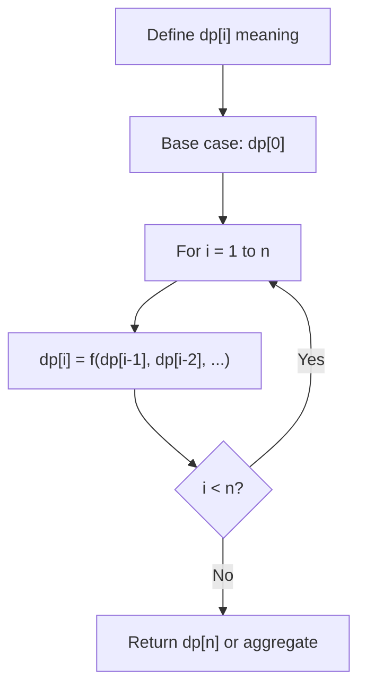
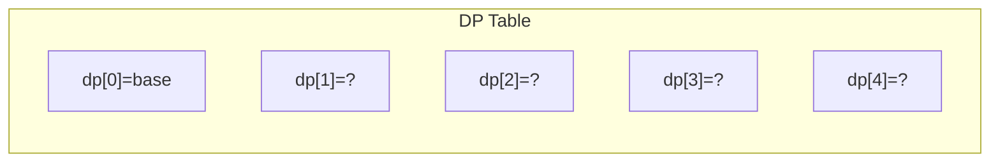
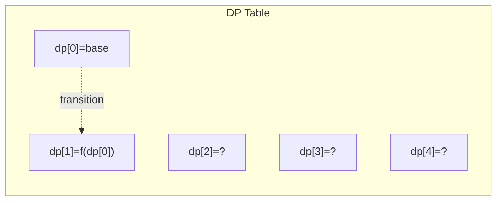
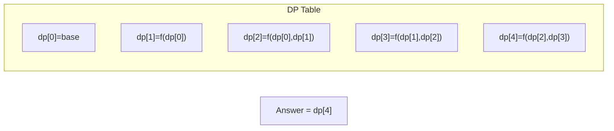

# Problem 1883: Minimum Skips to Arrive at Meeting On Time

**Difficulty:** Hard  
**Tags:** Array, Dynamic Programming  
**Pattern:** Dynamic Programming (1D)  
**Link:** [leetcode.com/problems/minimum-skips-to-arrive-at-meeting-on-time](https://leetcode.com/problems/minimum-skips-to-arrive-at-meeting-on-time/)

## Description

You are given an integer `hoursBefore`, the number of hours you have to travel to your meeting. To arrive at your meeting, you have to travel through `n` roads. The road lengths are given as an integer array `dist` of length `n`, where `dist[i]` describes the length of the `i^th` road in **kilometers**. In addition, you are given an integer `speed`, which is the speed (in **km/h**) you will travel at.

After you travel road `i`, you must rest and wait for the **next integer hour** before you can begin traveling on the next road. Note that you do not have to rest after traveling the last road because you are already at the meeting.

	- For example, if traveling a road takes `1.4` hours, you must wait until the `2` hour mark before traveling the next road. If traveling a road takes exactly `2` hours, you do not need to wait.

However, you are allowed to **skip** some rests to be able to arrive on time, meaning you do not need to wait for the next integer hour. Note that this means you may finish traveling future roads at different hour marks.

	- For example, suppose traveling the first road takes `1.4` hours and traveling the second road takes `0.6` hours. Skipping the rest after the first road will mean you finish traveling the second road right at the `2` hour mark, letting you start traveling the third road immediately.

Return *the **minimum number of skips required** to arrive at the meeting on time, or* `-1`* if it is** impossible***.

 

Example 1:

```

**Input:** dist = [1,3,2], speed = 4, hoursBefore = 2
**Output:** 1
**Explanation:**
Without skipping any rests, you will arrive in (1/4 + 3/4) + (3/4 + 1/4) + (2/4) = 2.5 hours.
You can skip the first rest to arrive in ((1/4 + 0) + (3/4 + 0)) + (2/4) = 1.5 hours.
Note that the second rest is shortened because you finish traveling the second road at an integer hour due to skipping the first rest.

```

Example 2:

```

**Input:** dist = [7,3,5,5], speed = 2, hoursBefore = 10
**Output:** 2
**Explanation:**
Without skipping any rests, you will arrive in (7/2 + 1/2) + (3/2 + 1/2) + (5/2 + 1/2) + (5/2) = 11.5 hours.
You can skip the first and third rest to arrive in ((7/2 + 0) + (3/2 + 0)) + ((5/2 + 0) + (5/2)) = 10 hours.

```

Example 3:

```

**Input:** dist = [7,3,5,5], speed = 1, hoursBefore = 10
**Output:** -1
**Explanation:** It is impossible to arrive at the meeting on time even if you skip all the rests.

```

 

**Constraints:**

	- `n == dist.length`
	- `1 <= n <= 1000`
	- `1 <= dist[i] <= 10^5`
	- `1 <= speed <= 10^6`
	- `1 <= hoursBefore <= 10^7`

## Approach: Dynamic Programming (1D)

Break the problem into overlapping subproblems. Define dp[i] as the optimal value for the subproblem ending at or considering index i. Build the solution bottom-up, using previously computed dp values.

## Pseudocode

```
1. Define dp[i] = optimal value for subproblem i
2. Base case: dp[0] = initial value
3. For i from 1 to n:
   a. dp[i] = recurrence(dp[i-1], dp[i-2], ...)
4. Return dp[n] or max/min of dp
```

## Algorithm Flow



## Visual State Transitions

**1D Dynamic Programming Table Build:**

**Frame 1: Initialize base cases**


**Frame 2: Fill dp[1] from dp[0]**


**Frame 3: Fill remaining cells**



## Complexity Analysis

- **Time:** O(n)
- **Space:** O(n)

## Solution (Python3)

```python
class Solution:
    def minSkips(self, dist: List[int], speed: int, hoursBefore: int) -> int:
        # Dynamic programming (1D) - O(n) time, O(n) space
        if not dist:
            return 0
        n = len(dist) if isinstance(dist, list) else dist
        dp = [0] * (n + 1)
        dp[0] = 1  # base case
        for i in range(1, n + 1):
            dp[i] = dp[i-1]  # transition (customize per problem)
            if i >= 2:
                dp[i] += dp[i-2]
        return dp[n]
```

## Solution (C++)

```cpp
#include <string>
#include <vector>
using namespace std;

class Solution {
public:
    int minSkips(vector<int>& dist, int speed, int hoursBefore) {
        // Dynamic programming (1D) - O(n) time, O(n) space
        int n = dist;
        if (n <= 0) return 0;
        vector<int> dp(n + 1, 0);
        dp[0] = 1;
        for (int i = 1; i <= n; i++) {
            dp[i] = dp[i-1];
            if (i >= 2) dp[i] += dp[i-2];
        }
        return dp[n];
    }
};
```
