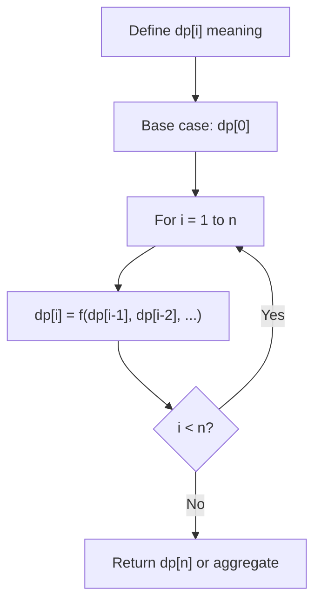
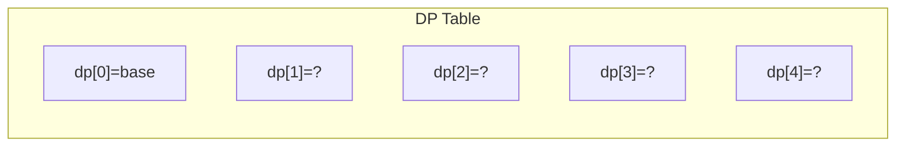
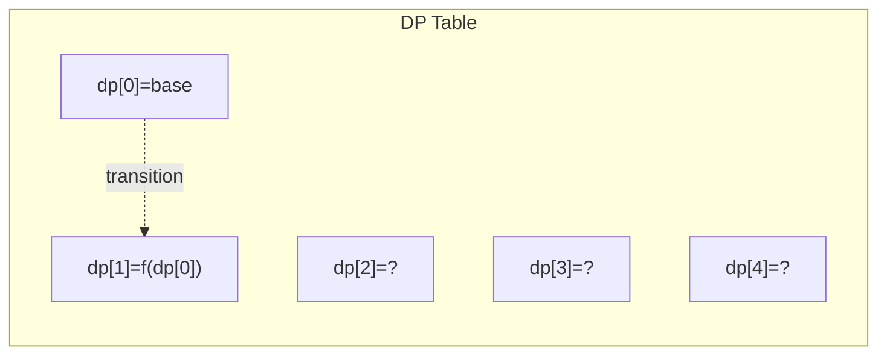
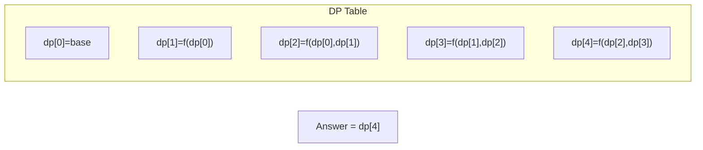

# Problem 1884: Egg Drop With 2 Eggs and N Floors

**Difficulty:** Medium  
**Tags:** Math, Dynamic Programming  
**Pattern:** Dynamic Programming (1D)  
**Link:** [leetcode.com/problems/egg-drop-with-2-eggs-and-n-floors](https://leetcode.com/problems/egg-drop-with-2-eggs-and-n-floors/)

## Description

You are given **two identical** eggs and you have access to a building with `n` floors labeled from `1` to `n`.

You know that there exists a floor `f` where `0 <= f <= n` such that any egg dropped at a floor **higher** than `f` will **break**, and any egg dropped **at or below** floor `f` will **not break**.

In each move, you may take an **unbroken** egg and drop it from any floor `x` (where `1 <= x <= n`). If the egg breaks, you can no longer use it. However, if the egg does not break, you may **reuse** it in future moves.

Return *the **minimum number of moves** that you need to determine **with certainty** what the value of *`f` is.

 

Example 1:

```

**Input:** n = 2
**Output:** 2
**Explanation:** We can drop the first egg from floor 1 and the second egg from floor 2.
If the first egg breaks, we know that f = 0.
If the second egg breaks but the first egg didn't, we know that f = 1.
Otherwise, if both eggs survive, we know that f = 2.

```

Example 2:

```

**Input:** n = 100
**Output:** 14
**Explanation:** One optimal strategy is:
- Drop the 1st egg at floor 9. If it breaks, we know f is between 0 and 8. Drop the 2nd egg starting from floor 1 and going up one at a time to find f within 8 more drops. Total drops is 1 + 8 = 9.
- If the 1st egg does not break, drop the 1st egg again at floor 22. If it breaks, we know f is between 9 and 21. Drop the 2nd egg starting from floor 10 and going up one at a time to find f within 12 more drops. Total drops is 2 + 12 = 14.
- If the 1st egg does not break again, follow a similar process dropping the 1st egg from floors 34, 45, 55, 64, 72, 79, 85, 90, 94, 97, 99, and 100.
Regardless of the outcome, it takes at most 14 drops to determine f.

```

 

**Constraints:**

	- `1 <= n <= 1000`

## Approach: Dynamic Programming (1D)

Break the problem into overlapping subproblems. Define dp[i] as the optimal value for the subproblem ending at or considering index i. Build the solution bottom-up, using previously computed dp values.

## Pseudocode

```
1. Define dp[i] = optimal value for subproblem i
2. Base case: dp[0] = initial value
3. For i from 1 to n:
   a. dp[i] = recurrence(dp[i-1], dp[i-2], ...)
4. Return dp[n] or max/min of dp
```

## Algorithm Flow



## Visual State Transitions

**1D Dynamic Programming Table Build:**

**Frame 1: Initialize base cases**


**Frame 2: Fill dp[1] from dp[0]**


**Frame 3: Fill remaining cells**



## Complexity Analysis

- **Time:** O(n)
- **Space:** O(n)

## Solution (Python3)

```python
class Solution:
    def twoEggDrop(self, n: int) -> int:
        # Dynamic programming (1D) - O(n) time, O(n) space
        if not n:
            return 0
        n = len(n) if isinstance(n, list) else n
        dp = [0] * (n + 1)
        dp[0] = 1  # base case
        for i in range(1, n + 1):
            dp[i] = dp[i-1]  # transition (customize per problem)
            if i >= 2:
                dp[i] += dp[i-2]
        return dp[n]
```

## Solution (C++)

```cpp
#include <string>
#include <vector>
using namespace std;

class Solution {
public:
    int twoEggDrop(int n) {
        // Dynamic programming (1D) - O(n) time, O(n) space
        int n = n;
        if (n <= 0) return 0;
        vector<int> dp(n + 1, 0);
        dp[0] = 1;
        for (int i = 1; i <= n; i++) {
            dp[i] = dp[i-1];
            if (i >= 2) dp[i] += dp[i-2];
        }
        return dp[n];
    }
};
```
